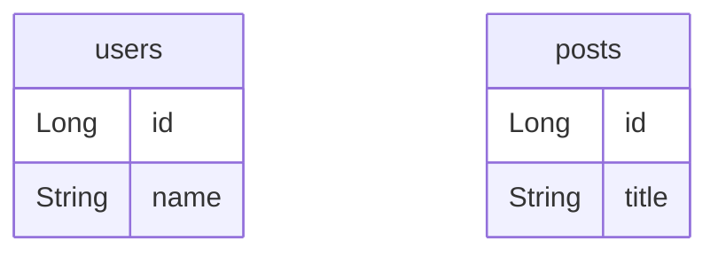
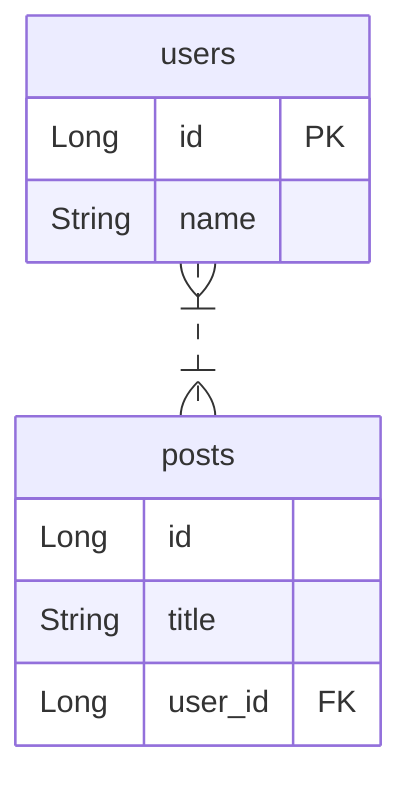

# RDBMS 기본 구성

## Table, Column, Row

MySQL, MariaDB, PostgreSQL과 같은 DB가 관계형 데이터베이스(RDBMS). 관계형은 **여러 테이블**로 구성됨. 테이블은 **표**다. 테이블은 **열(컬럼, Column)** 과 **행(로우, Row)** 로 이루어짐.

## PK, FK

### PK(Primary Key) - 기본키

- 특정 데이터를 식별하기 위한 값.
- 중복 되어서는 안 되며, 비어있어서도 안된다.

📌 주의점 (현업)
- `주민등록번호`, `이메일` 이 특정 데이터를 PK로 넣으면 안된다. 바뀔 가능성이 존재함.
- 바뀌면 식별하던 값이 바뀌어 데이터를 관리하거나 사용하는 입장에서 혼란.
- 바뀌면 성능도 안좋음.
현업에서는 PK를 주로 **Auto Increment**(숫자가 1씩 증가하는 방식)나, **UUID**(랜덤 값)로 설정함.

### FK(Foreign Key) - 외래키

- 다른 테이블의 데이터와 관계를 연결하기 위한 키

[FK 사용 전]
users (사용자)

| id  | 이름  |
| --- | --- |
| 1   | 박재성 |
| 2   | 김유찬 |

posts (게시글)

| id  | 제목               |
| --- | ---------------- |
| 1   | 개발자 취업 방법 알려드려요! |
| 2   | 면접 후기 공유합니다      |
| 3   | TIL - 객체지향       |

[FK 사용 후]
users (사용자)

| id (PK) | 이름  |
| ------- | --- |
| 1       | 박재성 |
| 2       | 김유찬 |

posts (게시글)

| id (PK) | 제목               | user_id (FK)   |
| ------- | ---------------- | -------------- |
| 1       | 개발자 취업 방법 알려드려요! | 2              |
| 2       | 면접 후기 공유합니다      | 1              |
| 3       | TIL - 객체지향       | ~~20~~ (Error) |

FK 부가 기능 존재.
- 적절하지 않은 FK를 넣었을 때 DB에서는 에러를 발생 시킴.
- **'참조 무결성'** 이라고 함.
- 결점(모순되는 점)이 없도록 유지하는 특성.
