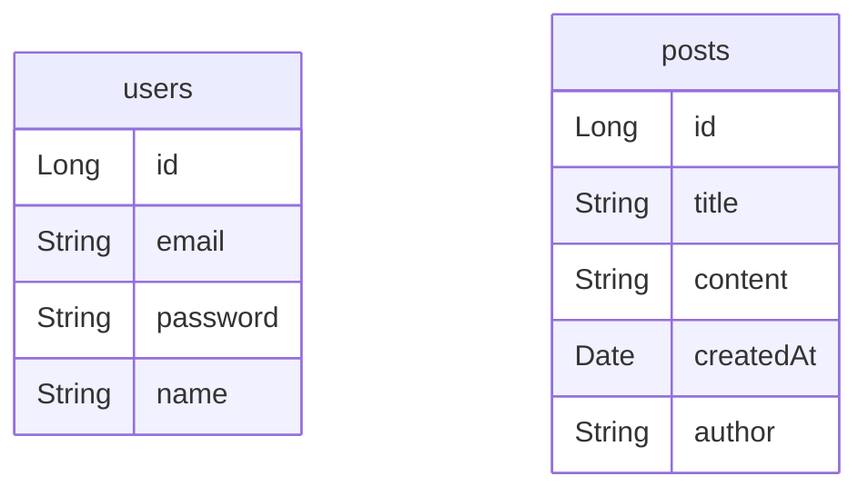

# 핵심 원칙

## DB 설계 시 꼭 기억해야 할 핵심 원칙 1가지

### DB 설계의 핵심은 '중복 없애기'다

users (사용자)

| id  | 이름  |
| --- | --- |
| 1   | 박재성 |
| 2   | 김유찬 |

posts (게시글)

| id  | 제목             | 내용  | 작성자 |
|:-- | -------------- | --- | --- |
| 1   | [속보] 개발자 채용 확대 | 내용1 | 박재성 |
| 2   | 취업 꿀팁          | 내용2 | 박재성 |
| …   | …              | …   | …   |
| 132 | 면접             | 내용3 | 박재성 |

박재성이 쓴 게시글이 3개가 있다. 근데 박재성이 박지성으로 개명함. 그러면 이름도 전부 박지성으로 고쳐주어야 함

users (사용자)

| id  | 이름  |
| --- | --- |
| 1   | 박지성 |
| 2   | 김유찬 |

posts (게시글)

| **id** | **제목**         | **내용** | **작성자**                |
| ------ | -------------- | ------ | ---------------------- |
| 1      | [속보] 개발자 채용 확대 | 내용1    | **박지성**                |
| 2      | 취업 꿀팁 공유합니다!   | 내용2    | **박지성**                |
| …      | …              | …      | …                      |
| 132    | 어제 면접 보고 온 썰   | 내용3    | **박재성** (이녀석은 실수로 안고침) |

132번의 데이터는 실수로 안고침. 근데 132번의 게시글에 신고가 들어옴. 찾았더니 없는 사용자. DB가 꼬인 것
이런 문제는 **데이터 중복**때문임. 중복되는 데이터가 많으면 모든 데이터를 찾아 고쳐야 함. 실수가 생기면 모순이 생김.

> 저장된 데이터들 중에서 모순되는 상황이 생긴 현상을 보고 **이상현상(Anomaly)** 이라고 함. 위의 경우는 이상현상 중 **갱신 이상(Update Anomaly)** 임.

이런 문제를 해결하기 위해 만들어낸 방법이 **정규화(Normalization)** 임.

### 정규화(Normalization)란?

데이터들 사이에서 발생한 모순의 근본적인 원인이 데이터 중복임. 이런 문제를 해결하려면 중복 데이터를 없애면 됨. 설계시 중복을 없애는 과정이 정규화임.
제1정규형, 제2정규형, 제3정규형 등 모든 정규형은 중복을 없애게 해주는 방법들임.

#### 1정규형 (1NF, First Normal Form)

- 의미: 모든 컬럼 값이 원자 값이어야 하며, 하나의 셀에 여러 값이 포함되어 있지 않아야 함.
- 요구 조건: 각 테이블의 열이 단일 값을 가져야 하며, 복수의 값이 나 중첩된 데이터가 없어야 함.

#### 2정규형 (2NF, Second Normal Form)

- 의미: 1정규형을 만족하면서, 기본키에 완전하게 종속된 모든 비키 속성들이 포함된 테이블이어야 함.
- 요구 조건: 부분 함수 종속성을 제거함. 즉, 비기본 키 속성들이 기본 키의 일부에만 의존하지 않고 전체에 의존해야 함.

#### 3정규형 (3NF, Third Normal Form)

- 의미: 2정규형을 만족하면서, 비 기본키 속성 간 이행적 종속이 없어야 함.
- 요구 조건: 비기본키 속성이 다른 비기본키 속성에 종속 되는 이행적 종속을 제거하여, 보든 비기본키가 오직 기본키에만 의존하도록 함.

#### 보이스-코드 정규형 (BCNF, Boyce-Codd Normal Form)

- 의미: 3정규형을 강화한 형태로, 결정자가 후보키여야 한다는 조건이 추가됨.
- 요구 조건: 모든 결정자가 후보키여야 하며, 테이블의 함수적 종속성이 더 강력하게 제어 됨. 이 정규형은 사실상 3NF의 특수한 경우로 간주될 수 있음.

#### 4정규형 (4NF, Fourth Normal Form)

- 의미: 다치 종속(Multi-Valued Dependency)을 제거하는 것을 목표로 함.
- 요구 조건: 4정규형은 BCNF를 만족하면서, 다치 종속이 발생하지 않도록 해야 함. 즉, 하나의 속성이 다른 속성의 다치 종속 관계에 있지 않아야 함.

#### 5정규형 (5NF, Fifth Normal Form)

- 의미: 조인 종속성(Join Dependency)을 제거하는 단계
- 요구 조건: 테이블이 5정규형을 만족하려면, 가능한 모든 조인 종속성이 후보키에 의존해야 함. 데이터가 여러 테이블에 나뉘어 있을 때, 테이블 간 분리로 인해 데이터의 논리적 무결성이 유지될 수 있어야 함.

정규형에는 총 6가지 정규형이 있음. 하지만, 1,2,3 정규형만 보통 사용되고, 나머지를 적용시키면 지나치게 테이블이 분리되어 관리가 복잡해짐.

## DB 설계 전체 과정

### 1. 저장해야 하는 데이터 파악하기

✅ 요구사항을 보면서 DB에 어떤 데이터를 저장해두어야 하는지 파악하는게 가장 먼저. 어떤 데이터를 저장해두어야 하는지 파악해야, 어떤 방식으로 데이터를 분류해 저장할 지 결정 가능.

- 회원가입 기능
	- 이메일, 비밀번호, 이름
- 로그인 기능
	- 이메일, 비밀번호
- 게시글 작성 기능
	- 로그인한 사용자만 게시글 작성 가능
	- 제목, 내용
- 게시글 조회 기능
	- 게시글 제목, 게시글 내용, 게시글 작성 시간, 작성자

### 2. 그루핑해서 분류하기

✅ 저장해야 하는 데이터를 묶어 그루핑할 수 있는 상위 개념을 찾아야 함. 이렇게 그룹핑 된 하나의 그룹을 보고 DB에서는 엔티티(Entity) 라고 이야기 함. **엔티티**가 DB의 테이블이라고 생각해도 됨.

[예시]
- 아이디, 패스워드, 이름, 이메일 -> 사용자
- 게시글 제목, 내용, 생성시간 -> 게시글

✅ 테이블로 나타내기

users (사용자)

### 3. 6가지 규칙 적용시키면서 테이블 분리해나가기
