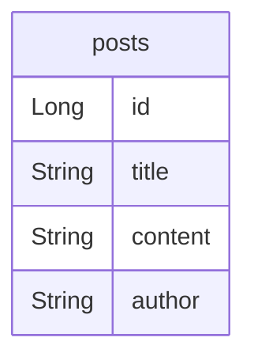

# 설계 해보기(설계 규칙)

## [규칙1] 한 칸에는 한 가지 정보만 들어가도록 만들어라

### ✅ 한 칸에는 한 가지 정보만 들어가도록 만들어라

안 지킨 사례

**users (사용자)**

| id (PK) | 이름  | 이메일                                      |
|:------ | --- | ---------------------------------------- |
| 1       | 박재성 | js123@naver.com, js00@naver.com       |
| 2       | 김시안 | king123@naver.com, queen123@naver.com |

한 칸에 2가지 이상의 정보가 들어가 있음.

왜?
데이터를 조회할 때마다 콤마(,)를 제거하고 배열에 집어넣는 로직을 넣어야 함. 한 칸에 데이터를 여러 개 넣으면 실수로 데이터를 중복해서 넣음. 한 칸에는 한 가지 정보만 넣으려 함.

### ✅ 한 칸에 2개 이상의 정보가 들어가 있을 땐?

**테이블을 분리**하면 된다. 테이블을 분리해서 한 칸에 한 가지 정보만 들어가도록 함.

**users (사용자)**

| id (PK) | 이름  |
| ------- | --- |
| 1       | 박재성 |
| 2       | 김시안 |

**emails (이메일)**

| id (PK) | 이메일                                             |
| ------- | ----------------------------------------------- |
| 1       | [js123@naver.com](mailto:js123@naver.com)       |
| 2       | [js00@naver.com](mailto:js00@naver.com)         |
| 3       | [king123@naver.com](mailto:king123@naver.com)   |
| 4       | [queen123@naver.com](mailto:queen123@naver.com) |

테이블을 분리하는 것까지 좋은데 특정 사용자의 이메일 주소를 알 수 있는 방법이 없음. 특정 사용자의 이메일 주소가 어떤 건지 알 수 있게 보완하자.

**users (사용자)**

|id (PK)|이름|이메일 id (FK)|
|---|---|---|
|1|박재성|1, 2|
|2|김시안|3, 4|

**emails (이메일)**

| id (PK) | 과목명                                             |
| ------- | ----------------------------------------------- |
| 1       | [js123@naver.com](mailto:js123@naver.com)       |
| 2       | [js00@naver.com](mailto:js00@naver.com)         |
| 3       | [king123@naver.com](mailto:king123@naver.com)   |
| 4       | [queen123@naver.com](mailto:queen123@naver.com) |

- 근데 이렇게 하면 특정 사용자의 이메일 주소를 알 수는 있지만,
- 한 칸에 2가지 이상의 정보가 다시 들어가게 됨. (,콤마로 구분)
- 이 때는 FK를 다른 테이블로 옮겨보자.
- `users` 테이블에서 `emails` 테이블로 옮기는 것.

**users (사용자)**

|**id (PK)**|**이름**|
|---|---|
|1|박재성|
|2|김시안|

**emails (이메일)**

| **id (PK)** | **과목명**                                         | **사용자 id (FK)** |
| ----------- | ----------------------------------------------- | --------------- |
| 1           | [js123@naver.com](mailto:js123@naver.com)       | 1               |
| 2           | [js00@naver.com](mailto:js00@naver.com)         | 1               |
| 3           | [king123@naver.com](mailto:king123@naver.com)   | 2               |
| 4           | [queen123@naver.com](mailto:queen123@naver.com) | 2               |

이렇게 하면 특정 사용자의 이메일 주소도 알 수 있고, 한 칸에 한 가지의 정보만 들어가게 만들었음. 위와 같이 테이블을 분리해야 함.

> 한 칸에 두 가지 이상의 정보가 들어가면, **테이블을 분리**해서 **FK를 활용**해 한 칸에 한 가지 정보만 들어가게 만들어야 함.

이것이 **제1정규형**임.

### ✅ 심화) '한 가지 정보'라는게 관점에 따라 달라질 수 있다

**users (사용자)**

|id|이름|
|---|---|
|1|박재성|
|2|김시온|

**users (사용자)**

|id|성|이름|
|---|---|---|
|1|박|재성|
|2|김|시온|

- `박재성`이라는 전체 이름이 하나의 정보라고 생각.
- `박`이 하나의 정보고, `재성`이 하나의 정보라고 판단할 수도 있음.
- **둘 다 올바른 관점임.**
- 한 가지 정보라는 건 절대적이지 않음. 서비스에 맞게 판단해야 함.

> 그럼 어떻게 판단해야 할까? → **서비스에서 데이터의 사용 방식에 따라 결정해야 한다!**

예를 들어, 서비스에서 성과 이름을 따로따로 조회해야 하는 경우가 많다면 2번째 테이블의 형태로 구성하는 게 좋다. 반대로 서비스에서 성과 이름을 따로따로 조회할 일이 없고 통째로 쓰는 경우만 있다면 1번째 테이블의 형태로 구성하는 게 좋다.

## [규칙2] FK를 넣어도 '규칙1'을 못지킬 때는 중간 테이블을 하나 더 만들자

### ✅ FK를 넣어도 '규칙1'을 못지킬 때는 중간 테이블을 하나 더 만들자

students (학생)

| **id** | **이름** | **수강 과목** |
| ------ | ------ | --------- |
| 1      | 박재성    | 수학, 과학    |
| 2      | 김재은    | 국어, 수학    |
| 3      | 김지훈    | 국어, 과학    |

규칙1(한 칸에 하나의 정보) 를 몾지킴

**students (학생)**

|**id**|**이름**|**수강 과목 id (FK)**|
|---|---|---|
|1|박재성|2, 3|
|2|김재은|1, 2|
|3|김지훈|1, 3|

**courses (수강 과목)**

|**id**|과목명|
|---|---|
|1|국어|
|2|수학|
|3|과학|

여전히 규칙 1을 안 지키고 있다. 그러면 FK를 `students` 테이블이 아닌 `courses` 테이블로 옮겨보자.

**students (학생)**

|**id**|**이름**|
|---|---|
|1|박재성|
|2|김재은|
|3|김지훈|

**courses (수강 과목)**

| **id** | 과목명 | 학생 id |
| ------ | --- | ----- |
| 1      | 국어  | 2, 3  |
| 2      | 수학  | 1, 2  |
| 3      | 과학  | 1, 3  |

FK의 위치를 다른 테이블로 바꿔도 여전히 규칙1이 안지켜짐.
이 때는 **중간 테이블을 하나 더 만들어**야 함.

**students (학생)**

|**id**|**이름**|
|---|---|
|1|박재성|
|2|김재은|
|3|김지훈|

**course_registrations (수강 과목 등록)**

| id  | 학생 id (FK) | 수강 과목 id (FK) |
| --- | ---------- | ------------- |
| 1   | 1          | 2             |
| 2   | 1          | 3             |
| 3   | 2          | 1             |
| 4   | 2          | 2             |
| 5   | 3          | 1             |
| 6   | 3          | 3             |

**courses (수강 과목)**

| **id** | 과목명 |
| ------ | --- |
| 1      | 국어  |
| 2      | 수학  |
| 3      | 과학  |

모두 파악 가능하고 규칙1을 지킬 수 있음.

📌 보통은 studuents 테이블과 courses 테이블을 연결하는 중간 테이블을 `students_courses` 테이블로 명하는 경우가 많음.
하지만, **두 테이블의 관계를 표현**해주는 동사를 명하는 것이 좋음. 즉, `course_registrations(수강과목 등록)` 와 같이.

## [규칙 3] 헷갈릴 땐 관계(1:1, 1:N, N:M)를 파악한다

### ✅ 1:1 관계 / 1:N 관계 / N:M 관계?

**엔티티 간의 관계**에서 패턴 존재. **1:1 관계, 1:N 관계, N:M 관계**라는 패턴.

### ✅ 엔티티 관계 파악 방법

#### 1. 엔티티 간 어울리는 동사 찾기

- `A(주어)가 B를 _____.` (A가 주어)
- `B(주어)가 A에 의해 ______.` (B가 주어)

서비스의 관점에서 동사를 떠올려야 한다.

#### 2. 1번 과정에서 찾은 동사를 활용해 적절한 단어(`하나의` or `여러 개의`) 찾기

- `하나의 A는 (하나의 or 여러 개의) B를 _______.` (A의 관점)
- `하나의 B는 (하나의 or 여러 개의) A에 의해 _______.` (B의 관점)

문장 처음에 시작하는 `하나의`라는 말을 반드시 붙여야 헷갈리지 않는다.
서비스를 어떻게 기획하냐에 따라 달라질 수 있다. 반드시 자신의 서비스에 대입해서 생각해야 한다.

#### 3. 관계 판단하기

- A, B의 관점 전부 다 `하나`만 기진다면 → A: B = 1: 1
- A의 관점에서는 `여러개`의 B를 가지고, B의 관점에서는 `하나`의 A를 가진다면 → A: B = 1: N
- A의 관점에서는 `하나`의 B를 가지고, B의 관점에서는 `여러개`의 A를 가진다면 → A: B = N: 1
- A, B의 관점 전부 다 `여러개`를 가진다면 → A: B = N: M

#### 예시)

**사용자 (users), 이메일 (emails)**

(한 명의 사용자가 회원가입 할 때 여러 개의 이메일을 입력할 수 있는 서비스라고 가정하자.)

- 사용자가 이메일을 **소유한다.**
- 이메일은 사용자에 의해 **소유된다.**
- 한 명의 사용자는 **여러 개의** 이메일을 **소유한다(소유할 수 있다).**
- 하나의 이메일은 **한 명의** 사용자에 의해 **소유된다.**

**⇒ 사용자: 이메일 = 1: N 관계**

---

**학생 (students), 수강 과목 (courses)**

- 학생이 수강 과목을 **듣는다.**
- 수강 과목은 학생에 의해 **들어진다.**
- 한 명의 학생은 **여러 개의** 수강 과목을 **듣는다(들을 수 있다).**
- 하나의 수강 과목은 **여러** 학생에 의해 **들어진다.**

**⇒ 학생: 수강 과목 = N: M**

### ✅ 1:N 관계의 특징

- N 쪽의 테이블에 FK가 들어가야 한다.
- 1이 아닌.

### ✅ N:M 관계의 특징

- 중간 테이블이 있어야 한다.
- 중간 테이블에 두 테이블의 FK가 들어가야 한다.
- N:M 관계에서 중간 테이블을 추가해 1:N 관계로 바꿔 표현하게 된다.

### ✅ 1:1 관계의 특징

(DB 설계할 때는 1:1 관계가 생각보다 잘 안 나옴)

- 아무 테이블에 FK를 넣어도 됨.
- 합쳐도 되는지 고려한다. (왠만하면 1:1 관계로 분리하지 않는걸 추천함)

**users (사용자)**

| id  | 이메일 | 비밀번호 | 프로필 id (FK) |
| --- | --- | ---- | ----------- |
|     |     |      |             |

**profiles (프로필)**

| id  | 사진  | 닉네임 | 자기소개 |
| --- | --- | --- | ---- |
|     |     |     |      |

**users (사용자)**

| id  | 이메일 | 비밀번호 | 프로필 사진 | 닉네임 | 자기소개 |
| --- | --- | ---- | ------ | --- | ---- |
|     |     |      |        |     |      |

위와 같이 `users` 테이블에 FK가 있어도 되고, `profiles`에 FK가 있어도 되고, `users`와 `profiles` 테이블 둘 다에 FK가 있어도 된다.

## [규칙 4] 데이터 중복이 발생하는 컬럼이 있는 지 확인

### ✅ 데이터 중복이 발생하는지 시뮬레이션 해보자

DB 설계 핵심은 '중복 제거'다.

테이블을 잘 만들었는지 확인한다. 중복 데이터가 발생하지 않으면 잘 한 것.

**posts (게시글)**

| **id** | title          | content | author |
| ------ | -------------- | ------- | ------ |
| 1      | [속보] 개발자 채용 확대 | 내용1     | 박재성    |
| 2      | 취업 꿀팁 공유합니다!   | 내용2     | 박재성    |
| 3      | 어제 면접 보고 온 썰   | 내용3     | 박재성    |

`author`가 중복이 발생함. 어떻게 보완? -> 테이블을 분리함.

### ✅ 테이블 분리를 활용해 데이터 중복 제거

**posts (게시글)**

| id  | 제목             | 내용  | 작성자 id (FK) |
| --- | -------------- | --- | ----------- |
| 1   | [속보] 개발자 채용 확대 | 내용1 | 1           |
| 2   | 취업 꿀팁 공유합니다!   | 내용2 | 1           |
| 3   | 어제 면접 보고 온 썰   | 내용3 | 1           |

'FK의 중복'은 중복이라고 판단하지 않는다.

**users (사용자)**

| id  | name |
| --- | ---- |
| 1   | 박재성  |

### ✅ 이 경우도 데이터 중복이지 않나?

게시글 테이블의 다른 부분에서 중복 데이터 발생할 수 있으려나?

**posts (게시글)**

|**id**|**제목**|**내용**|**작성자 id (FK)**|
|---|---|---|---|
|1|AWS 배포 과정 정리|내용1|1|
|2|AWS 배포 과정 정리|내용2|1|
|3|어제 면접 보고 온 썰|내용2|1|

위 데이터를 보면 `제목` 컬럼에서 데이터 중복이 발생한 것처럼 보이고, `내용` 컬럼에서 데이터 중복이 발생한 것처럼 보인다. 과연 이것도 데이터 중복일까?

## [규칙 5] 가짜 중복과 진짜 중복 구별

### ✅ 가짜 중복과 진짜 중복 구별

posts (게시글)

| **id** | **제목**         | **내용** | **작성자** |
| ------ | -------------- | ------ | ------- |
| 1      | [속보] 개발자 채용 확대 | 내용     | 박재성     |
| 2      | [속보] 개발자 채용 확대 | 내용     | 박재성     |
| 3      | [속보] 개발자 채용 확대 | 내용     | 박재성     |

`제목`, `내용` 둘 다 중복인 것 처럼 보임. 여기서 진짜 데이터 중복은 `작성자` 컬럼 뿐임.
진짜인지 판단하려면 질문해보면 된다.
- **실제 서비스에서 A 데이터의 값을 수정하면, B 데이터의 값도 같이 수정되어야 하는가?**

1. 1번 게시글의 작성자 이름을 수정하면, 2번 게시글의 작성자 이름도 같이 수정되어야 하는가?
   → Yes! (= 진짜 중복이다)
2. 1번 게시글의 제목을 수정하면, 2번 게시글의 제목도 같이 수정되어야 하는가?
   → No! (= 가짜 중복이다)
3. 1번 게시글의 내용을 수정하면, 2번 게시글의 내용도 같이 수정되어야 하는가?
   → No! (= 가짜 중복이다)

## [규칙 6] 숨어있는 중복찾기

### ✅ 숨어있는 중복찾기

**posts (게시글)**

| **id** | **제목** | **내용** | **좋아요 수** | **사용자 id (FK)** |
| ------ | ------ | ------ | --------- | --------------- |
| 1      | 제목1    | 내용1    | 2         | 1               |

**users (사용자)**

| id  | 이름  |
| --- | --- |
| 1   | 박재성 |
| 2   | 김지후 |

**likes (좋아요)**

| id  | 사용자 id (FK) | 게시글 id (FK) |
| --- | ----------- | ----------- |
| 1   | 1           | 1           |
| 2   | 2           | 1           |

여기에는 임의의 데이터를 넣어봐도 중복 데이터가 발생하는 컬럼이 있지 않음. 하지만 숨어 있음.
다시, 특정 데이터를 수정하려고 할 때, 그 데이터와 중복되는 모든 데이터를 같이 수정해야 함.

만약 좋아요 취소를 한다.
- likes 테이블의 2번째 데이터를 지웠다.
- 그러면 posts의 id가 1번에 해당하는 `좋아요 수` 를 2 -> 1 으로 해주어야 함.

즉, 한번의 트랜잭션에서 posts, likes 두 개의 테이블을 건들여야 한다는 뜻.

따라서 이런 경우를 보고 **숨어있는 중복**이라고 얘기한다. 숨어있는 중복은 주로 집계(합계, 평균, 최대값 등)의 값에서 많이 나타난다.

해결하려면, posts 테이블에서 `좋아요 수` 컬럼을 제거해야 함. 그러고 카운팅 해야 함.

**posts (게시글)**

| **id** | **제목** | **내용** | **~~좋아요 수~~** | **사용자 id (FK)** |
| ------ | ------ | ------ | ------------- | --------------- |
| 1      | 제목1    | 내용1    | ~~2~~         | 1               |
