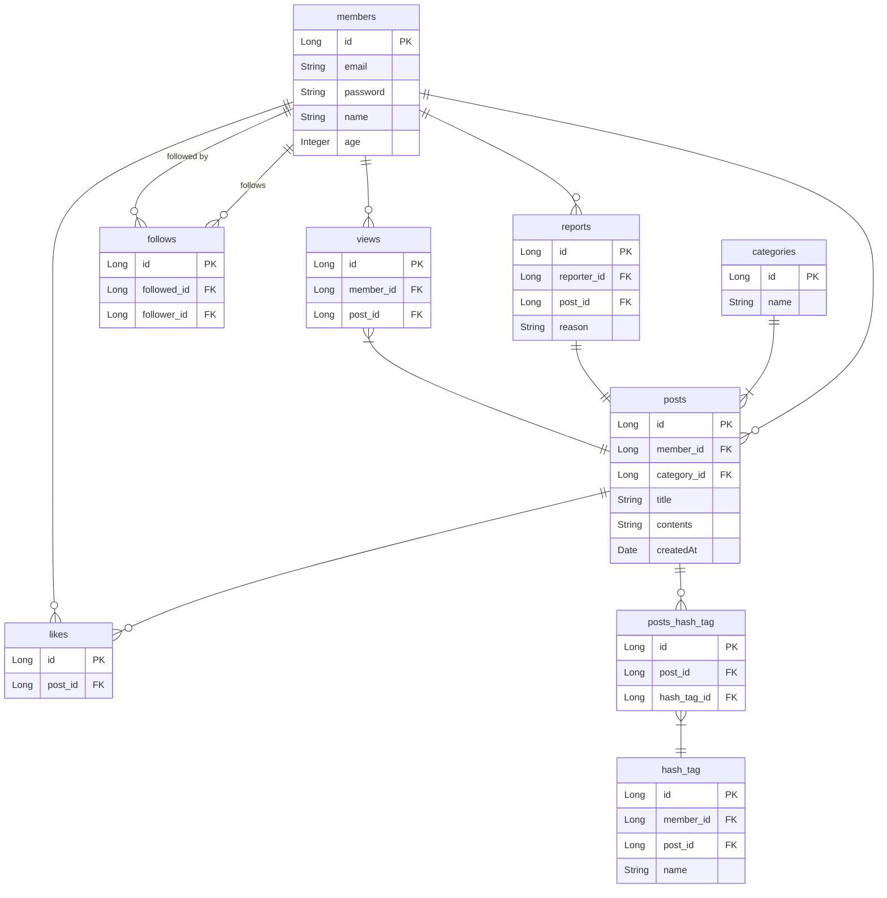

# (실습) 커뮤니티 설계

- 회원가입 기능
    - 회원가입을 할 때 이메일, 비밀번호, 이름, 나이의 정보를 받는다.
- 로그인 기능
    - 로그인할 때 이메일, 비밀번호를 활용해서 로그인한다.
- 게시글 작성 기능
    - 로그인한 사용자만 게시글을 작성할 수 있다.
    - 게시글에는 제목과 내용을 작성할 수 있고, 해시태그를 달 수 있고, 게시글의 카테고리(정보 게시글, 홍보 게시글 등)를 고를 수 있다.
- 게시글 조회 기능
    - 작성자, 게시글 제목, 게시글 내용, 게시글 작성 시간, 좋아요 수, 조회 수를 조회할 수 있어야 한다.
- 해시태그로 게시글 조회 기능
    - 특정 해시태그를 가진 모든 게시글을 조회할 수 있어야 한다.
- 좋아요 기능
    - 로그인한 사용자가 특정 게시글에 좋아요를 누를 수 있다.
    - 로그인한 사용자가 특정 게시글에 좋아요 취소를 할 수 있다.
    - 특정 게시글에 어떤 사용자들이 좋아요를 눌렀는 지 조회할 수 있어야 한다.
- 팔로우 기능
    - 특정 사용자가 다른 사용자를 팔로우 할 수 있다.
    - 특정 사용자가 다른 사용자를 언팔로우 할 수 있다.
    - 각 사용자의 팔로우 수를 조회할 수 있어야 한다.
- 신고 기능
    - 로그인한 사용자가 특정 게시글을 신고할 수 있다.
    - 신고할 때 신고 사유를 작성해야 한다.

## ✅ DB 설계 과정

1. **저장할 데이터 파악하기**

    - 이메일, 비밀번호, 이름, 나이
    - 게시글 제목, 게시글 내용, 게시글에 달린 해시태그, 게시글의 카테고리, 게시글 작성자, 게시글 작성 시간, 게시글 좋아요 수, 게시글 조회 수
    - 어떤 게시글에 어떤 사용자가 좋아요를 눌렀는 지
    - 어떤 사용자가 누구를 팔로우 했는 지
    - 팔로우 수
    - 어떤 사용자가 어떤 게시글을 신고 했는 지, 신고 사유
2. **그룹핑해서 분류하기**

    - 이메일, 비밀번호, 이름, 나이 → **사용자**
    - 게시글 제목, 게시글 내용, 게시글에 달린 해시태그, 게시글의 카테고리, 게시글 작성자, 게시글 작성 시간, 게시글 좋아요 수, 게시글 조회 수 → **게시글**
    - 어떤 게시글에 어떤 사용자가 좋아요를 눌렀는 지 → **게시글? 사용자?**
    - 어떤 사용자가 누구를 팔로우 했는 지 → **사용자?**
	- 팔로우 수 → **사용자**
	- 어떤 사용자가 어떤 게시글을 신고 했는 지, 신고 사유 → **신고**

