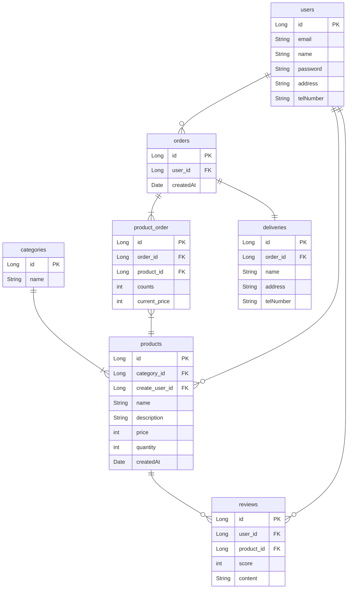

# (실습) 쇼핑몰

- 회원가입 기능
    - 회원가입 시 이메일, 비밀번호, 이름, 주소, 전화번호의 정보를 받는다.
- 로그인 기능
    - 로그인할 때 이메일과 비밀번호를 활용해서 로그인한다.
- 상품 등록 기능
    - 로그인한 사용자만 상품을 등록할 수 있다.
    - 상품에는 상품명, 설명, 가격, 재고량, 카테고리(의류, 신발, 가전제품 등)의 정보가 포함된다.
- 상품 조회 기능
    - 상품명, 설명, 가격, 재고량, 등록 시간을 조회할 수 있다.
    - 특정 카테고리의 상품만 조회할 수 있다.
- 주문 기능
    - 한 번 주문할 때 여러 개의 상품을 주문할 수 있다.
    - 각 상품의 수량을 정해서 주문할 수 있다.
    - 주문한 여러개의 상품의 가격과 수량을 기록한다.
    - 주문했을 때 상품의 총 가격을 계산할 수 있다.
    - 로그인한 사용자만 주문할 수 있다.
    - 주문 시 배송 정보(이름, 주소, 전화번호)를 입력해야 한다.
    - 주문한 날짜를 조회할 수 있어야 한다.
- 리뷰 작성 기능
    - 로그인한 사용자만 리뷰를 작성할 수 있다.
    - 상품에 대한 리뷰를 작성하고, 평점(1~5점)을 매길 수 있다.
    - 다른 사용자들이 작성한 리뷰를 조회할 수 있다.
- 관리자 기능
    - 관리자 페이지에 접근하려면 관리자용 이메일과 비밀번호를 입력해야 한다.

## **✅ DB 설계 과정**

1. **저장할 데이터 파악하기**
	- 이메일, 비밀번호, 이름, 주소, 전화번호
	- 상품명, 상품 설명, 가격, 재고량, 카테고리(의류, 신발, 가전제품 등), 상품 등록 시간, 누가 상품을 등록했는 지
	- 특정 장바구니에 포함된 상품들, 장바구니에 포함된 상품의 각 개수, 장바구니의 주인이 누군 지
	- 주문 시 배송 정보 (이름, 주소, 전화번호), 주문한 상품 및 수량, 누가 주문했는 지
	- 어떤 상품에 리뷰를 달았는 지, 리뷰 내용, 평점, 누가 리뷰를 달았는 지
	- 관리자용 이메일, 비밀번호
2. **그룹핑해서 분류하기**
	- 이메일, 비밀번호, 이름, 주소, 전화번호 → **사용자**
	- 상품명, 상품 설명, 가격, 재고량, 카테고리(의류, 신발, 가전제품 등), 상품 등록 시간, 누가 상품을 등록했는 지 → **상품**
	- 특정 장바구니에 포함된 상품들, 장바구니에 포함된 상품의 각 개수, 장바구니의 주인이 누군 지 → **장바구니**
	- 주문 시 배송 정보 (이름, 주소, 전화번호), 주문한 상품 및 수량, 누가 주문했는 지 → **주문**
	- 어떤 상품에 리뷰를 달았는 지, 리뷰 내용, 평점, 누가 리뷰를 달았는 지 → **리뷰**
	- 관리자용 이메일, 비밀번호 → **관리자**

관리자는 따로이므로 사진에서 생략함.

