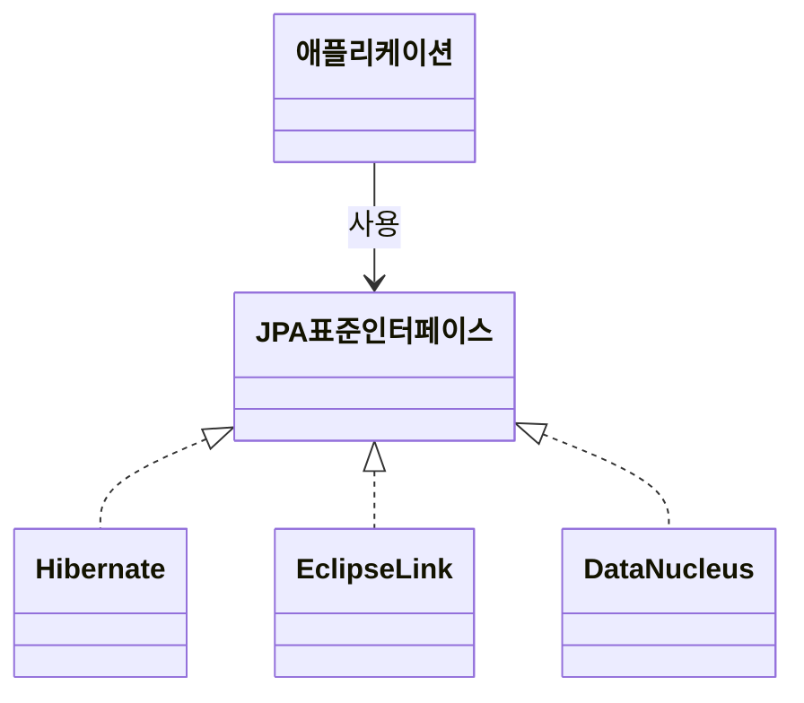

# 정의

## JPA

- Java Persistence API
- 자바 진영의 ORM 기술 표준

 

## ORM

- Object-relational mapping(객체 관계 매핑)
- 객체는 객체대로 설계
- 관계형 데이터베이스는 관계형 데이터베이스대로 설계
- ORM 프레임워크가 중간에서 매핑
- 대중적인 언어에는 대부분 ORM 기술이 존재

**JPA는 어플리케이션과 JDBC 사이에서 동작한다.**

**JPA 동작 - 저장**

**JPA 동작 - 조회**

 

## JPA는 표준 명세

- JPA는 인터페이스의 모음
- JPA 2.1 표준 명세를 구현한 3가지 구현체
- 하이버네이트, EclipseLink, DataNucleus

## JPA를 왜 사용해야 하는가?
- SQL 중심적인 개발에서 객체 중심으로 개발
- 생산성
- 유지보수
- 패러다임의 불일치 해결
- 성능
- 데이터 접근 추상화와 벤더 독립성
- 표준

### 생산성 - JPA와 CRUD

- 저장: `jpa.persist(member)`
- 조회: `Member member = jpa.find(memberId)`
- 수정: `member.setName("변경할 이름")`
- 삭제: `jpa.remove(member)`

