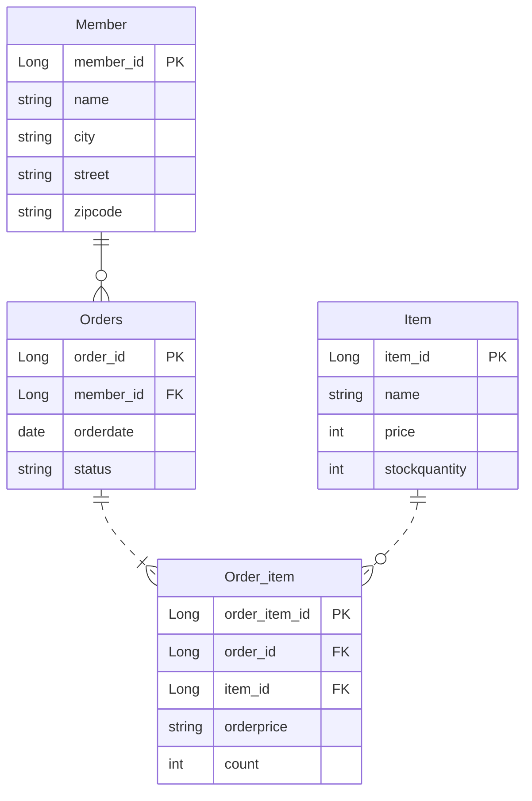

# (예제)요구사항 분석과 기본 매핑

## 요구사항 분석

- 회원은 상품을 주문할 수 있다.
- 주문 시 여러 종류의 상품을 선택할 수 있다.

## 기능 목록

- 회원 기능
	- 회원등록
	- 회원조회
- 상품 기능
	- 상품등록
	- 상품수정
	- 상품조회
- 주문 기능
	- 상품주문
	- 주문내역조회
	- 주문취소

## 도메인 모델 분석

- **회원과 주문의 관계**: **회원**은 여러 번 **주문**할 수 있다. (일대다)
- **주문과 상품의 관계**: **주문**할 때 여러 상품을 선택할 수 있다.
  반대로 같은 **상품**도 여러 번 **주문**될 수 있다. **주문상품**이라는 모델을 만들어 다대다 관계를 일대다, 다대일 관계로 풀어냄.




이걸 Object로 설계하면 아래와 같이 나옴.

하지만, 문제가 존재함.

### 데이터 중심 설계의 문제점

- 현재 방식은 객체 설계를 테이블 설계에 맞춘 방식
- 테이블의 외래키를 객체에 그대로 가져옴
- 객체 그래프 탐색이 불가능
- 참조가 없으므로 UML도 잘못됨

```java
Order order = em.find(Order.class, 1L);  
Long memberId = order.getMemberId();  
  
Member member = em.find(Member.class, memberId);
```

이런 코드가 나온다. 즉, order로 member를 찾으려면 order를 가져와서, memberId를 찾고, memberId를 통해 member를 찾음. 즉, 객체지향스럽지 않다.
관계 DB에 맞춘 설계 방식이다.

```java
Member findMember = order.getMember();
```

이 코드가 객체지향스러운 코드다.

다음 페이지에서 이어 설명한다.
