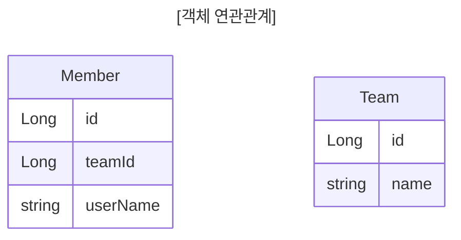
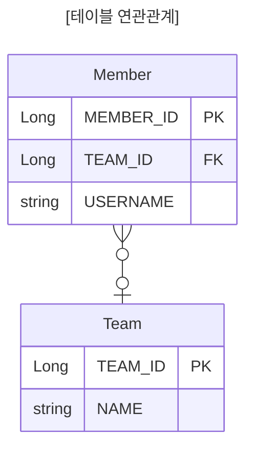

# 연관관계 매핑

## 단방향 연관관계

용어 이해
- **방향**(Direction): 단방향, 양방향
- **다중성**(Multiplicity): 다대일(N:1), 일대다(1:N), 일대일(1:1), 다대다(N:M) 이해
- **연관관계의 주인**(Owner): 객체 양방향 연관관계는 관리 주인이 필요

## 연관관계가 필요한 이유

'객체지향 설계의 목표는 자율적인 객체들의 **협력 공동체**를 만드는 것이다.'

### 예제 시나리오

- 회원과 팀이 있음.
- 회원은 하나의 팀에만 소속될 수 있다.
- 회원과 팀은 다대일 관계다.

### 객체를 테이블에 맞추어 모델링(연관관계가 없는 객체)





외래 키 식별자를 직접 다룸

```java {7}
Team team = new Team();  
team.setName("TeamA");  
em.persist(team);  
  
Member member = new Member();  
member.setName("member1");  
member.setTeamId(team.getId());  // 이 부분 이상
// member.setTeam(team); // 원랜 이게 정상
em.persist(member);
```


이제 member를 찾고, 해당 member의 team을 알고 싶다면?

```java
Member findMember = em.find(Member.class, member.getId());
Long teamId = findMember.getTeamId();
Team findTeam = em.find(Team.class, teamId);
```

이렇게 teamId를 가져와서 다시 찾아야 함. DB에 계속 물어봐야하는 상황이 생긴다.

즉, 객체를 테이블에 맞추어 데이터 중심으로 모델링하면, 협력 관계를 만들 수 없다.

- **테이블은 왜래 키로 조인**을 사용해 연관된 테이블을 찾는다.
- **객체는 참조**를 사용해서 연관된 객체를 찾는다.
- 테이블과 객체 사이에는 이런 큰 간격이 있음.

## 단방향 연관관계

### 객체 지향 모델링(객체 연관관계 사용)


Team의 id가 아니라 Team 객체 참조 값을 그대로 들고옴.

```java {8-9}
@Entity  
public class Member {  
  
    // ...
  
    // @Column(name = "TEAM_ID")  
    // private Long teamId;  
    @ManyToOne
    @JoinColumn(name = "TEAM_ID")
    private Team team;

	// ...
}
```

`Team` 객체 자체를 선언하고, `@ManytoOne` 어노테이션을 넣어줌.
Many는 Member이고, One은 Team 이라는 의미이다.

그리고 `@JoinColumn` 을 통해 어떤 FK 를 가져와 id로 매핑시킬 것인지 알려주어야 함. 즉, 관계와 관계에 join을 할 때 어떤 걸 할껀지를 정해주면 된다.

#### ORM 매핑


```java {7}
Team team = new Team();
team.setName("TeamA");
em.persist(team);

Member member = new Member();
member.setName("member1");
member.setTeam(team);  // 단방향 연관관계 설정, 참조 저장
em.persist(member);
```

teamId를 넣는게 아니라, `setTeam()` 으로 team 참조형을 직접 넣어주면 된다.

#### 객체 그래프 탐색

```java
Member findMember = em.find(Member.class, member.getId());

// Long teamId = findMember.getTeamId();
// Team findTeam = em.find(Team.class, teamId);

// 참조를 사용해 연관관계 조회
Team findTeam = findMember.getTeam();
```

그리고 찾을 경우, DB를 teamId로 조회하는게 아니라, member 객체 안에 들어있는 Team 객체 자체를 꺼낼 수 있음.

em.find() 전에

```java
em.flush();  
em.clear();
```

를 넣어주면 쿼리를 직접 select 통해 직접 조회하는 경우도 볼 수 있음.

```
select
	m1_0.MEMBER_ID,
	m1_0.USERNAME,
	t1_0.TEAM_ID,
	t1_0.name 
from
	Member m1_0 
left join
	Team t1_0 
		on t1_0.TEAM_ID=m1_0.TEAM_ID 
where
	m1_0.MEMBER_ID=?
```

이렇게 join문을 만들어 조회를 시도함.

#### 연관관계 수정

```java
// 새로운 팀B
Team teamB = new Team();
teamB.setName("TeamB");
em.persist(teamB);

// 회원1에 새로운 팀 B 설정
member.setTeam(teamB);
```

## 양방향 연관관계와 연관관계의 주인


테이블 연관관계는 아무 변화가 없다. 단, 객체는 Team 객체 안에 members(list)가 새로 만들어졌다. 즉, Team에 소속된 member를 알고 싶을 경우 사용하는 것이다.

테이블이 아무 변화가 없는 것은 FK로 join을 하는 매커니즘 때문이다.

```sql
select member_id, username
from team t 
	join member m on t.team_id = m.team_id;
```

| MEMBER_ID | USERNAME |
| --------- | -------- |
| 1         | member1  |
| 2         | member2  |

이렇게 하면 Team에 속한 멤버가 누구인지 알 수 있기 때문임.

```java
@Entity  
public class Team {  
    // ...
  
    @OneToMany(mappedBy = "team")
    private List<Member> members = new ArrayList<>();
    // new ArrayList<>() 를 붙인 이유는 관례적으로 .add() 할 경우 null 포인터 익셉션 뜨지 않게 하기 위함.
    
    // ...
}
```

이렇게 Team에 `@OneToMany` 를 넣어주면 된다. Team 입장에서 One이고, member 입장은 Many 이기 때문.
그리고 `mappedBy` 속성을 넣어주어야 함.
`mappedMy = "team"` 에서 `team` 은

```java
@Entity  
public class Member {  
    @ManyToOne  
    @JoinColumn(name = "TEAM_ID")  
    private Team team;
}
```

Member 엔티티의 `Team team` 의 team 멤버 변수 명을 의미한다.

**객체 그래프 탐색**

```java
Team findTeam = em.find(Team.class, team.getId());
int memberSize = findTeam.getMembers().size(); //역방향 조회
```

하지만, 객체는 왠만하면 단방향이 좋다.

### ⭐️⭐️⭐️ 연관관계의 주인과 mappedBy

#### 객체와 테이블이 관계를 맺는 차이

- **객체 연관관계 = 2개**
	- 회원 -> 팀 연관관계 1개 (단방향)
	- 팀 -> 회원 연관관계 1개 (단방향)
- **테이블 연관관계 = 1개**
	- 회원 <-> 팀의 연관관계 1개 (양방향)

#### 객체의 양방향 관계

- 객체의 **양방향 관계는 사실 양방향 관계가 아니라 서로 다른 단방향 관계 2개다.**
- 객체를 양방향으로 참조하려면 **단방향 연관관계를 2개** 만들어야 함.
	- A -> B (a.getB())
	- B -> A (b.getA())

#### 테이블의 양방향 연관관계

- 테이블은 **외래 키 하나**로 두 테이블의 연관관계를 관리
- `MEMBER.TEAM_ID` 외래 키 하나로 양방향 연관관계 가짐 (양쪽으로 조인할 수 있다.)

```sql
SELECT *
FROM MEMBER M
JOIN TEAM T ON M.TEAM_ID = T.TEAM_ID

SELECT *
FROM TEAM T
JOIN MEMBER M ON T.TEAM_ID = M.TEMA_ID
```

#### 둘 중 하나로 외래 키 관리해야 함


만약 member의 team 을 변경하고 싶으면 어떻게 해야하나?
- Member 객체의 team 을 변경해야 하나?
- Team의 members(list)를 변경해야 하나?
- 하지만, MEMBER 테이블의 입장에선 team_id만 변경하면 됨.

극단적으로 member 객체의 team 값은 변경했지만, team 객체의 members는 변경해주지 않았음. 그러면 오류가 발생.

따라서, Member 객체의 team으로 외래키를 관리할지, Team객체의 members(list)에서 외래 키를 관리할지 정해야 한다.

#### 연관관계의 주인(Owner)

양방향 매핑 규칙
- 객체의 두 관계 중 하나를 연관관계의 주인으로 지정
- **연관관계의 주인만이 외래 키를 관리(등록, 수정)**
- **주인이 아닌 쪽은 읽기만 가능**
- 주인은 mappedBy 속성 사용 X
- 주인이 아니면 mappedBy 속성으로 주인 지정

#### 누구를 주인으로?

- 외래 키가 있는 곳을 주인으로 정해라
- 여기서는 `Member.team` 이 연관관계의 주인


📌 Member의 team을 주인으로 두는 것을 추천한다. 즉, Many쪽에 FK를 관리하도록 하는 것이 좋다.
- 이유는, members(list) 를 변경 한다고 가정
- 그러면 Member table에도 update 쿼리가 발생한다.
- team 안의 members를 변경했는데 TEAM, MEMBER 두 테이블 모두 SQL이 발생되어 버림.
- 그렇게 되면 헷갈림.
하지만,
- Member 객체의 team만 변경하면
- Team 객체의 members(list)도 변경은 되지만
- table을 변경하는 sql은 발생하지 않음. (단순 객체 읽기만 하므로)
- 헷갈림이 줄어듦.

#### 양방향 매핑시 가장 많이 하는 실수

연관관계의 주인에 값을 입력하지 않음.

```java
Member member = new Member();  
member.setName("member1");

Team team = new Team();  
team.setName("TeamA");  
// 역방향 (주인이 아닌 방향)만 연관관계 설정
team.getMembers().add(member);  
em.persist(team);
```
