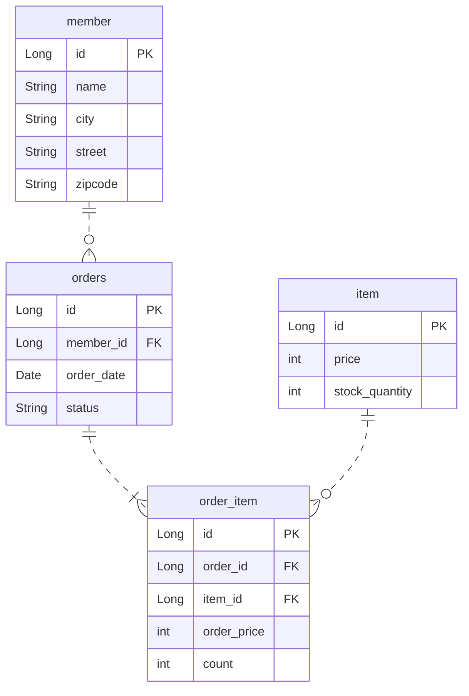

# (예제) 연관관계 매핑 시작

## 구조

### 테이블 구조

### 객체 구조

![[assets/images/d95b524f3fa54b019d7a14ac20d26f6c_MD5.png]]

## 단방향
```java
@Entity  
@Table(name = "ORDERS")
public class Order {
	// @Column(name = "MEMBER_ID")
	// private Long memberId;
	  
	@ManyToOne
	@JoinColumn(name = "MEMBER_ID")  
	private Member member;
}
```
위와 같이 Column으로 FK를 직접 지정해주었다면 단방향 매핑으로, `@ManyToOne`, `@JoinColumn` 두 개 어노테이션을 걸어주만 자연스럽게 FK 매핑 + 객체 매핑이 완료 된다.

## 양방향
```java
@Entity  
public class Member {  
  
    @OneToMany(mappedBy = "member")  
    private List<Order> orders = new ArrayList<>();
}
```
`@OneToMany` 에 `mappedBy` 로 Order의 지역변수인 member에 걸어주면 된다.

**핵심은 단방향으로 왠만하면 설계해라!**
