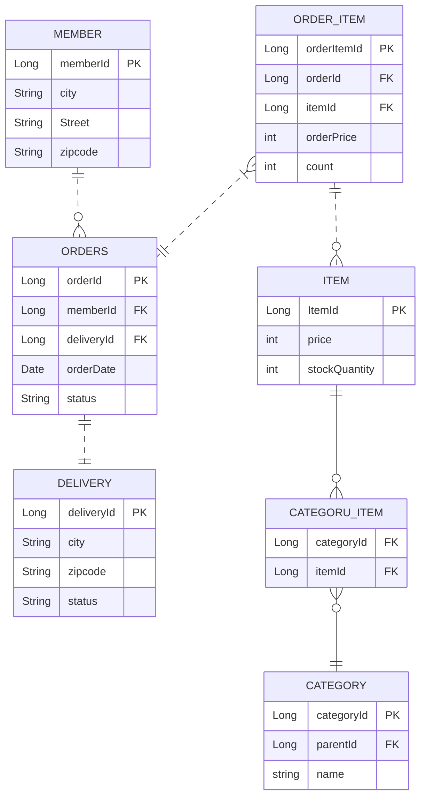

# (예제) 다양한 연관관계 매핑

## 배송, 카테고리 추가 - 엔티티

- 주문과 배송은 1:1 (`@OneToMany`)
- 상품과 카테고리는 N:M (`@ManyToMany`)

## N:M 관계는 1:N, N:1로

- 테이블의 N:M 관계는 중간 테이블을 이용해 1:N, N:1
- 실전에서는 중간 테이블이 단순하지 않음.
- `@ManyToMany` 는 제약: 필드 추가x, 엔티티 테이블 불일치
- 실전에서는 `@ManyToMany` 사용 X
