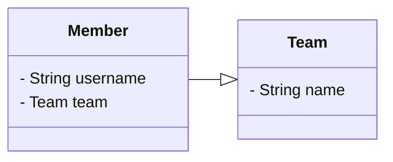

# 프록시

## 프록시

Member를 조회할 때 Team도 함께 조회해야 할까?

회원과 팀 함께 출력
```java {5}
public void printUserAndTeam(String memberId) {
  Member member = em.find(Member.lcass, memberId);
  Team team = member.getTeam();
  System.out.println("회원 이름: " + member.getUsername());
  System.out.println("소속팀: " + team.getName());
}
```
회원만 출력
```java
public void printUser(String memberId) {
  Member member = em.find(Member.lcass, memberId);
  Team team = member.getTeam();
  System.out.println("회원 이름: " + member.getUsername());
}
```
만약 Team을 사용하지도 않는데 둘 다 sql로 땡겨오면 손해다.
프록시는 이를 해결함.

### 프록시 기초

- `em.find()` vs `em.getReference()`
- `em.find()`: DB를 통해 실제 엔티티 객체 조회
- `em.getReference()`: **DB 조회를 미루는 가짜(프록시) 엔티티 객체 조회**

![[assets/images/e30733ef02d02c2c2aac59a1cb44c806_MD5.png]]```java
Member findMember = em.find(Member.class, member.getId());

System.out.println("findMember.getId() = " + findMember.getId());
System.out.println("findMember.getName() = " + findMember.getName());

``````

Hibernate:
    select
        m1_0.MEMBER_ID,
        m1_0.city,
        m1_0.name,
        m1_0.street,
        m1_0.zipcode
    from
        Member m1_0
    where
        m1_0.MEMBER_ID=?
findMember.getId() = 1
findMember.getName() = user1

```
이렇게 `select` 문이 나가고 log가 찍혔다.
```java {1}
Member findMember = em.getReference(Member.class, member.getId());

System.out.println("findMember.getId() = " + findMember.getId());
System.out.println("findMember.getName() = " + findMember.getName());
``````
findMember.getId() = 1
Hibernate: 
    select
        m1_0.MEMBER_ID,
        m1_0.city,
        m1_0.name,
        m1_0.street,
        m1_0.zipcode 
    from
        Member m1_0 
    where
        m1_0.MEMBER_ID=?
findMember.getName() = user1
```
- `getReference()` 를 하는 시점에는 쿼리가 나가지 않는다.
- `getId()` 가 먼저찍힌 이유는 쿼리를 찾을 때 이미 넣었기 때문에 1차 캐시에 있는걸 갖고 왔기 때문이고
- `getName()` 메서드로 실제 값이 필요한 경우는 쿼리를 날려 가져옴.
- 즉, 호출하는 시점에 나중에 가져오는 것
```java
System.out.println("findMember = " + findMember.getClass());
// findMember = class jpabook.jpashop.domain.Member$HibernateProxy$mmuEaBVD
```
이렇게 나오는데, `Member$HibernateProxy$mmuEaBVD` 이게 찍힘. 즉, 하이버네이트의 가짜 객체임.

### 프록시 특징

- 실제 클래스를 상속 받아서 만들어짐
- 실제 클래스와 겉 모양이 같음
- 사용하는 입장에서는 진짜 객체인지 프록시 객체인지 구분하지 않고 사용하면 됨(이론상)

![[assets/images/e7b16a89ae50a9129fcf27b24b56244a_MD5.png]]

- 프록시 객체는 실제 객체의 참조(target)를 보관
- 프록시 객체를 호출하면 프록시 객체는 실제 객체의 메소드를 호출

![[assets/images/8392e4be79f5fc935845d3e283567cbe_MD5.png]]```java
Member member = em.getReference(Member.class, “id1”);
member.getName();
```
![[assets/images/ddd2b4ee6b482f9165018e88e405aa04_MD5.png]]

⭐️ 중요한 특징
- 프록시 객체는 처음 사용할 때 한 번만 초기화
- 프록시 객체를 초기화 할 때, 프록시 객체가 실제 엔티티로 바뀌는 것은 아님, 초기화되면 프록시 객체를 통해서 실제 엔티티에 접근 가능
- 프록시 객체는 원본 엔티티를 상속받음, 따라서 타입 체크시 주의해야함 (== 비교 실패, 대신 instance of 사용)
- 영속성 컨텍스트에 찾는 엔티티가 이미 있으면 em.**getReference()**를 호출해도 실제 엔티티 반환
- 영속성 컨텍스트의 도움을 받을 수 없는 준영속 상태일 때, 프록시를 초기화하면 문제 발생 (하이버네이트는 org.hibernate.LazyInitializationException 예외를 터트림)

### 프록시 확인

- **프록시** **인스턴스의** **초기화** **여부** **확인**
	PersistenceUnitUtil.isLoaded(Object entity)
- **프록시** **클래스** **확인** **방법**
	entity.getClass().getName() 출력(..javasist.. or HibernateProxy…)
- **프록시** **강제** **초기화**
	org.hibernate.Hibernate.initialize(entity);
- 참고: JPA 표준은 강제 초기화 없음
	강제 호출: **member.getName()**
