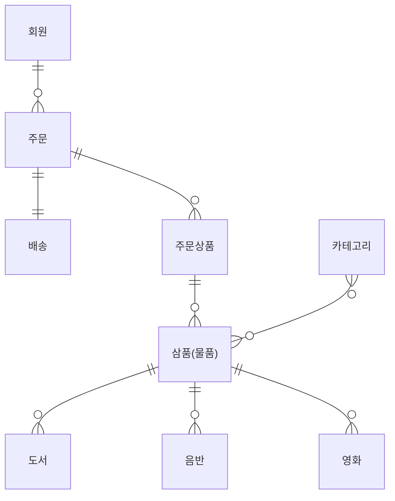

# 설계

## 요구사항 분석

- 회원 기능
	- 회원 등록
	- 회원 조회
- 상품 기능
	- 상품 등록
	- 상품 수정
	- 상품 조회
- 주문 기능
	- 상품 주문
	- 주문 내역 조회
	- 주문 취소
- 기타 요구사항
	- 상품은 재고 관리가 필요하다.
	- 상품의 종류는 도서, 음반, 영화가 있다.
	- 상품을 카테고리로 구분할 수 있다.
	- 상품 주문시 배송 정보를 입력할 수 있다.

## 도메인 모델과 테이블 설계

![[assets/images/2a714df8e4eff2f0d6389fc7db0930fe_MD5.png]]

- 회원, 주문, 상품의 관계
	- 회원은 여러 상품 주문 가능
	- 한 번 주만할 대 여러 상품을 선택 가능.
	- 다대다
	- 하지만 다대다는 DB와 엔티티에서도 거의 사용하지 않음.
	- 따라서 그림처럼 주문상품이라는 엔티티를 추가해 다대다 관계를 일대다, 다대일 관계로 품.
- 상품 분류
	- 상품은 도서, 음반, 영화로 구분. 상품이라는 공통 속성을 사용하므로 상속 구조로 표현.

### 회원 엔티티 분석

![[assets/images/b5a6bcb11da19055c3dd44001a005683_MD5.png]]
**회원(Member)**
- 이름과 임베디드 타입인 주소(`Address`), 그리고 주문(`orders`) 리스트를 가진다.

**주문(Order)**
- 한 번 주문시 여러 상품을 주문할 수 있으므로 주문과 주문상품(`OrderItem`)은 일대다 관계임.
- 상품을 주문한 회원과 배송 정보, 주문날짜, 주문 상태(`status`)를 가지고 있다.
- 주문 상태는 열거형을 사용했는데 주문(`ORDER`), 취소(`CANCEL`) 을 표현할 수 있다.

**주문상품(OrderItem)**
- 주문한 상품 정보와 주문 금액(`orderPrice`), 주문 수량(`count`) 정보
- 보통 `OrderLine`, `LineItem` 으로 사용됨.

**상품(Item)**
- 이름, 가격, 재고수량을 가짐.
- 상품을 주문하면 재고수량이 줄어듦.
- 상품 종류는 도서, 음반, 영화 존재. 각 속성이 조금씩 다름

**배송(Delivery)**
- 주문 시 하나의 배송 정보를 생성. 주문과 배송은 일대일 관계

**카테고리(Category)**
- 상품과 다대다.
- `parent`, `child` 로 부모, 자식 카테고리 연결함.

**주소(Address)**
- 값 타입(임베디드 타입).
- 회원, 배송에서 사용함.

> 📌 참고: 회원이 주문을 하기 때문에, 회원이 주문 리스트를 가지는 것은 얼핏 보면 잘 설계한 것 같지만, 객체 세상은 실제와는 다름. 실무에서는 회원이 주문을 참조하지 않고, 주문이 회원을 참조하는 것으로 충분함. 여기서는 일대다, 다대일의 양방향 연관관계를 맺지만, 사실은 단방향 연관관계를 맺는게 맞다.

![[assets/images/a358df0181c582d5b14276cdb9097813_MD5.png]]

### 연관관계 매핑 분석

**회원과 주문**: 일대다, 다대일의 양방향 관계다. 따라서 연관관계의 주인을 정해야 하는데, 외래 키가 있는 주문을 연관

관계의 주인으로 정하는 것이 좋다. 그러므로 `Order.member` 를 `ORDERS.MEMBER_ID` 외래 키와 매핑한다.

**주문상품과 주문**: 다대일 양방향 관계다. 외래 키가 주문상품에 있으므로 주문상품이 연관관계의 주인이다. 그러므로

`OrderItem.order` 를 `ORDER_ITEM.ORDER_ID` 외래 키와 매핑한다.

**주문상품과 상품**: 다대일 단방향 관계다. `OrderItem.item` 을 `ORDER_ITEM.ITEM_ID` 외래 키와 매핑한다.

**주문과 배송**: 일대일 양방향 관계다. `Order.delivery` 를 `ORDERS.DELIVERY_ID` 외래 키와 매핑한다.

**카테고리와 상품**: `@ManyToMany` 를 사용해서 매핑한다.(실무에서 @ManyToMany는 사용하지 말자. 여기서는 다대다 관계를 예제로 보여주기 위해 추가했을 뿐이다)

> 📌 왜래키가 있는 곳은 연관관계의 주인으로 정해라.
> 연관관계의 주인은 단순히 왜래 키를 누가 관리하냐의 문제이지, 비즈니스상 우위에 있다고 주인으로 정하면 안된다. 예를 들어 자동차와 바퀴가 있으면, 일대다 관계에서 항상 다쪽에 왜래키가 있으므로 왜래 키가 있는 바퀴를 연관관계의 주인으로 정하면 된다. 물론 자동차를 연관관계의 주인으로 정하는 것이 불가능한 것은 아니지만, 자동차를 연관관계의 주인으로 정하면 자동차가 관리하지 않는 바퀴 테이블의 왜래 키 값이 업데이트 되므로 관리와 유지보수가 어렵고, 추가적으로 별도의 업데이트 쿼리가 발생하는 성능 문제도 있음.
