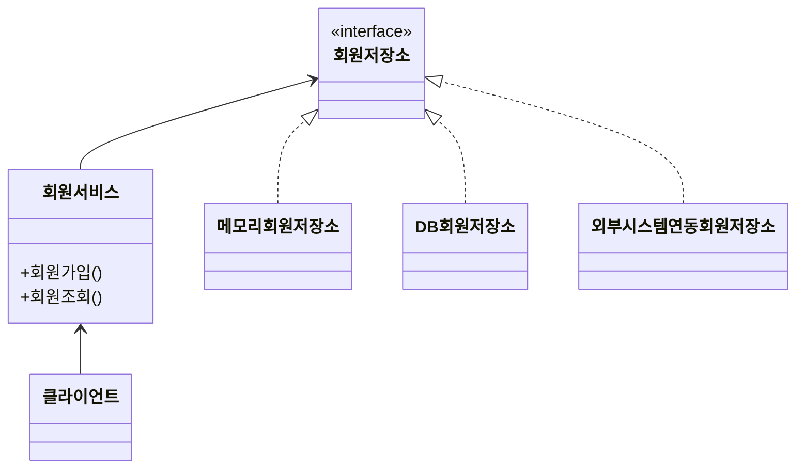
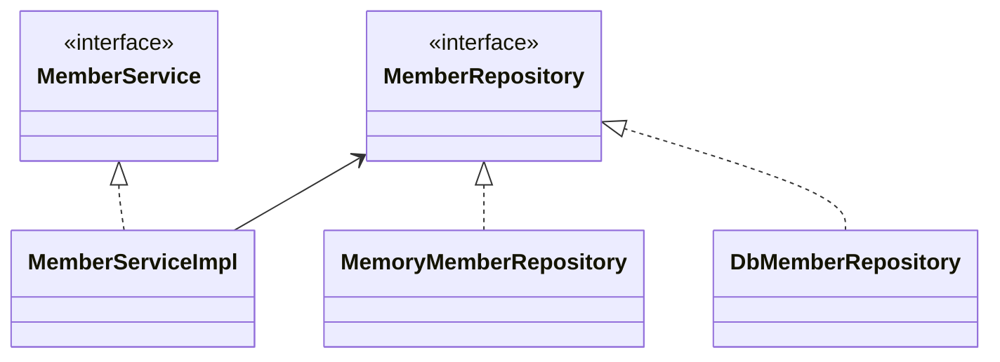
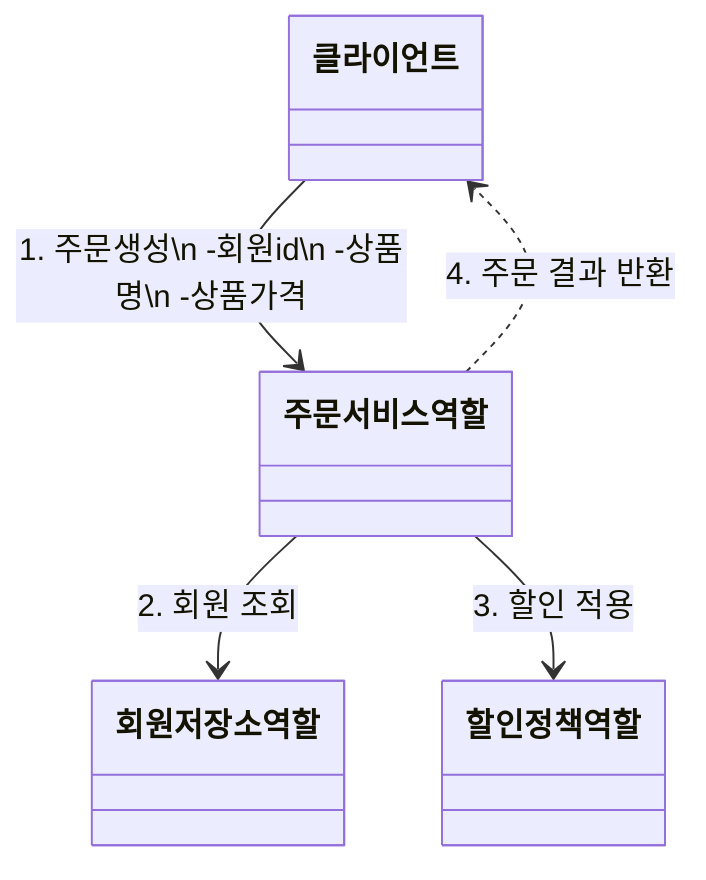
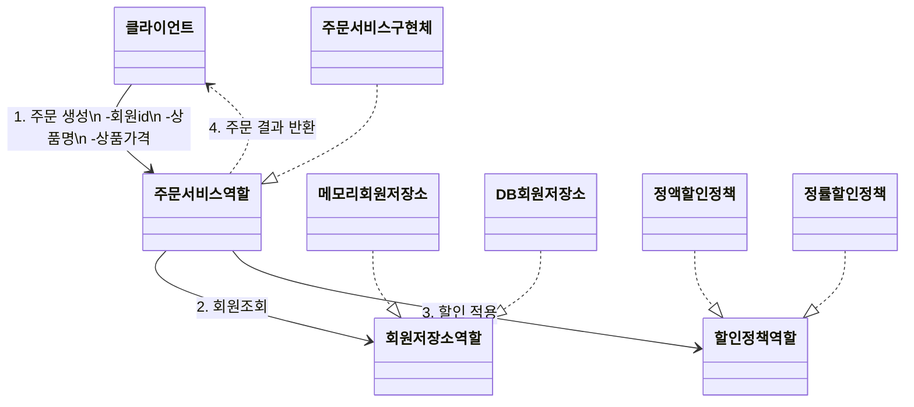
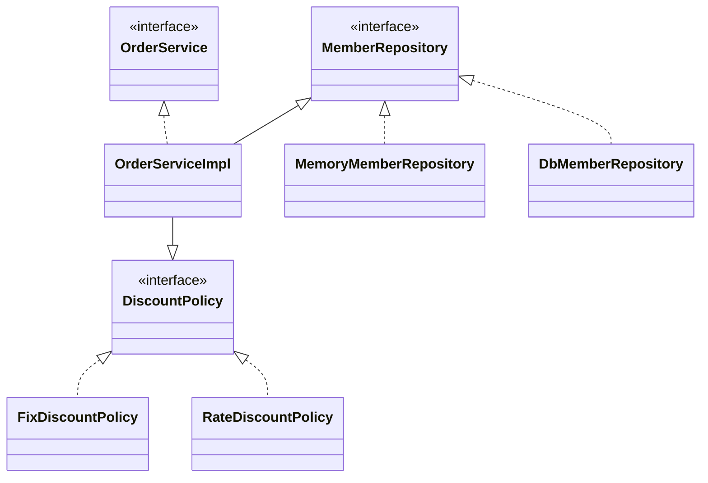
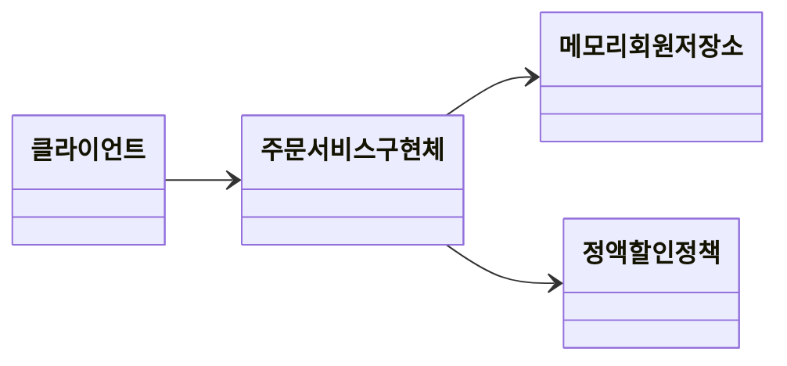
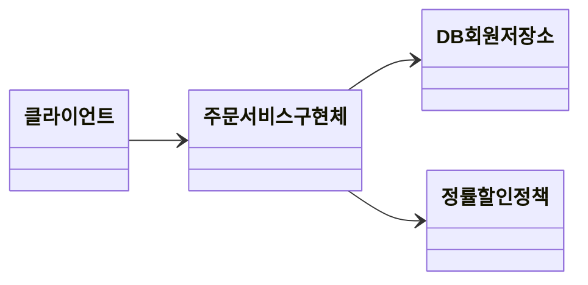

# 비즈니스 요구사항과 설계

- 회원
  - 회원을 가입하고 조회할 수 있다.
  - 회원은 일반과 VIP 두 가지 등급이 있다.
  - 회원 데이터는 자체 DB를 구축할 수 있고, 외부 시스템과 연동할 수 있다. (미확정)
- 주문과 할인 정책
  - 회원은 상품을 주문할 수 있다.
  - 회원 등급에 따라 할인 정책을 적용할 수 있다.
  - 할인 정책은 모든 VIP는 1000원을 할인해주는 고정 금액 할인을 적용해달라. (나중에 변경될 수 있다)
  - 할인 정책은 변경 가능성이 높다. 회사의 기본 할인 정책을 아직 정하지 못했고, 오픈 직전까지 고민을 미루고 싶다. 최악의 경우 할인을 적용하지 않을 수도 있다. (미확정)

<br/>

요구사항을 보면 회원 데이터, 할인 정책 같은 부분은 지금 결정하기 어려운 부분. 그렇다고 정책이 결정될 때 까지 개발을 무기한 기다릴 수도 없음. 객체 지향 설계 방법으로 함.

인터페이스를 만들고 구현체 언제든지 갈아끼울 수 있도록 설계하면 됨.

<br/>

## 회원 도메인 설계

**회원 도메인 협력 관계**



**회원 클래스 다이어그램**



**회원 객체 다이어그램**


<br/>

## 회원 도메인 개발

entity -> repository -> service -> controller 순으로 만드심. 단, service 만들고 test 코드 바로 짬.

... 개발 생략

<br/>

## 테스트

```java
public class MemberServiceTest {

    private MemberService memberService;

    @BeforeEach
    void beforeEach() {
        memberService = new MemberServiceImpl();
    }

    @Test
    void join() {
        // given
        Member member = new Member(1L, "memberA", Grade.VIP);

        // when
        memberService.join(member);
        Member findMember = memberService.findMember(1L);

        // then
        assertThat(findMember).isEqualTo(member);
    }
}
```

회원 도메인 설계의 문제점

- 이 코드의 설계상 문제점은 무엇?
- 다른 저장소로 변경할 때 OCP 원칙을 잘 준수할까?
- DIP를 잘 지키고 있나?
- 의존관계가 인터페이스 뿐만 아니라 구현까지 모두 의존하는 문제가 있음.
  - -> 주문까지 만들고나서 문제점과 해결 방안을 설명


<br/>

## 주문과 할인 도메인 설계

**주문 도메인 협력, 역할, 책임**



1. 주문 생성: 클라이언트는 주문 서비스에 주문 생성을 요청한다.
2. 회원 조회: 할인을 위해서는 회원 등급이 필요하다. 그래서 주문 서비스는 회원 저장소에서 회원을 조회한다.
3. 할인 적용: 주문 서비스는 회원 등급에 따른 할인 여부를 할인 정책에 위임한다.
4. 주문 결과 반환: 주문 서비스는 할인 결과를 포함한 주문 결과를 반환한다.

**주문 도메인 전체**



**역할과 구현을 분리**해서 자유롭게 구현 객체를 조립할 수 있게 설계함. 덕분에 회원 저장소는 물론이고, 할인 정책도 유연하게 변경할 수 있음.

**주문 도메일 클래스 다이어그램**



**주문 도메인 객체 다이어그램1**



회원을 메모리에서 조회하고, 정액 할인 정책(고정 금액)을 지원해도 주문 서비스를 변경하지 않아도 된다. 역할들의 협력 관계를 그대로 재사용할 수 있다.

**주문 도메인 객체 다이어그램2**



회원을 메모리가 아닌 실제 DB에서 조회하고, 정률 할인 정책(주문 금액에 따라 % 할인)을 지원해도 주문 서비스를 변경하지 않아도 된다.

