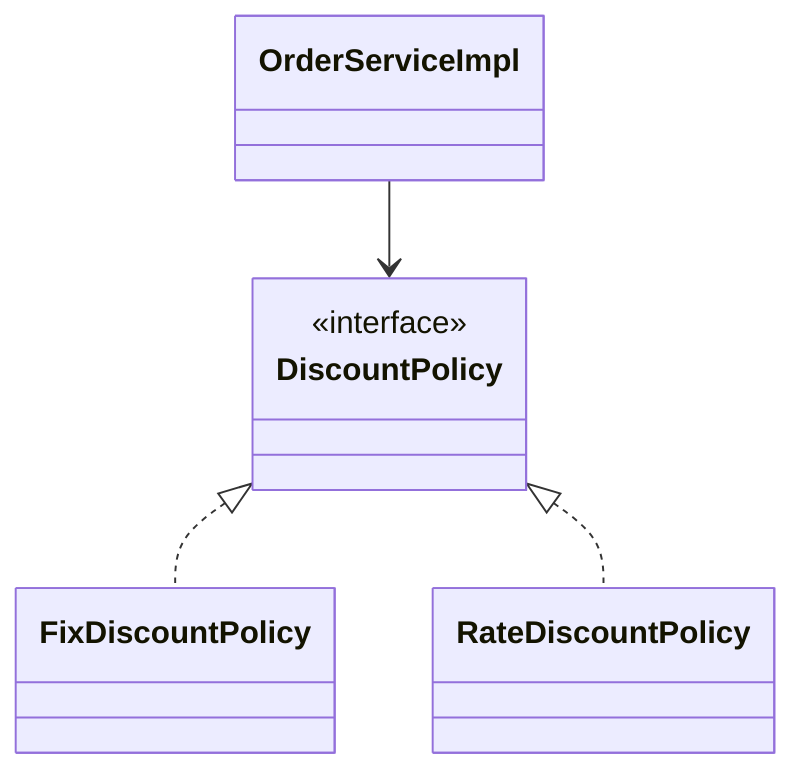
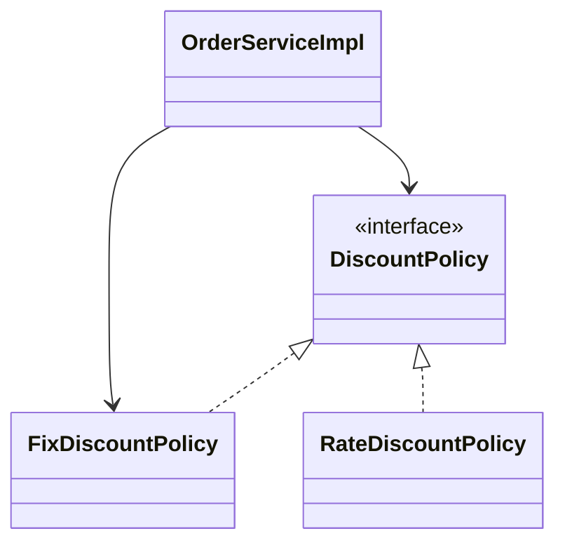
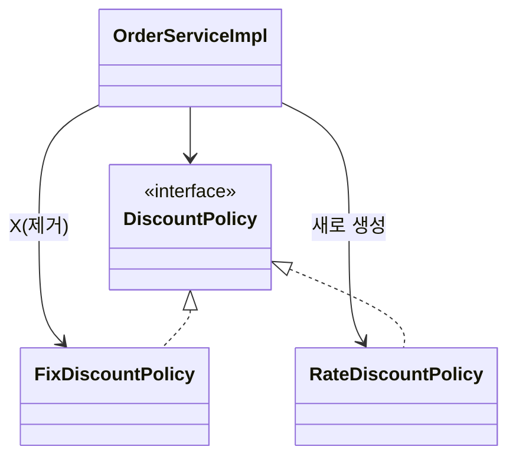

# 0.4 객체지향 원리 적용 - 문제점

할인 정책 변경하려면 클라이언트인 `OrderServiceImpl` 코드를 고쳐야 함.

```java
public class OrderServiceImpl implements OrderService {

    // private final DiscountPolicy discountPolicy = new FixDiscountPolicy();
    private final DiscountPolicy discountPolicy = new RateDiscountPolicy();
  
    // ...
}
```

**문제점 발견**

- 역할과 구현을 충실하게 분리했다. -> OK
- 다형성도 활용하고, 인터페이스와 구현 객체를 분리했다. -> OK
- OCP, DIP 같은 객체 지향 설계 원칙을 충실히 준수함
	- -> 그렇게 보이지만 사실은 아님
- DIP: 주문 서비스 클라이언트(`OrderServiceImpl`)은 `DiscountPolicy` 인터페이스에 의존하면서 DIP를 지킨 것 같은데?
  - -> 클래스 의존관계를 분석해보자. 추상(인터페이스) 뿐 아니라 **구체(구현) 클래스에도 의존**하고 있다.
    - 추상(인터페이스) 의존: `DiscountPolicy`
    - 구체(구현) 클래스: `FixDiscountPolicy`, `RateDiscountPolicy`
- OCP: 변경하지 않고 확장할 수 있다고 했는데!
	- **-> 지금 코드는 기능을 확장해서 변경하면, 클라이언트 코드에 영향을 준다!** 따라서 **OCP를 위반**한다.

**왜 클라이언트 코드를 변경해야 할까?**

클래스 다이어그램으로 의존관계를 분석해보자.

**기대했던 의존관계**



**실제 의존관계**



클라이언트인 `OrderServiceImpl` 이 `DiscountPolicy` 인터페이스 뿐 아니라 `FixDiscountPolicy` 인 구체 클래스도 함께 의존하고 있음. 셀제 코드를 보면 의존하고 있음. **DIP 위반**

**정책 변경**



**어떻게 해결?**

- 클라이언트 코드인 `OrderServiceImpl` 은 `DiscountPolicy` 의 인터페이스 뿐 아니라 구체 클래스도 함께 의존한다.
- 그래서 구체 클래스를 변경할 때 클라이언트 코드도 함께 변경해야 함.
- **DIP 위반** -> 추상에만 의존하도록 변경(인터페이스에만 의존)
- DIP를 위반하지 않도록 인터페이스에만 의존하도록 의존관계를 변경하면 된다.

**인터페이스에만 의존하도록 설계 변경**


**인터페이스에만 의존하도록 코드 변경**

```java
public class OrderServiceImpl implements OrderService {
    // private final DiscountPolicy discountPolicy = new RateDiscountPolicy();
  	private final DiscountPolicy discountPolicy;
    // ...
}
```

- 인터페이스에만 의존하도록 설계와 코드를 변경함.
- 그런데 구현체가 없는데 어떻게 코드 실행함?
- 실제 실행해보면 NPE(null pointer exception)이 발생.

**해결방안**

- 이 문제를 해결하려면 누군가가 클라이언트인 `OrderServiceImpl` 에 `DiscountPolicy` 의 구현 객체를 대신 생성하고 주입해주어야 함.
