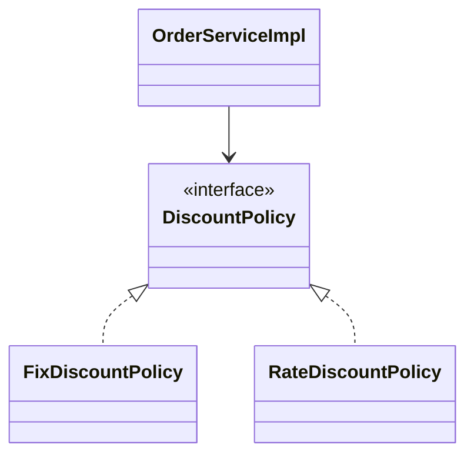
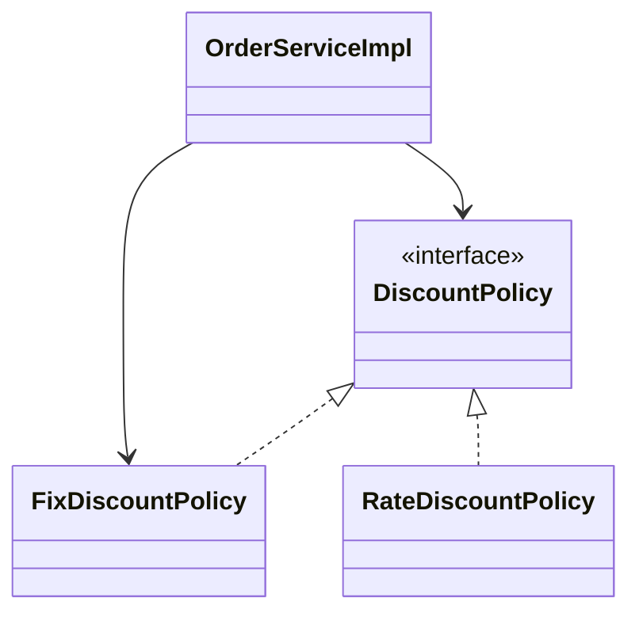
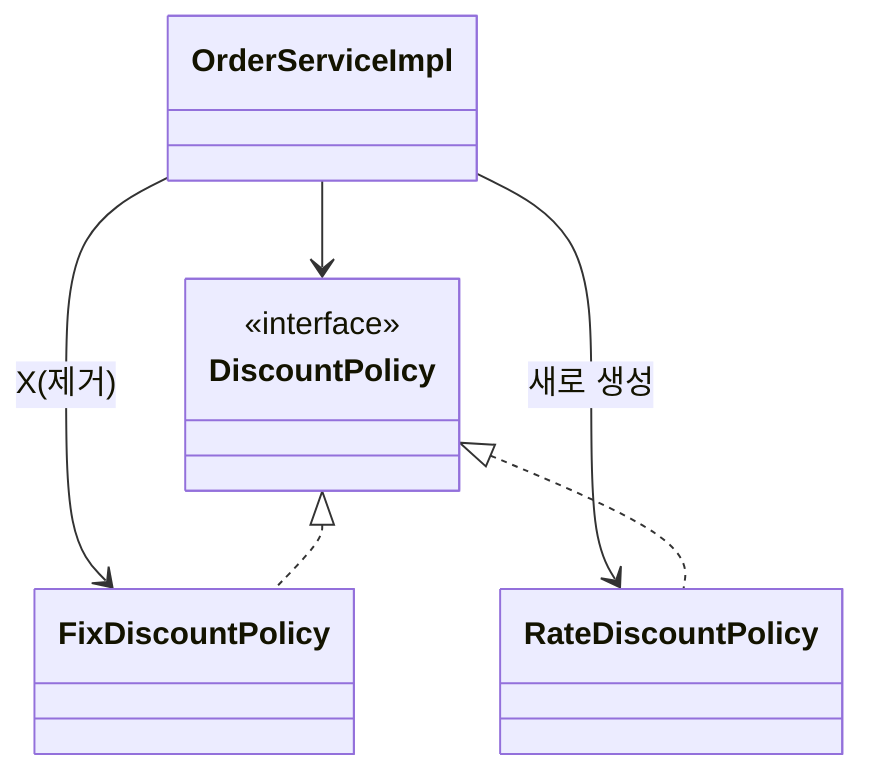
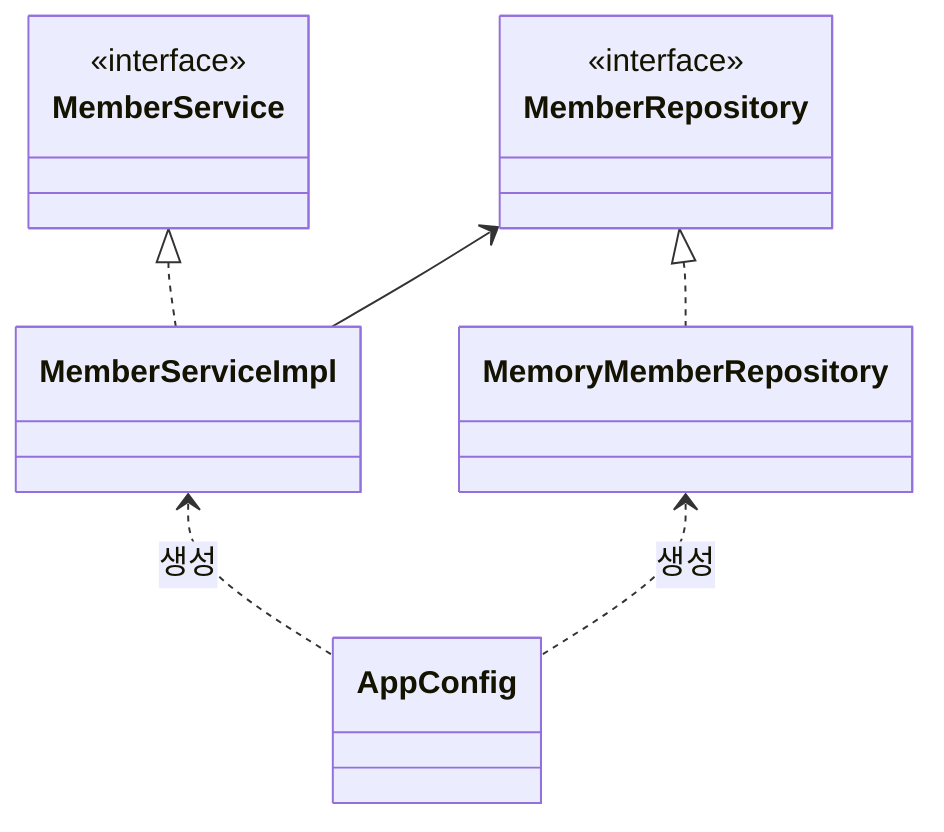
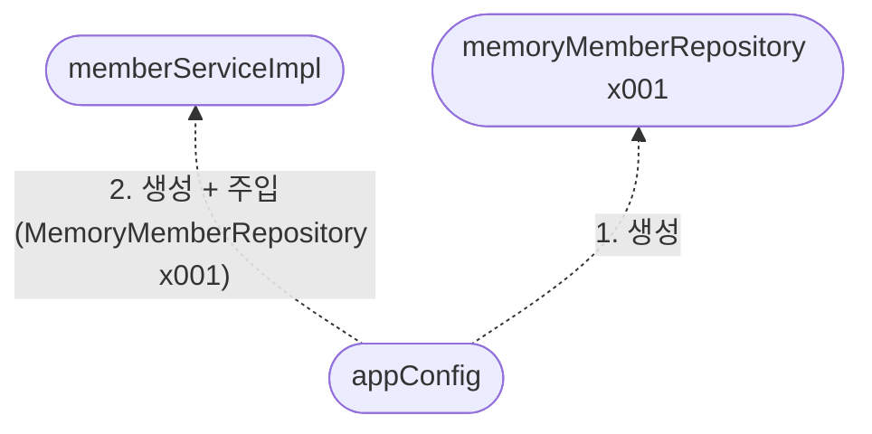
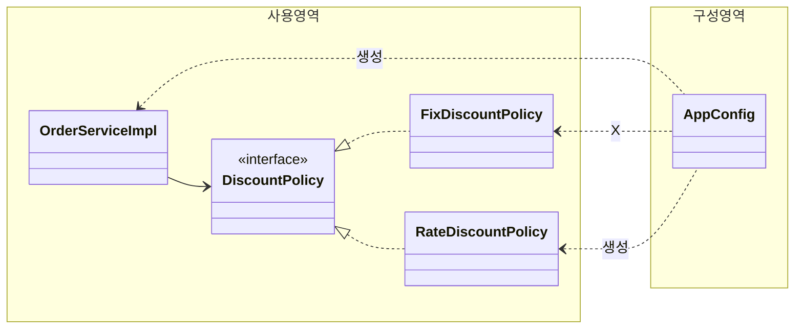

# 0.4 객체지향 원리 적용

할인 정책 변경하려면 클라이언트인 `OrderServiceImpl` 코드를 고쳐야 함.

```java
public class OrderServiceImpl implements OrderService {

    // private final DiscountPolicy discountPolicy = new FixDiscountPolicy();
    private final DiscountPolicy discountPolicy = new RateDiscountPolicy();
  
    // ...
}
```

**문제점 발견**

- 역할과 구현을 충실하게 분리했다. -> OK
- 다형성도 활용하고, 인터페이스와 구현 객체를 분리했다. -> OK
- OCP, DIP 같은 객체 지향 설계 원칙을 충실히 준수함
  - -> 그렇게 보이지만 사실은 아님
- DIP: 주문 서비스 클라이언트(`OrderServiceImpl`)은 `DiscountPolicy` 인터페이스에 의존하면서 DIP를 지킨 것 같은데?
  - -> 클래스 의존관계를 분석해보자. 추상(인터페이스) 뿐 아니라 **구체(구현) 클래스에도 의존**하고 있다.
    - 추상(인터페이스) 의존: `DiscountPolicy`
    - 구체(구현) 클래스: `FixDiscountPolicy`, `RateDiscountPolicy`
- OCP: 변경하지 않고 확장할 수 있다고 했는데!
  - **-> 지금 코드는 기능을 확장해서 변경하면, 클라이언트 코드에 영향을 준다!** 따라서 **OCP를 위반**한다.

<br/>

**왜 클라이언트 코드를 변경해야 할까?**

클래스 다이어그램으로 의존관계를 분석해보자.

**기대했던 의존관계**



**실제 의존관계**



클라이언트인 `OrderServiceImpl` 이 `DiscountPolicy` 인터페이스 뿐 아니라 `FixDiscountPolicy` 인 구체 클래스도 함께 의존하고 있음. 셀제 코드를 보면 의존하고 있음. **DIP 위반**

**정책 변경**



**어떻게 해결?**

- 클라이언트 코드인 `OrderServiceImpl` 은 `DiscountPolicy` 의 인터페이스 뿐 아니라 구체 클래스도 함께 의존한다.
- 그래서 구체 클래스를 변경할 때 클라이언트 코드도 함께 변경해야 함.
- **DIP 위반** -> 추상에만 의존하도록 변경(인터페이스에만 의존)
- DIP를 위반하지 않도록 인터페이스에만 의존하도록 의존관계를 변경하면 된다.

**인터페이스에만 의존하도록 설계 변경**


**인터페이스에만 의존하도록 코드 변경**

```java
public class OrderServiceImpl implements OrderService {
    // private final DiscountPolicy discountPolicy = new RateDiscountPolicy();
  	private final DiscountPolicy discountPolicy;
    // ...
}
```

- 인터페이스에만 의존하도록 설계와 코드를 변경함.
- 그런데 구현체가 없는데 어떻게 코드 실행함?
- 실제 실행해보면 NPE(null pointer exception)이 발생.

**해결방안**

- 이 문제를 해결하려면 누군가가 클라이언트인 `OrderServiceImpl` 에 `DiscountPolicy` 의 구현 객체를 대신 생성하고 주입해주어야 함.

<br/>

## 관심사의 분리

### AppConfig의 등장

- 어플리케이션의 전체 동작 방식을 구성(config)하기 위해, "**구현 객체를 생성**" 하고 "**연결**" 하는 책임을 가지는 별도의 설정 클래스를 만듦.

```java
public class AppConfig {

    public MemberService memberService() {
        return new MemberServiceImpl(new MemoryMemberRepository());
    }

    public OrderService orderService() {
        return new OrderServiceImpl(new MemoryMemberRepository(), new FixDiscountPolicy());
    }

}
```

- AppConfig는 어플 실제 동작에 필요한 **구현 객체를 생성**함.
  - `MemberServiceImpl`
  - `MemoryMemberRepository`
  - `OrderServiceImpl`
  - `FixDiscountPolicy`
- AppConfig는 생성한 객체 인스턴스의 참조(레퍼런스)를 **생성자를 통해 주입(연결)** 해준다.
  - `MemberServiceImpl` -> `MemoryMemberRepository`
  - `OrderServiceImpl` -> `MemoryMemberRepository`, `FixDiscountPolicy`

**`MemberServiceImp` - 생성자 주입**

```java
public class MemberServiceImpl implements MemberService {
    private final MemberRepository memberRepository;

    public MemberServiceImpl(MemberRepository memberRepository) {
        this.memberRepository = memberRepository;
    }

    @Override
    public void join(Member member) {
        memberRepository.save(member);
    }

    @Override
    public Member findMember(Long memberId) {
        return memberRepository.findById(memberId);
    }
}
```

- 설계 변경으로 `MemberServiceImpl` 은 `MemoryMemberRepository` 를 의존하지 않는다!
- 단지 `MemberRespository` 인터페이스만 의존함.
- `MemberServiceImpl` 입장에서 생성자를 통해 어떤 구현 객체가 들어올지(주입될지)는 알 수 없음.
- `MemberServiceImpl` 의 생성자를 통해 어떤 구현 객체를 주입할지는 오직 외부(`AppConfig`)에서 결정됨.
- `MemberServiceImpl` 은 이제부터 **의존관계에 대한 고민은 외부**에 맡기고 **실행에만 집중**하면 된다.

**그림 - 클래스 다이어그램**



- 객체의 생성과 연결은 `AppConfig` 가 담당함.
- **DIP 완성**: `MemberServiceImpl` 은 `MemberRepository` 인 추상화에만 의존하면 된다. 이제 구체 클래스를 몰라도 된다.
- **관심사의 분리**: 객체를 생성하고 연결하는 역할과 실행하는 역할이 명확히 분리됨.

**그림 - 회원 객체 인스턴스 다이어그램**



- `appConfig` 객체는 `memoryMemberRepository` 객체를 생성하고 그 참조 값을 `memberServiceImpl` 을 생성하면서 생성자로 전달한다.
- 클라이언트인 `memberServiceImpl` 입장에서 보면 의존관계를 마치 외부에서 주입해주는 것 같다고 해서 DI(Dependency Injection) 우리말로 의존관계 주입 또는 의존성 주입이라 함.

<br/>

## 정리

- AppConfig를 통해 관심사를 확실히 분리했음.
- AppConfig는 공연 기획자.
- AppConfig는 구체 클래스를 선택함. 배역에 맞는 담당 배우 선택. 어플리케이션이 어떻게 동작해야할지 전체 구성을 책임짐.
- 이제 각 배우들은 담당 기능을 실행하는 책임만 지면 된다.
- `OrderServiceImpl` 은 기능을 실행하는 책임만 지면 된다.


