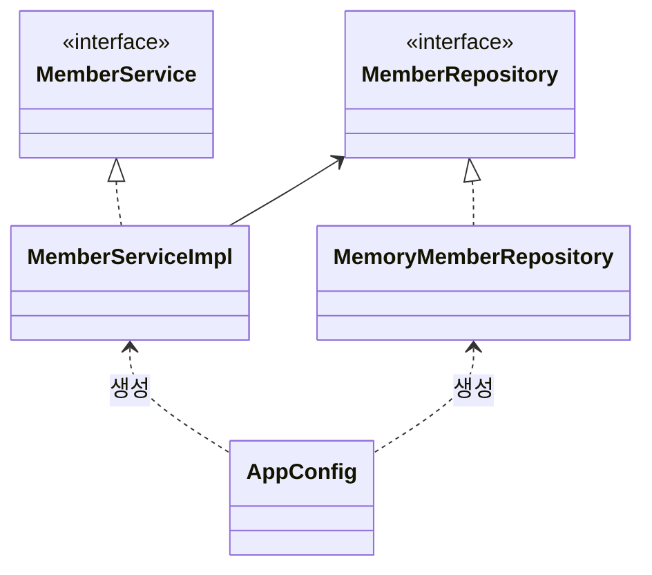
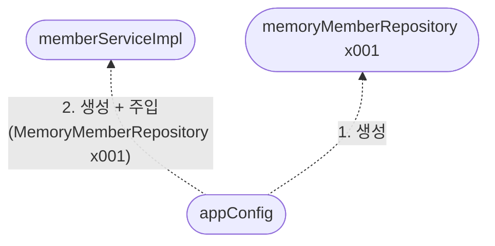
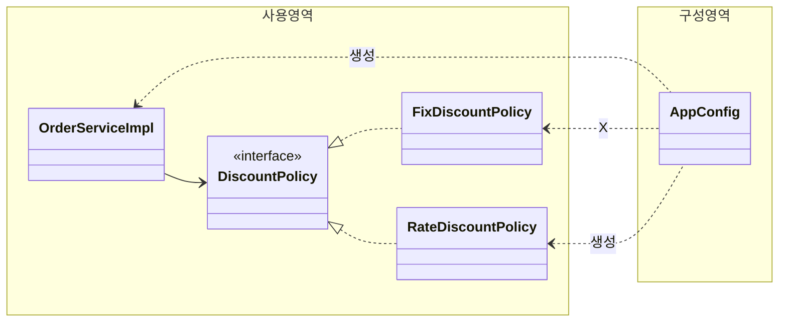

# 관심사 분리

- 어플리케이션을 공연이라 생각
- 공연하면 역할을 누가 할지 배우들이 정하는게 아님.
- 배우는 본인의 역할인 배역을 수행하는 것에만 집중
- 주인공에 어떤 사람이 선택 되더라도 그 역할을 할 수 있어야 함.
- 공연 구성, 담당배우 섭외, 역할에 맞는 배우를 지정하는 책임을 담당하는 별도의 **공연 기획자**가 필요.
- 기획자와 배우의 책임을 확실히 구분한다.

## AppConfig 등장

어플리케이션의 전체 동작 방식을 구성(config) 하기 위해, **구현 객체를 생성**하고, **연결**하는 책인을 가지는 별도의 설정 클래스 필요.

```java
public class AppConfig {

    public MemberService memberService() {
        return new MemberServiceImpl(new MemoryMemberRepository());
    }

    public OrderService orderService() {
        return new OrderServiceImpl(new MemoryMemberRepository(), new FixDiscountPolicy());
    }
}
```

- AppConfig는 어플 실제 동작에 필요한 **구현 객체를 생성**함.
  - `MemberServiceImpl`
  - `MemoryMemberRepository`
  - `OrderServiceImpl`
  - `FixDiscountPolicy`
- AppConfig는 생성한 객체 인스턴스의 참조(레퍼런스)를 **생성자를 통해 주입(연결)** 해준다.
  - `MemberServiceImpl` -> `MemoryMemberRepository`
  - `OrderServiceImpl` -> `MemoryMemberRepository`, `FixDiscountPolicy`

**`MemberServiceImp` - 생성자 주입**

```java
public class MemberServiceImpl implements MemberService {
    private final MemberRepository memberRepository;

    public MemberServiceImpl(MemberRepository memberRepository) {
        this.memberRepository = memberRepository;
    }

    @Override
    public void join(Member member) {
        memberRepository.save(member);
    }

    @Override
    public Member findMember(Long memberId) {
        return memberRepository.findById(memberId);
    }
}
```

- 설계 변경으로 `MemberServiceImpl` 은 `MemoryMemberRepository` 를 의존하지 않는다!
- 단지 `MemberRespository` 인터페이스만 의존함.
- `MemberServiceImpl` 입장에서 생성자를 통해 어떤 구현 객체가 들어올지(주입될지)는 알 수 없음.
- `MemberServiceImpl` 의 생성자를 통해 어떤 구현 객체를 주입할지는 오직 외부(`AppConfig`)에서 결정됨.
- `MemberServiceImpl` 은 이제부터 **의존관계에 대한 고민은 외부**에 맡기고 **실행에만 집중**하면 된다.

**그림 - 클래스 다이어그램**



- 객체의 생성과 연결은 `AppConfig` 가 담당함.
- **DIP 완성**: `MemberServiceImpl` 은 `MemberRepository` 인 추상화에만 의존하면 된다. 이제 구체 클래스를 몰라도 된다.
- **관심사의 분리**: 객체를 생성하고 연결하는 역할과 실행하는 역할이 명확히 분리됨.

그림 - 회원 객체 인스턴스 다이어그램



- `appConfig` 객체는 `memoryMemberRepository` 객체를 생성하고 그 참조 값을 `memberServiceImpl` 을 생성하면서 생성자로 전달한다.
- 클라이언트인 `memberServiceImpl` 입장에서 보면 의존관계를 마치 외부에서 주입해주는 것 같다고 해서 DI(Dependency Injection) 우리말로 의존관계 주입 또는 의존성 주입이라 함.

## 정리

- AppConfig를 통해 관심사를 확실히 분리했음.
- AppConfig는 공연 기획자.
- AppConfig는 구체 클래스를 선택함. 배역에 맞는 담당 배우 선택. 어플리케이션이 어떻게 동작해야할지 전체 구성을 책임짐.
- 이제 각 배우들은 담당 기능을 실행하는 책임만 지면 된다.
- `OrderServiceImpl` 은 기능을 실행하는 책임만 지면 된다.


