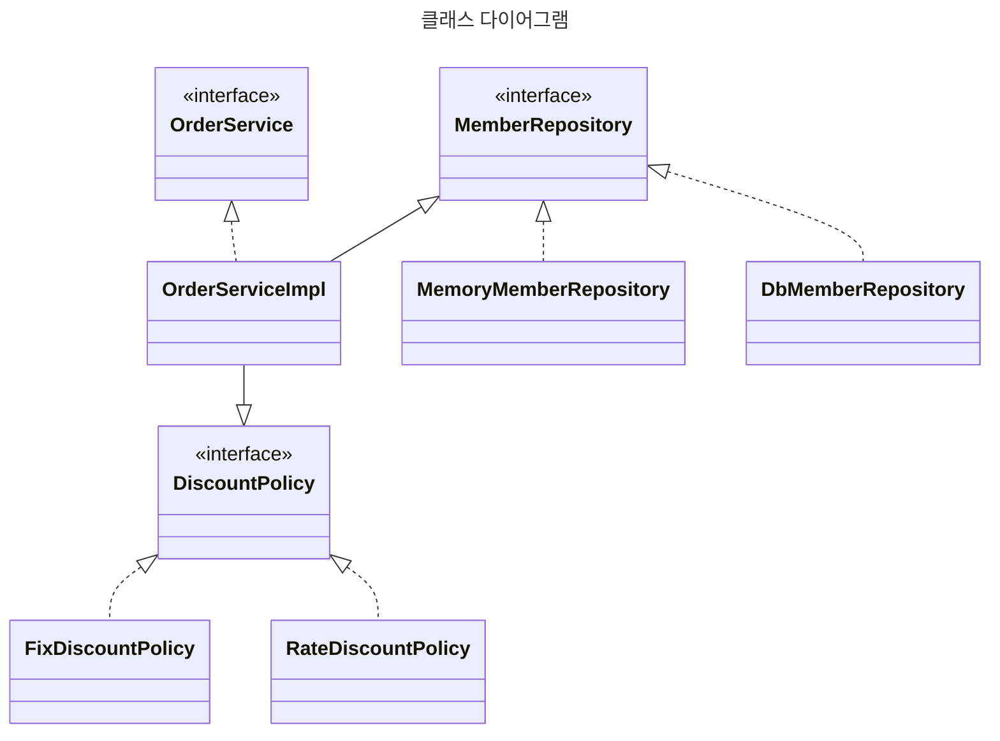
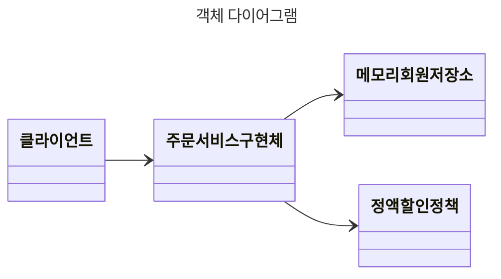

# 0.5 IoC, DI, 그리고 컨테이너

## 제어의 역전 IoC(Inversion of Control)

- 기존 프로그램은 클라이언트 구현 객체가 스스로 필요한 서버 구현 객체를 생성하고, 연결하고, 실행했다. 즉, 구현 객체가 프로그램의 제어 흐름을 스스로 조종함. 개발자 입장에서는 자연스러움.
- 반면 AppConfig가 등장한 이후 구현 객체는 자신의 로직을 실행하는 역할만 함. 프로그램의 제어 흐름은 이제 AppConfig 몫임. 예를 들어 `OrderServiceImpl` 은 필요 인터페이스들을 호출하지만 어떤 구현 객체들이 실행될지 모름.
- 프로그램에 대한 제어 흐름에 대한 권한은 모두 AppConfig가 가지고 있음. 심지어 `OrderServiceImpl` 도 AppConfig가 생성. 그리고 AppConfig는 `OrderServiceImpl` 이 아닌 OrderService 인터페이스의 다른 구현 객체를 생성하고 실행할 수도 있음. 그런 사실도 모른채 `OrderServiceImpl` 은 묵묵히 자신의 로직 실행할 뿐.
- 이렇게 프로그램 제어 흐름을 직접 제어하는 것이 아니라 외부에서 관리하는 것을 제어의 역전(IoC) 라 함.

 

## 프레임워크 vs 라이브러리

- 프레임워크가 내가 작성한 코드를 제어하고, 대신 실행하면 그것은 프레임워크가 맞다. (JUnit)
- 반면 내가 작성한 코드가 직접 제어의 흐름을 담당한다면 그것은 프레임워크가 아니라 라이브러리다.

 

## 의존관계 주입 DI(Dependency Injection)

- `OrderServiceImpl` 은 `DiscountPolicy` 인터페이스에 의존함. 실제 어떤 구현 객체가 사용될지는 모름.
- 의존관계는 "**정적인 클래스 의존 관계와, 실행 시점에 결정되는 동적인 객체(인스턴스) 의존 관계**" 둘을 분리해서 생각해야 함.

**정적인 클래스 의존관계**

클래스가 사용하는 import 코드만 보고 의존관계를 쉽게 판단할 수 있음. 정적 의존관계는 어플리케이션을 실행하지 않아도 분석할 수 있음. 그런데 클래스 의존관계 만으로는 실제 어떤 객체가 주입될지 알 수 없다.

**동적인 객체 인스턴스 의존관계**

어플리케이션 실행 시점에 실제 생성된 객체 인스턴스의 참조가 연결된 의존 관계.

- 어플리케이션 **실행 시점(런타임)**에 외부에서 실제 구현 객체를 생성하고 클라이언트에 전달해서 클라이언트와 서버의 실제 의존관계가 연결 되는 것을 의존관계 주입이라 함.
- 객체 인스턴스를 생성하고, 그 참조 값을 전달해서 연결된다.
- DI 사용하면 클라 코드를 변경하지 않고, 클라가 호출하는 대상의 타입 인스턴스를 변경 가능.
- DI 사용하면 정적 클래스 의존관계를 변경하지 않고, 동적인 객체 인스턴스 의존관계를 쉽게 변경 가능.

 

## IoC 컨테이너, DI 컨테이너

- AppConfig 처럼 객체를 생성하고 관리하면서 의존관계를 연결해주는 것을 IoC 컨테이너 또는 **DI 컨테이너**라 함.
- 의존관계 주입에 초점을 맞춰 최근에는 주로 DI 컨테이너라 함.
- 또는 어샘블러, 오브젝트 팩토리 등으로 불림.
