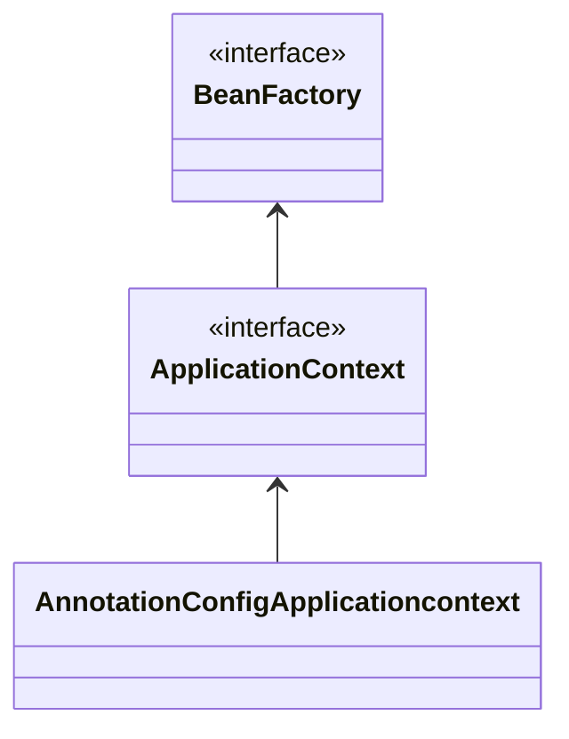
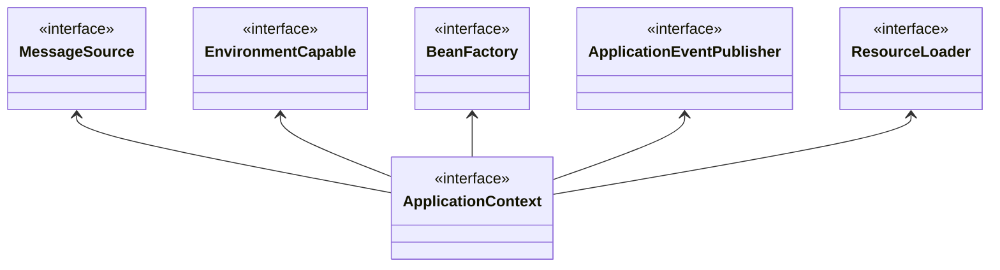
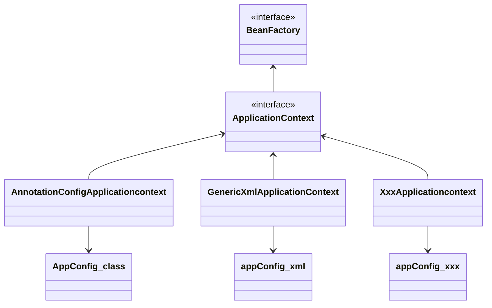

# BeanFactory와 ApplicationContext

## 인터페이스

- `ApplicationContext` 는 인터페이스임.
- 스프링 컨테이너는 XML을 기반으로 만들 수 있고, 어노테이션 기반의 자바 설정 클래스로 만들 수 있음.
- 직전 `AppConfig` 를 사용했던 방식이 어노테이션 기반의 자바 설정 클래스로 스프링 컨테이너를 만든 것임.



**BeanFactory**

- 스프링 컨테이너의 최상위 인터페이스.
- 스프링 빈을 관리하고 조회하는 역할 담당.
- `getBean()` 을 제공.
- 지금까지 우리가 사용했던 대부분의 기능은 BeanFactory가 제공하는 기능.

**ApplicationContext**

- BeanFactory 기능을 모두 상속받아 제공함.
- 빈을 관리하고 검색하는 기능을 BeanFactory가 제공해주는데, 차이는?
- 어플리케이션을 개발할 때는 빈은 관리하고 조회하는 기능은 물론이고, 수 많은 부가 기능이 필요함.

**ApplicationContext가 제공하는 부가기능**



- **메시지소스를 활용한 국제화 기능** (MessageSource)
  - 예를 들어 한국에서 들어오면 한국어로, 영어권에서 들어오면 영어로 출력
- **환경변수** (EnvironmentCapable)
  - 로컬, 개발, 운영등을 구분해서 처리
- **어플리케이션 이벤트** (ApplicationEventPublisher)
  - 이벤트를 발행하고 구독하는 모델을 편리하게 지원
- **편리한 리소스 조회** (ResourceLoader)
  - 파일, 클래스패스, 외부 등에서 리소스를 편리하게 조회

**정리**

- ApplicationContext는 BeanFactory의 기능을 상속 받는다.
- ApplicationContext는 빈 관리기능 + 편리한 부가 기능을 제공.
- BeanFactory를 직접 사용할 일은 거의 없음. 부가기능이 포함된 ApplicationContext를 사용.
- BeanFactory나 ApplicationContext를 스프링 컨테이너라 함.

# 다양한 설정 형식 지원 - 자바 코드, XML

스프링 컨테이너는 다양한 형식의 설정 정보를 받아드릴 수 있게 유연하게 설계되어 있음. (자바 코드, XML, Groovy 등)



## 어노테이션 기반 자바 코드 설정 사용

- 지금까지 했던 것
- `new AnnotationConfigApplicationcontext(AppConfig.class)`
- `AnnotationConfigApplicationcontext` 클래스를 사용하면서 자바 코드로 된 설정 정보를 넘기면 된다.

## XML 설정 사용

- 최근엔 스프링 부트를 많이 사용하면서 XML 기반 설정은 잘 사용하지 않음. 아직 레거시 플젝이 XML로 되어 있고, 또 XML을 사용하면 컴파일 없이 빈 설정 정보를 변경할 수 있는 장점도 있으므로 한번쯤 배워두는 것도 괜찮.
- `GenericXmlApplicationContext` 를 사용하면서 `xml` 설정 파일을 넘기면 된다.

```java
public class XmlAppContext {

    @Test
    void xmlAppContext() {
        ApplicationContext ac = new GenericXmlApplicationContext("appConfig.xml");
        MemberService memberService = ac.getBean("memberService", MemberService.class);
        assertThat(memberService).isInstanceOf(MemberService.class);
    }
}
```

resource 하위에 appConfig.xml 파일생성.

```xml
<?xml version="1.0" encoding="UTF-8"?>
<beans xmlns:xsi="http://www.w3.org/2001/XMLSchema-instance"
       xmlns="http://www.springframework.org/schema/beans"
       xsi:schemaLocation="http://www.springframework.org/schema/beans http://www.springframework.org/schema/beans/spring-beans.xsd">

    <bean id="memberService" class="hello.core.member.MemberServiceImpl">
        <constructor-arg name="memberRepository" ref="memberRepository"/>
    </bean>
    <bean id="memberRepository"
          class="hello.core.member.MemoryMemberRepository"/>
    <bean id="orderService" class="hello.core.order.OrderServiceImpl">
        <constructor-arg name="memberRepository" ref="memberRepository"/>
        <constructor-arg name="discountPolicy" ref="discountPolicy"/>
    </bean>
    <bean id="discountPolicy" class="hello.core.discount.RateDiscountPolicy"/>
</beans>
```

- xml 기반의 `appConfig.xml` 스프링 설정 정보와 자바 코드로 된 `AppConfig.java` 설정 정보를 비교해보면 거의 비슷하다는 것을 알 수 있다.

근데 거의 사용 안함.
