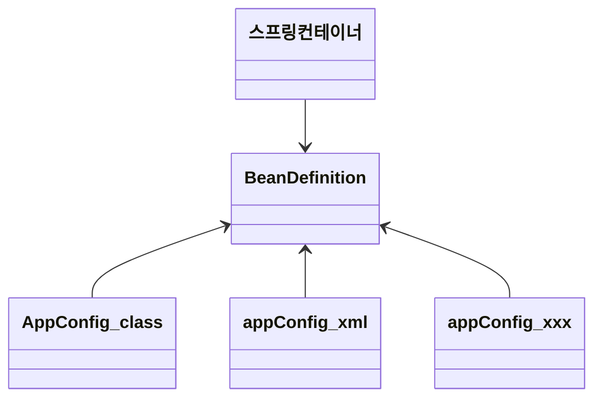
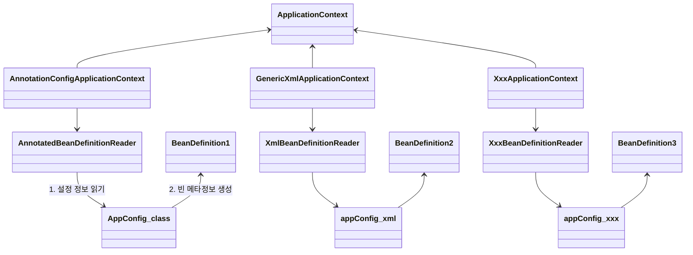

# 빈 설정 메타 정보 - BeanDefinition

스프링은 어떻게 이런 다양한 설정 형식을 지원할까? 중심에는 `BeanDefinition` 이라는 추상화가 있음.

- **역할과 구현을 개념적으로 나눈 것**
	- XML을 읽어 BeanDefinition을 만들면 된다.
	- 자바 코드를 읽어 BeanDefinition을 만들면 된다.
	- 스프링 컨테이너는 자바 코드인지, XML인지 몰라도 됨. 오직 BeanDefinition만 알면 됨.
- `BeanDefinition` 을 **빈 설정 메타정보**라 함.
	- `@Bean`, `<bean>` 당 각각 하나씩 메타 정보가 생성됨.
- 스프링 컨테이너는 이 메타 정보를 기반, 스프링 빈을 생성.



코드 레벨로 조금 더 깊이 있게 들어가보자.



- `AnnotationConfigApplicationContext` 는 `AnnotatedBeanDefinitionReader` 를 사용해 `AppConfig.class` 를 읽고 `BeanDefinition` 을 생성함.
- `GenericXmlApplicationContext` 는 `XmlBeanDefinitionReader` 를 사용해 `appConfig,xml` 을 읽고 `BeanDefinition` 을 생성함.
- 새로운 형식의 설정 정보가 추가되면, `XxxBeanDefinitionReader` 를 만들어 `BeanDefinition` 을 생성하면 됨.

## BeanDefinition 살펴보기

### BeanDefinition 정보

- BeanClassName: 생성할 빈의 클래스 명(자바 설정 처럼 팩토리 역할의 빈을 사용하면 없음)
- factoryBeanName: 팩토리 역할의 빈을 사용할 경우 이름, 예) appConfig
- factoryMethodName: 빈을 생성할 팩토리 메서드 지정, 예) memberService
- Scope: 싱글톤(기본 값)
- lazyInit: 스프링 컨테이너를 생성할 때 빈을 생성하는 것이 아니라, 실제 빈을 사용할 때까지 최대한 생성을 지연처리 하는지 여부
- InitMethodName: 빈을 생성하고, 의존관계를 적용한 뒤에 호출되는 초기화 메서드 명
- DestoryMethodName: 빈의 생명주기가 끝나서 제거하기 직전에 호출되는 메서드 명
- Constructor arguments, Properties: 의존관계 주입에서 사용한다. (자바 설정 처럼 팩토리 역할의 빈을 사용하면 없음)

```java
public class BeanDefinitionTest {

    AnnotationConfigApplicationContext ac = new AnnotationConfigApplicationContext(AppConfig.class);

    @Test
    @DisplayName("빈 설정 메타정보 확인")
    void findApplicationBean() {
        String[] beanDefinitionNames = ac.getBeanDefinitionNames();
        for (String beanDefinitionName : beanDefinitionNames) {
            BeanDefinition beanDefinition = ac.getBeanDefinition(beanDefinitionName);

            if (beanDefinition.getRole() == BeanDefinition.ROLE_APPLICATION) {
                System.out.println("beanDefinitionName = " + beanDefinitionName
                        + " beanDefinition" + beanDefinition);
            }
        }
    }
}
```

**정리**

- BeanDefinition을 직접 생성해서 스프링 컨테이너에 등록할 수도 있다. 하지만 실무에서 BeanDefinition을 직접 정의하거나 사용할 일은 거의 없음.
- BeanDefinition에 대해서 너무 깊이 있게 이해하기 보다는, 스프링이 다양한 형태의 설정 정보를 BeanDefinition으로 추상화해서 사용하는 것 정도만 이해하면 됨.
- 가끔 스프링 코드나 스프링 관련 오픈소스의 코드를 볼 때, BeanDefinition이라는 것이 보일 때가 있음. 이런 매커니즘을 떠올리면 됨.
