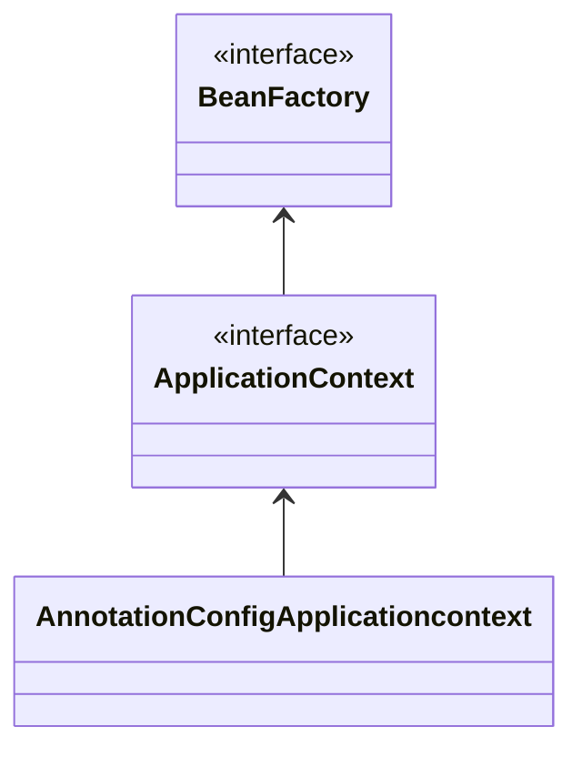
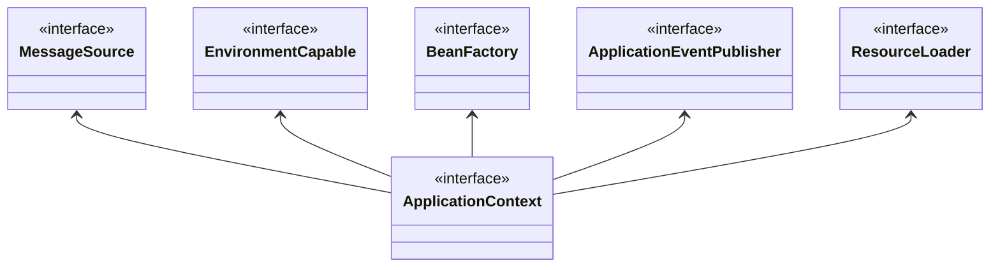
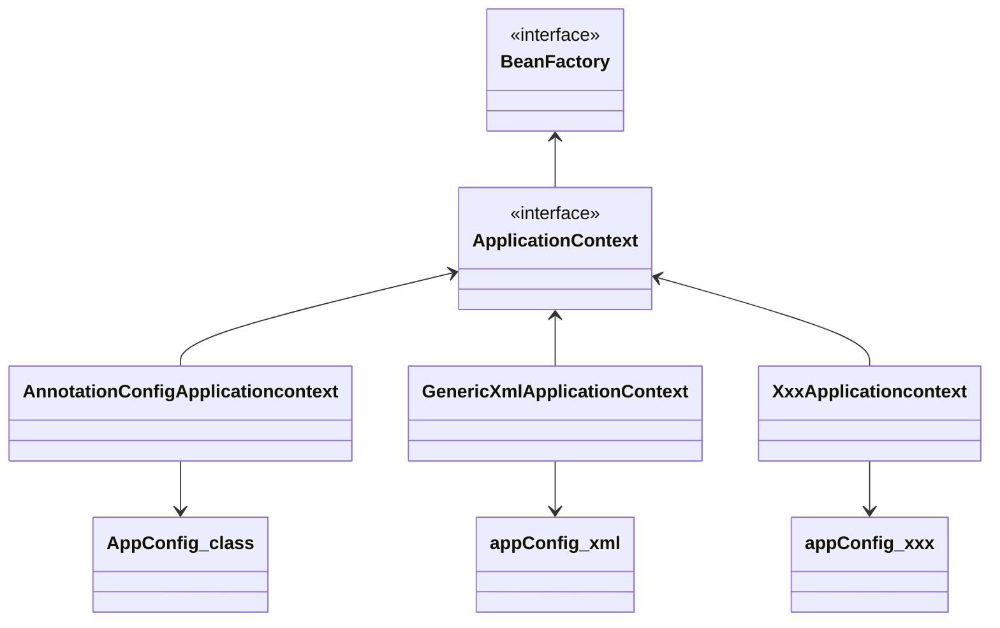
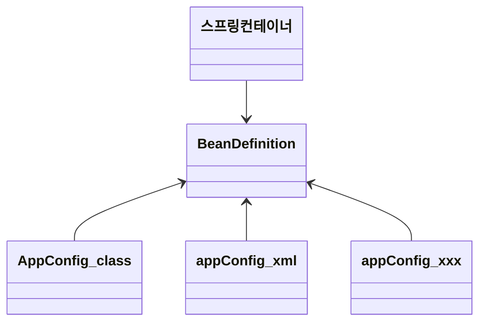
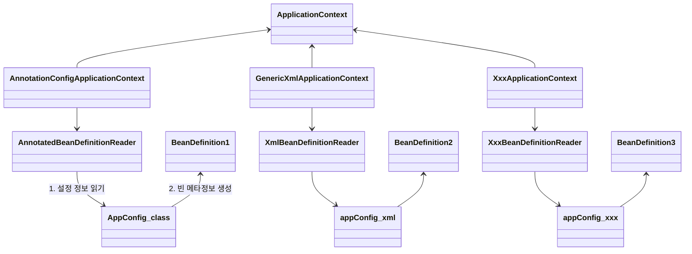

**BeanFactory**

- 스프링 컨테이너의 최상위 인터페이스.
- 스프링 빈을 관리하고 조회하는 역할 담당.
- `getBean()` 을 제공.
- 지금까지 우리가 사용했던 대부분의 기능은 BeanFactory가 제공하는 기능.

**ApplicationContext**

- BeanFactory 기능을 모두 상속받아 제공함.
- 빈을 관리하고 검색하는 기능을 BeanFactory가 제공해주는데, 차이는?
- 어플리케이션을 개발할 때는 빈은 관리하고 조회하는 기능은 물론이고, 수 많은 부가 기능이 필요함.

**ApplicationContext가 제공하는 부가기능**



- **메시지소스를 활용한 국제화 기능** (MessageSource)
  - 예를 들어 한국에서 들어오면 한국어로, 영어권에서 들어오면 영어로 출력
- **환경변수** (EnvironmentCapable)
  - 로컬, 개발, 운영등을 구분해서 처리
- **어플리케이션 이벤트** (ApplicationEventPublisher)
  - 이벤트를 발행하고 구독하는 모델을 편리하게 지원
- **편리한 리소스 조회** (ResourceLoader)
  - 파일, 클래스패스, 외부 등에서 리소스를 편리하게 조회

**정리**

- ApplicationContext는 BeanFactory의 기능을 상속 받는다.
- ApplicationContext는 빈 관리기능 + 편리한 부가 기능을 제공.
- BeanFactory를 직접 사용할 일은 거의 없음. 부가기능이 포함된 ApplicationContext를 사용.
- BeanFactory나 ApplicationContext를 스프링 컨테이너라 함.

<br/>

## 다양한 설정 형식 지원 - 자바 코드, XML

스프링 컨테이너는 다양한 형식의 설정 정보를 받아드릴 수 있게 유연하게 설계되어 있음. (자바 코드, XML, Groovy 등)



### 어노테이션 기반 자바 코드 설정 사용

- 지금까지 했던 것
- `new AnnotationConfigApplicationcontext(AppConfig.class)`
- `AnnotationConfigApplicationcontext` 클래스를 사용하면서 자바 코드로 된 설정 정보를 넘기면 된다.

### XML 설정 사용

- 최근엔 스프링 부트를 많이 사용하면서 XML 기반 설정은 잘 사용하지 않음. 아직 레거시 플젝이 XML로 되어 있고, 또 XML을 사용하면 컴파일 없이 빈 설정 정보를 변경할 수 있는 장점도 있으므로 한번쯤 배워두는 것도 괜찮.
- `GenericXmlApplicationContext` 를 사용하면서 `xml` 설정 파일을 넘기면 된다.

```java
public class XmlAppContext {

    @Test
    void xmlAppContext() {
        ApplicationContext ac = new GenericXmlApplicationContext("appConfig.xml");
        MemberService memberService = ac.getBean("memberService", MemberService.class);
        assertThat(memberService).isInstanceOf(MemberService.class);
    }
}
```

resource 하위에 appConfig.xml 파일생성.

```xml
<?xml version="1.0" encoding="UTF-8"?>
<beans xmlns:xsi="http://www.w3.org/2001/XMLSchema-instance"
       xmlns="http://www.springframework.org/schema/beans"
       xsi:schemaLocation="http://www.springframework.org/schema/beans http://www.springframework.org/schema/beans/spring-beans.xsd">

    <bean id="memberService" class="hello.core.member.MemberServiceImpl">
        <constructor-arg name="memberRepository" ref="memberRepository"/>
    </bean>
    <bean id="memberRepository"
          class="hello.core.member.MemoryMemberRepository"/>
    <bean id="orderService" class="hello.core.order.OrderServiceImpl">
        <constructor-arg name="memberRepository" ref="memberRepository"/>
        <constructor-arg name="discountPolicy" ref="discountPolicy"/>
    </bean>
    <bean id="discountPolicy" class="hello.core.discount.RateDiscountPolicy"/>
</beans>
```

- xml 기반의 `appConfig.xml` 스프링 설정 정보와 자바 코드로 된 `AppConfig.java` 설정 정보를 비교해보면 거의 비슷하다는 것을 알 수 있다.

근데 거의 사용 안함.

<br/>

## 스프링 빈 설정 메타 정보 - BeanDefinition

스프링은 어떻게 이런 다양한 설정 형식을 지원할까? 중심에는 `BeanDefinition` 이라는 추상화가 있음.

- **역할과 구현을 개념적으로 나눈 것**
  - XML을 읽어 BeanDefinition을 만들면 된다.
  - 자바 코드를 읽어 BeanDefinition을 만들면 된다.
  - 스프링 컨테이너는 자바 코드인지, XML인지 몰라도 됨. 오직 BeanDefinition만 알면 됨.
- `BeanDefinition` 을 **빈 설정 메타정보**라 함.
  - `@Bean`, `<bean>` 당 각각 하나씩 메타 정보가 생성됨.
- 스프링 컨테이너는 이 메타 정보를 기반, 스프링 빈을 생성.



코드 레벨로 조금 더 깊이 있게 들어가보자.



- `AnnotationConfigApplicationContext` 는 `AnnotatedBeanDefinitionReader` 를 사용해 `AppConfig.class` 를 읽고 `BeanDefinition` 을 생성함.
- `GenericXmlApplicationContext` 는 `XmlBeanDefinitionReader` 를 사용해 `appConfig,xml` 을 읽고 `BeanDefinition` 을 생성함.
- 새로운 형식의 설정 정보가 추가되면, `XxxBeanDefinitionReader` 를 만들어 `BeanDefinition` 을 생성하면 됨.

<br/>

## BeanDefinition 살펴보기

### BeanDefinition 정보

- BeanClassName: 생성할 빈의 클래스 명(자바 설정 처럼 팩토리 역할의 빈을 사용하면 없음)
- factoryBeanName: 팩토리 역할의 빈을 사용할 경우 이름, 예) appConfig
- factoryMethodName: 빈을 생성할 팩토리 메서드 지정, 예) memberService
- Scope: 싱글톤(기본 값)
- lazyInit: 스프링 컨테이너를 생성할 때 빈을 생성하는 것이 아니라, 실제 빈을 사용할 때까지 최대한 생성을 지연처리 하는지 여부
- InitMethodName: 빈을 생성하고, 의존관계를 적용한 뒤에 호출되는 초기화 메서드 명
- DestoryMethodName: 빈의 생명주기가 끝나서 제거하기 직전에 호출되는 메서드 명
- Constructor arguments, Properties: 의존관계 주입에서 사용한다. (자바 설정 처럼 팩토리 역할의 빈을 사용하면 없음)

```java
public class BeanDefinitionTest {

    AnnotationConfigApplicationContext ac = new AnnotationConfigApplicationContext(AppConfig.class);

    @Test
    @DisplayName("빈 설정 메타정보 확인")
    void findApplicationBean() {
        String[] beanDefinitionNames = ac.getBeanDefinitionNames();
        for (String beanDefinitionName : beanDefinitionNames) {
            BeanDefinition beanDefinition = ac.getBeanDefinition(beanDefinitionName);

            if (beanDefinition.getRole() == BeanDefinition.ROLE_APPLICATION) {
                System.out.println("beanDefinitionName = " + beanDefinitionName
                        + " beanDefinition" + beanDefinition);
            }
        }
    }
}
```

**정리**

- BeanDefinition을 직접 생성해서 스프링 컨테이너에 등록할 수도 있다. 하지만 실무에서 BeanDefinition을 직접 정의하거나 사용할 일은 거의 없음.
- BeanDefinition에 대해서 너무 깊이 있게 이해하기 보다는, 스프링이 다양한 형태의 설정 정보를 BeanDefinition으로 추상화해서 사용하는 것 정도만 이해하면 됨.
- 가끔 스프링 코드나 스프링 관련 오픈소스의 코드를 볼 때, BeanDefinition이라는 것이 보일 때가 있음. 이런 매커니즘을 떠올리면 됨.
