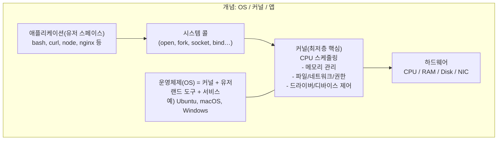
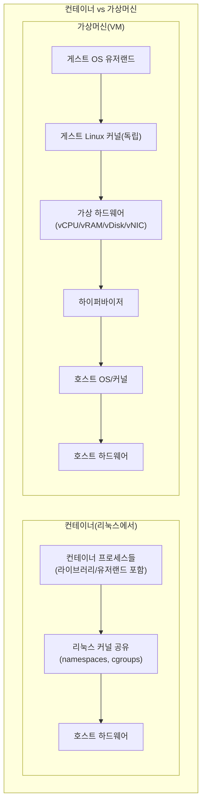
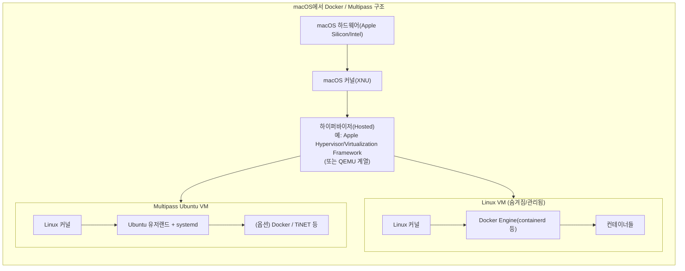

# 커널

## 1. 커널 / 운영체제 / 가상화

- 커널: 하드웨어(CPU, 메모리, 네트워크)를 직접 제어하는 핵심
	- 커널은 OS와는 다름.

```
운영체제 =
  커널
+ 시스템 라이브러리
+ 기본 명령어
+ 서비스 데몬
+ 부팅/패키지/계정 관리
```

- 운영체제(OS): 커널 + 유저랜드 도구 + 시스템 서비스
- macOS 커널(XNU)!= Linux 커널
	- 리눅스 전용 기능은 macOS에서 직접 불가

### 가상화의 본질

- 리눅스 커널은 macOS 위에서 도는게 아님
- 하이퍼바이저가 가상 하드웨어를 만들고
- CPU가 실제로 실행
- macOS는 관리자 역할만 함

## 2. Docker / VM / WSL2 / Multiplass 관계

- 컨테이너
	- 커널 없음
	- 호스트 Linux 커널 공유
	- 격리된 프로세스

```
하드웨어
 └─ 호스트 OS
     └─ 커널
         └─ 컨테이너
             └─ 프로세스
             └─ 라이브러리
             └─ 애플리케이션
```

- 가상머신(VM)
	- 독립 Linux 커널 보유
	- Systemd, network namespae 전부 가능

```
하드웨어
 └─ 호스트 OS
     └─ 하이퍼바이저
         └─ VM
             └─ 커널
             └─ OS 유저랜드
             └─ 애플리케이션
```

**macOS에서 현실**
- Docker on macOS
	- 숨겨진 Linux VM안에서 컨테이너 실행
	- Docker on macOS도 하이퍼바이저 위에서 동작한다.
- WSL2(Windows), Multipass(macOS)
	- -> 리눅스 커널 가진 VM
	- 구조적으로 거의 동일

> 그럼 EKS에 배포되는 docker container는 어떤 OS위에서 돌아가는거? 어떤 커널? 이런 컨테이너들도 host 자원 끌어다 써야 하는거 아니야?'
>
> -> Amazon EKS에 배포된 컨테이너는 반드시 '노드(Node)' 위에서 실행된다.
> - Amazon EC2 인스턴스
> - 또는 AWS Fargate (노드가 추상화 됨)
> 
> ```
> 물리 서버
>  └─ EC2 인스턴스
>      └─ Linux OS (Amazon Linux / Bottlerocket / Ubuntu 등)
>          └─ Linux 커널
>              └─ containerd / Docker
>                  └─ 컨테이너들
> ```

> 근데 linux 커널이라는건 macos위에서 돌아갈 수가 없을 것 같은데 어떻게 이걸 가상화하는거지? 하드웨어 스펙자체가 다를것 같은데.
>
> 하이퍼바이저로 하드웨어를 가짜로 하나 더 만들어 사용한다.
> ```
> 실제 하드웨어 (CPU, RAM, NIC)
>  └─ macOS
>      └─ 하이퍼바이저
>          └─ 가상 하드웨어
>              └─ Linux 커널
>                  └─ Linux OS
> ```
> 하이퍼바이저는 CPU에 명령을 내린다. 메메모리는 VM 전용 메모리 공간을 할당해서 리눅스 커널이 RAM으로 인식시켜 사용하게 함. 장치도 가짜 디스크를 만들어 사용하게 함.

> 폐쇠적인 macOS가 왜 하이퍼바이저 API를 노출시켜둠?
> -> 가상화 자체에 목적이 있다기 보다는 macOS를 개발/테스트의 '주 플랫폼'으로 유지하게 하는것. 리눅스 관련 개발자, 서버/클라우드 개발자들이 이탈 가능성이 많기 때문에 열어둔거.






