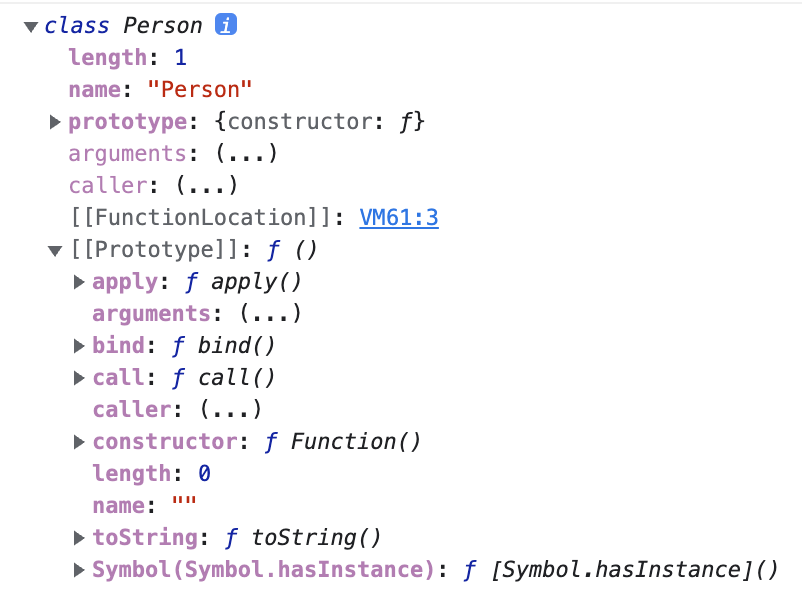

# 클래스

자바스크립트는 프로토타입 기반(prototype base) 객체지향 언어다. 프로토타입 기반 객체지향 언어는 클래스가 필요 없는 객체지향 프로그래밍 언어다. ES5에서는 클래스 없이도 생성자 함수로 가능했다.

```js
var Person = (function () {
  // 생성자 함수
  function Person(name) {
    this.name = name;
  }

  // 프로토타입 메서드
  Person.prototype.sayHi = function () {
    console.log(`Hi! My name is ${this.name}`);
  };

  // 생성자 함수 반환
  return Person;
})();

var me = new Person('Lee');
me.sayHi();
```

ES6에서 클래스가 기존 프로토타입 기반 객체지향 모델을 폐지하고 새롭게 클래스 기반 객체지향 모델을 제공하는 것은 아니다. 단, 클래스와 생성자 함수는 모두 프로토타입 기반의 인스턴스를 생성하지만 정확히 동일하게 동작하지는 않는다. 클래스는 생성자 함수보다 엄격하고, 생성자 함수에서 제공하지 않는 기능도 제공한다.

클래스와 생성자 함수의 차이점

1. 클래스를 new 키워드 없이 호출하면 error 발생.
2. 클래스는 상속을 지원하는 extends, super 키워드 제공.
3. 클래스는 호이스팅이 발생하지 않는 것처럼 동작함. -> let, const 와 같이 TDZ가 있음.
4. 클래스 내 모든 코드에는 암묵적으로 strict mode가 지정되어 실행, strict mode를 해제할 수 없다.
5. 클래스의 constructor, 프로토타입 메서드, 정적 메서드는 모두 프로퍼티 어트리뷰트 `[[Enumerable]]`의 값이 false다. 열거 되지 않는다.

<br/>

## 클래스 정의

클래스도 일급 객체다.

- 무명의 리터럴로 생성가능. 런타임에 생성이 가능하다.
- 변수나 자료구조(객체, 배열)에 저장할 수 있다.
- 함수의 매개변수에 전달할 수 있다.
- 함수의 반환값으로 사용할 수 있다.

클래스는 함수다. 또 클래스 몸체에는 0개 이상의 메서드만 정의할 수 있다. 정의할 수 있는 메서드는 constructor(생성자), 프로토타입 메서드, 정적 메서드의 세 가지가 있다.

```js
class Person {
  // 생성자
  constructor(name) {
    // 인스턴스 생성 및 초기화
    this.name = name; // name 프로퍼티는 public함
  }

  // 프로토타입 메서드
  sayHi() {
    console.log(`Hi! My name is ${this.name}`);
  }

  // 정적 메서드
  static sayHello() {
    console.log('Hello!');
  }
}

// 인스턴스 생성
const me = new Person('Lee');

// 인스턴스의 프로퍼티 참조
console.log(me.name); // Lee
// 프로토타입 메서드 호출
me.sayHi(); // Hi! My name is Lee
// 정적 메서드 호출
Person.sayHello(); // Hello!
```

<br/>

## 메서드

### Constructor

constructor는 인스턴스를 생성하고 초기화하기 위한 특수 메서드다. constructor이름을 변경할 수 없다.

```js
class Person {
  // 생성자
  constructor(name) {
    // 인스턴스 생성 및 초기화
    this.name = name;
  }
}
```

클래스는 인스턴스를 생성하기 위한 생성자 함수다. 클래스의 내부를 들여다보기 위해 실행해보자.

```js
console.log(typeof Person); // function
console.dir(Person);
```



Person 클래스의 constructor 내부에서 this에 추가한 name 프로퍼티가 클래스가 생성한 인스턴스의 프로퍼티로 추가된 것을 확인할 수 있다. 즉, 생성자 함수와 마찬가지로 constructor내부에서 this에 추가한 프로퍼티는 인스턴스 프로퍼티가 된다.
