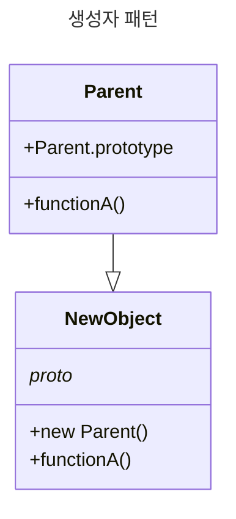

# 생성자 패턴

생성자는 객체가 새로 만들어진 뒤 초기화 하는데에 사용되는 특별 메서드임. JS에서 거의 모든 것이 객체다.

> 객체 생성자는 특정 유형의 객체를 생성할 때 사용되었다. 객체가 처음 생성되었을 때 인수로 받아온 값을 객체 멤버의 변수와 메서드에 할당하는 동시에 사용할 준비를 마친다.



JS에서 새로운 객체를 만들 때 사용하는 3가지 일반적 패턴임.

```js
// 1. 리터럴 표기법으로 빈 객체 생성
const newObject = {};
// 2. Object.create() 메서드를 사용해 빈 객체 생성
const newObject = Object.create(Object.prototype);
// 3. new 키워드를 사용해 빈 객체 생성
const newObject = new Object();
```

각 객체를 읽기 전용 상수(const)로 선언함. 막 줄은 Object 클래스의 생성자가 객체를 생성하는 역할을 하게 된다.

<br/>

## 특징

클래스는 객체 템플릿을 저으이하고 캡슐화 및 상속을 구현할 수 있다.

```js
class Car {
  constructor(model, year, miles) {
    this.model = model;
    this.year = year;
    this.miles = miles;
  }
  
  toString() {
    return `${this.model} has done ${this.miles} miles.`;
  }
}

let civic = new Car('Honda Civic', 2009, 20000);
let mondeo = new Car('Ford Mondeo', 2010, 5000);

console.log(civic.toString());
console.log(mondeo.toString());
```

생성자 패턴의 간단 예다. 하지만 문제가 있음.

- 상속이 어려워진다는 점.
- 다른 하나는 Car 생성자로 객체를 생성할 때마다 `toString()` 과 같은 함수를 `새로 정의`한다는 점. -> 즉 메모리 차지가 늘었다

Car 유형의 인스턴스는 모두 동일한 함수를 공유해야 하므로 이 방법은 효과적이지 않음.

<br/>

## 프로토타입을 가진 생성자

JS의 프로토타입 객체는 함수나 클래스 등 특정 객체의 모든 인스턴스 내 공통 메서드를 쉽게 정의할 수 있게 한다. 생성자를 통해 객체를 생성하면 생성자의 프로토타입 객체에 속한 속성을 새 객체에서도 활용할 수 있다. 이런 방식으로 동일 프로토타입 객체를 사용하는 여러 개의 Car 객체를 만들 수 있음.

```js
class Car {
  constructor(model, year, miles) {
    this.model = model;
    this.year = year;
    this.miles = miles;
  }
}

// 프로토타입 객체의 재정의를 피하기 위해 Object.prototype 대신
// Object.prototype.newMethod 형태를 사용하고 있음에 유의.
// 기존 이미 정의된 프로토 타입 객체를 유지하기 위해서임.
Car.prototype.toString = function() {
  return `${this.model} has done ${this.miles} miles.`;
}

let civic = new Car('Honda Civic', 2009, 20000);
let mondeo = new Car('Ford Mondeo', 2010, 5000);

console.log(civic.toString());
console.log(mondeo.toString());
```
