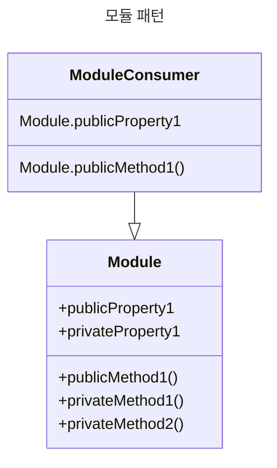

# 모듈 패턴

어플리케이션 아키텍처의 핵심 구성요소. 프로젝트를 구성하는 코드 단위를 체계적으로 분리 및 관리하는데 효과적으로 활용된다.

JS 초기에 다양한 방법으로 모듈을 구현함.

- 객체 리터럴 표기법
- 모듈 패턴
- AMD 모듈
- CommonJS 모듈

<br/>

## 객체 리터럴

중괄호 안에 키와 값을 쉼표로 구분하여 객체를 정의한다.

```js
const myObjectLiteral = {
  variableKey: variableValue,
  functionKey() {
    // ...
  }
}
```

객체 리터럴은 선언 시 new 연산자를 필요로 하지 않고 `{` 를 통해 객체 블록의 시작을 명시한다. 객체의 바깥에서 새로운 멤버를 추가하려면 다음과 같이 할당 연산자를 사용한다.

```js
myModule.property = 'someValue';
```

객체 리터럴을 사용하면 코드를 캡슐화 해 깔끔하고 체계적으로 정리할 수 있음.

<br/>

## 모듈 패턴

전통적 SW 엔지니어링 분야에서 클래스의 캡슐화를 위해 처음 고안 되었다. 개발자들은 재사용 가능 로직을 분할하고 관리하기 위해 개별 스크립트에 의존했고, 결과 하나의 HTML 파일에서 10~20개의 스크립트를 각각 수동으로 가져왔다. 객체를 활요하는 모듈 패턴을 그저 '공개' 및 '비공개' 메서드를 가진 로직을 캡슐화하는 방법 중 하나였음.

시간이 지나 모듈을 사용해 객체, 함수, 클래스, 변수 등을 구성해 다른 파일에 쉽게 보내거나 가져올 수 있음. 이 때문에 모듈 간 클래스 또는 함수명 충돌을 방지할 수 있음.



### 비공개 - private

모듈 패턴은 클로저(closure)를 활용, '비공개' 상태와 구성을 캡슐화 한다. 이는 공개 및 비공개 메서드와 변수를 묶어 전역 스코프로의 유출을 방지하고 다른 개발자의 인터페이스와의 충돌을 예방한다. 공개 API 만을 노출하고 나머지는 클로저 내부에 비공개로 유지할 수 있다.

모듈 패턴은 즉시 실행 함수(IIFE)를 사용, 객체를 반환해 비공개를 구현한다.

ES2019(ES10) 이전 JS에서 접근 제한자(`#`, 해시)를 지원하지 않아 엄밀히 말해 '비공개' 라는 개념이 존재하지 않았음. 함수 스코프를 이용해 비공개를 구현함. 모듈 패턴에서는 클로저를 통해 비공개를 구현하며, 선언된 모듈 내부에서만 변수와 메서드를 사용할 수 있다. 하지만 반환되는 객체에 포함된 변수와 메서드는 공개되어 다른 곳에서도 사용할 수 있다.

반환된 객체에 포함된 변수를 비공개하려면 `WeakMap()` 을 사용하면 된다. WeakMap은 객체만 키로 설정할 수 있으며 순회(iterate)가 불가능하다. 따라서 모듈 내부의 객체에 접근하는 유일한 방법은 해당 객체의 참조를 통해서 뿐이다. 한편, 모듈 외부에서 공개로 정의된 메서드를 통해서만 접근할 수 있다.

### 예제

export는 모듈 외부에서 모듈 기능에 대한 액세스를 제공하는 역할을 한다. 그리고 import는 모듈에서 내보낸 바인딩(binding)을 가져올 수 있게 한다.

```js
let counter = 0;

const testModule = {
  incrementCounter() {
    return counter++;
  }
  resetCounter() {
    console.log(`counter value prior to reset: ${counter}`);
    counter = 0;
  }
}
// 변수명을 정하지 않고 디폴트 default로서 내보내는 방법
export default testModule;
```

```js
import testModule from './testModule';

testModule.incrementCounter();
testModule.resetCounter(); // counter value prior to reset: 1
```

여기서 다른 파일들은 incrementCounter()나 resetcounter()를 직접 읽지 못한다. counter 변수는 전역 스코프로부터 완전히 보호되어 비공개 변수로서 작동함. 모듈의 클로저 내부로 스코프가 제한되어 오직 incrementCounter()나 resetcounter()만이 접근할 수 있다. 메서드를 호출 할 때 이름을 지정해서(namespace) 사용하기 때문에 앞의 예제에서처럼 testModule을 앞에 붙여야 함.

모듈 패턴을 사용하기 전에 간단한 템플릿을 만들어두면 도움이 된다. 다음은 네임스페이스, 공개 및 비공개 변수를 다루는 템플릿의 예다.

```js
// 비공개 카운터 변수
let myPrivateVar = 0;

// 인자를 출력하는 비공개 함수
const myPrivateMethod = foo => {
  console.log(foo);
}

const myNamespace = {
  // 공개 변수
  myPublicVar = 'foo',
  
  // 비공개 변수와 함수를 다루는 공개 함수
  myPublicFunction(bar) {
    myPrivateVar++;
    myPrivateMethod(bar);
  }
}

export default myNamespace;
```

- 비공개 자유성: 모듈 내부에서만 사용 가능한 비공개 함수를 자유롭게 만들 수 있다. 다른 파일에서 접근할 수 없기에 완전한 비공개를 실현할 수 있다.
- 디버깅 용이성: 대개 함수는 선언되고 이름이 정해지므로, 어떤함수가 예외를 발생시켰는지 알아내려고 할 때 디버거에서 콜 스택을 찾기 쉬워진다.

### 모듈 패턴의 변형

#### 믹스인(Mixin) 가져오기 변형

유틸 함수나 외부 라이브러리 같은 전역 스코프에 있는 요소를 모듈 내부의 고차 함수에 인자로 전달할 수 있게 한다. 이를 통해 전역 스코프 요소를 가져와 맘대로 이름을 지정(alias)할 수 있다.

```js
// utils.js
export const min = arr => Math.min(...arr);
```

```js
// privateMethod.js
import { min } from './utils';

export const privateMethod = () => console.log(min([10, 5, 100, 2, 1000]));
```

```js
// myModule.js
import { privateMethod } from './privateMethod';

const myModule => () => ({
  // 고차 함수
  publicMethod() {
    privateMehtod();
  }
});
// 고차함수 자체를 export
export default myModule;
```

```js
// main.js
import myModule from './myModule';

const moduleInstance = myModule();
moduleInstance.publicMethod(); // privateMethod를 publicMethod로 이름을 바꿔 사용
```

### 내보내기 변형

따로 이름을 지정해주지 않고 전역 스코프로 변수를 내보낸다. 이전 예제에서 본 것처럼 평소대로 가져와 사용할 수 있다.

```js
// module.js
const privateVariable = 'Hello World';
const privateMethod = () => {
  // ...
}

const module = {
  publicProperty: 'Foobar',
  publicMethod: () => {
    console.log(privateVariable);
  },
};

export default module;
```

### 장점

생성자 패턴도 좋은데 어째서 모듈 패턴을 사용해야할까? JS 관점에서 모듈 패턴은 캡슐화 개념보다 객체 지향 프로그래밍 지식을 가진 초보 개발자가 이해하기 쉽다. 앞선 믹스인 가져오기만 보더라도 모듈 사이의 의존성을 관리하고 전역 요소를 원하는 만큼 넘겨주어 코드의 유지보수를 용이하게 하고 독립적으로 만들어줌.

그리고 비공개 지원함. export를 이용해 바깥으로 노출한 값들만 접근할 수 있다. 바깥으로 노출하지 않은 값은 모듈 내부에 비공개로 유지된다.

### 단점

모듈 패턴의 단점은 공개와 비공개 멤버를 서로 다르게 접근해야 한다는 것이다. 공개 여부를 바꾸고 싶다면 값이 위치한 파일로 가서 각각 바꾸어주어야만 함.

자운에 추가한 메서드에서는 비공개 멤버에 접근할 수 없다. 하지만 모듈 패턴은 대체로 여전히 매우 유용하고 어플 구조를 개선할 수 있는 잠재력이 있음.

다른 단점으로는 자동화 단위 테스트에서 비공개 멤버는 제외된다는 것과 핫 픽스가 필요한 오류를 고칠 때 복잡도가 높다는 점. 그저 비공개 멤버를 수정하는 것은 불가능하기 때문이다. 대신 오류가 발생한 비공개 멤버를 고치기 위해서 해당 비공개 멤버를 사용하는 모든 공개 메서드를 살펴봐야만 한다.

<br/>

## WeakMap을 사용하는 최신 모듈 패턴

ES6에서 도입된 WeakMap 객체는 약한 참조를 가진 키-값의 쌍으로 이루어진 집합체다. 키는 객체여야만 하나, 값으로는 뭐든지 넣을 수 있다. WeakMap 객체는 기본적으로 키가 약하게 유지되는 맵(map) 이다. 즉 참조되지 않는 키는 가비지 컬렉션(GC) 대상이 된다.

```js
let _counter = new WeakMap();

class Module {
  constructor() {
    _counter.set(this, 0);
  }
  incrementCounter() {
    let counter = _counter.get(this);
    counter++;
    _counter.set(this, counter);
    
    return _counter.get(this);
  }
  resetCounter() {
    console.log(`counter value prior to reset: ${_counter.get(this)}`);
    _counter.set(this, 0);
  }
}

const testModule = new Module();

testModule.incrementCounter();
testModule.resetCounter(); // counter value prior to reset: 1
```

…

<br/>

## 최신 라이브러리와 모듈

리액트 같은 것도 모듈 패턴을 사용할 수 있음. 팀에서 커스텀 컴포넌트가 많다고 해보자. 모든 컴포넌트를 각각의 파일로 나누어 모듈로써 관리할 수 있음.
