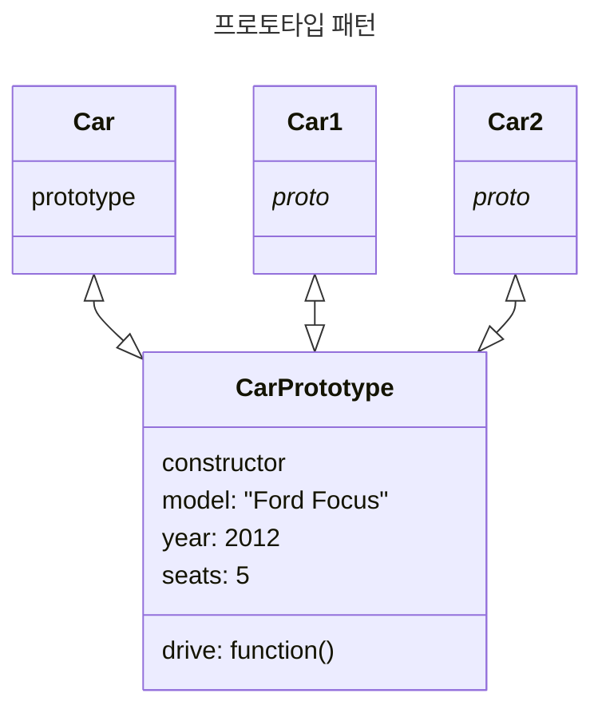

# 프로토파입 패턴

이미 존재하는 객체를 복제해 만든 템플릿을 기반으로 새 객체를 생성하는 패턴이라고 정의함.

상속을 기반으로 한다. 프로토타입 역할을 할 전용 객체를 생성하게 된다. 이렇게 만들어진 prototype 객체는 생성자를 통해 만들어진 객체의 설계도가 된다. 예를 들어 생성자 함수의 프로토타입이 name속성을 가지고 있다면, 해당 생성자 함수를 사용해 만들어진 객체들은 모두 name 속성을 가지게 된다.



JS 생태계 바깥에서 프로토타입의 정의를 찾아 올라가면 클래스에 대한 언급을 **어쩌면** 찾을 수 있음. 그러나 실제로는 프로토타입 상속과 클래스는 별개로 사용된다. 프로토타입 상속은 클래스처럼 따로 정의되는 것이 아니라, 이미 존재하는 다른 객체를 복제하여 새로운 객체를 만들어낸다.

프로토타입 패턴의 장점을 다른 언어의 기능을 따라하지 않고, JS 만이 가진 고유의 방식으로 작업할 수 있다는 것이다. 다른 디자인 패턴과 구별되는 특징이다.

이는 성능에서 이점도 챙길 수 있다. 객체 내 함수를 정의할 때 복사본이 아닌 참조로 생성되어 모든 자식 객체가 동일한 함수를 가리키게 할 수 있기 때문이다.

조금 더 알아보면, ECMAScript5 표준에 따라 프로토타입의 상속은 `Object.create` 를 필요로 한다. 프로토타입 객체를 생성하고 특정 속ㄷ성을 추가할 수도 있다.(예: `Object.creaste(prototype, optionalDescriptorObjects)`).

```js
const myCar = {
  name: 'Ford Escort',
  drive() {
    console.log('weeee. I\m driving!');
  },
  panic() {
    console.log('Wait. How do you stop this thing?');
  },
};

// 새로운 car를 인스턴스화 하기 위해 Object.create를 사용
const yourCar = Object.create(myCar);

// 프로토타입이 제대로 들어왔음을 알 수 있다.
console.log(yourCar.name);
```

Object.create는 다른 객체들로부터 직접 상속할 수 있게 해주는 차등 상속(differential inheritance)과 같은 고급 개념을 쉽게 구현할 수 있게 해준다. Object.create는 두 번째 인자를 사용해 객체의 속성을 초기화할 수 있게 해준다.

```js
const vehicle = {
  getModel() {
    console.log(`The model of this vehicle is ... ${this.model}`);
  },
};

const car = Object.create(vehicle, {
  id: {
    value: MY_GLOBAL.nextId(),
    // writable: false, configurable: false가 기본 값으로 들어간다.
    enumerable: true,
  },
  model: {
    value: 'Ford',
    enumerable: true,
  },
});
```

Object.defineProperties와 비슷하게 객체의 속성을 초기화 한다.

하지만 프로토타입 관계는 객체의 속성을 나열할 때 문제를 일으킬 수 있으므로, `hasOwnProperty()` 로 속성을 체크하는 것을 추천한다.

