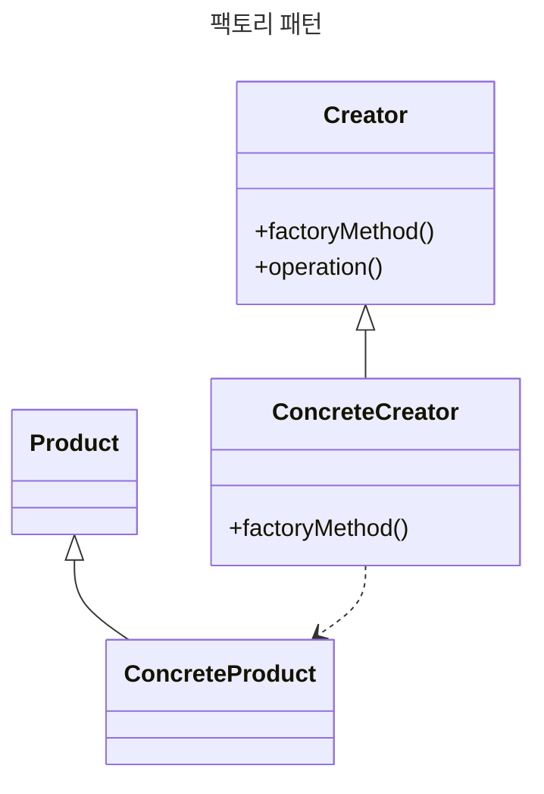

# 팩토리 패턴

객체를 생성하는 생성 패턴의 하나. 다른 패턴과 달리 생성자를 필요로 하지 않지만, 필요한 타입의 팩토리 객체를 생성하는 다른 방법을 제공한다.



UI 컴포넌트를 만드는 UI 팩토리를 상상해본다. new 연산자나 생성자를 사용해 직접 만드는 대신 팩토리 객체에 만들어 달라고 할 수도 있다. 팩토리 객체에 버튼이나 패널 (Panel) 처럼 어떤 요소가 필요한지 알려주면 결과물을 인스턴스화 하여 사용할 수 있도록 준비한다.

동적인 요소나 어플리케이션 구조에 깊게 의지하는 등의 상황처럼 객체 생성과정이 복잡할 때 특히 유용하다.

```js
// Types.js - 백그라운드에서 사용되는 클래스
// 자동차를 정의하는 클래스
class Car {
  constructor({ doors = 4, state = 'brand new', color = 'silver' } = {}) {
    this.doors = doors;
    this.state = state;
    this.color = color;
  }
}

// 트럭을 정의하는 클래스
class Truck {
  constructor({ state = 'used', wheelSize = 'large', color = 'blue' } = {}) {
    this.state = state;
    this.wheelSize = wheelSize;
    this.color = color;
  }
}

// factoryExample.js
class VehicleFactory {
  constructor() {
    this.vehicleClass = Car;
  }
  
  // 새 차량 인스턴스를 생성하는 팩토리 함수
  createVehicle(options) {
    const { vehicleType, ...rest } = options;
    
    switch (vehicleType) {
      case 'car':
        this.vehicleClass = Car;
        break;
      case 'truck':
        this.vehicleClass = Truck;
        break;
      // 해당되지 않으면 VehicleFactory.prototype.vehicleClass에 Car를 할당.
    }
    return new this.vehicleClass(rest);
  }
}
```

```js
// 자동차를 만드는 픽토리의 인스턴스 생성
const carFactory = new VehicleFactory();
const car = carFactory.createVehicle({
  vehicleType: 'car',
  color: 'yellow',
  doors: 6
});

// 자동차가  vehicleClass/prototype Car로 생성되었는지 확인
console.log(car instanceof Car); // true
console.log(car); // {doors: 6, state: 'brand new', color: 'yellow'}
```

각 차량과 관련된 속성을 설정하는 생성자로 자동차와 트럭 클래스를 정의함. 그리고 Factory는 전달되 vehicleType에 따라 새 Car 또는 Truck 차량 객체를 생성할 수 있음.

하지만, `Car` 와 `Truck` 클래스의 생성자의 프로퍼티 종류는 겹치는 부분이 있고, 겹치지 않는 부분도 있다. VehicleFactory 클래스를 통해 트럭을 만드는 방법은 크게 두 가지가 있음.

1. VehicleFactory인스턴스를 수정해 Truct 클래스를 사용하도록 하는 것

```js
const moviungTruck = carFactory.createVehicle({
  vehicleType: 'truct',
  state: 'like new',
  color: 'red',
  wheelSize: 'small',
});

// 트럭이 vehicleClass/prototype Truck으로 생성되었는지 확인
console.log(movingTruck instanceof Truck); // true
console.log(movingTruck); // {state: 'like new', color: 'red', wheelSize: 'small'}
```

1. VehicleFactory를 서브 클래스화 하여 Truck을 만드는 팩토리를 생성하는 것이다.

```js
class TruckFactory extends VehicleFactory {
  constructor() {
    super();
    this.vehicleClass = Truck;
  }
}
```

<br/>

## 팩토리 패턴을 사용하면 좋은 상황

- 객체나 컴포넌트의 생성 과정이 높은 복잡성을 가지고 있을 때
- 상황에 맞춰 다양한 객체 인스턴스를 편리하게 생성할 수 있는 방법이 필요할 때
- 같은 속ㄷ성을 공유하는 여러 개의 작은 객체 또는 컴포넌트를 다뤄야 할 때
- 덕 타이핑(duck typing) 같은 API 규칙만 충족하면 되는 다른 객체의 인스턴스와 함께 객체를 구성할 때 또한 디커플링(decoupling)에도 유용함.

<br/>

## 안되는 상황

잘못 사용하면 복잡도가 크게 증가한다. 객체 생성 인터페이스 제공이 작업 중인 라이브러리나 프레임워크의 설계 목표가 아니라면 차라리 위험을 피해 생성자를 사용하는 것이 좋다.

팩토리 패턴은 객체 생성 과정을 인터페이스 뒤에 추상화하기 때문에 객체 생성과정이 복잡할 경우 단위 테스트의 복잡성 또한 증가시킬 수 있다.

<br/>

## 추상 팩토리 패턴

추상 팩토리
