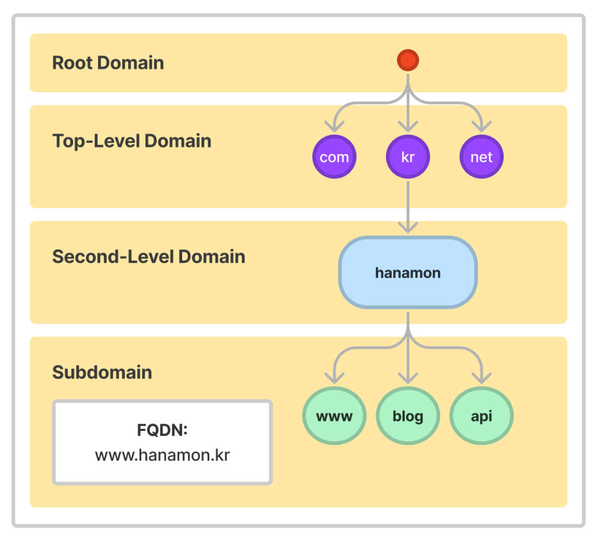
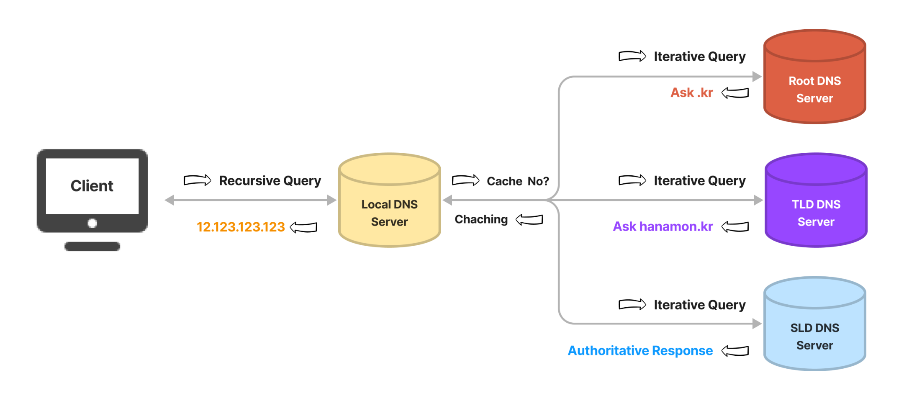

# DNS란?

> [출처](https://hanamon.kr/dns%EB%9E%80-%EB%8F%84%EB%A9%94%EC%9D%B8-%EB%84%A4%EC%9E%84-%EC%8B%9C%EC%8A%A4%ED%85%9C-%EA%B0%9C%EB%85%90%EB%B6%80%ED%84%B0-%EC%9E%91%EB%8F%99-%EB%B0%A9%EC%8B%9D%EA%B9%8C%EC%A7%80/)

## DNS(Domain Name System)란?

- 웹사이트에 접속할 때 우리는 외우기 어려운 IP 주소 대신 도메인 이름을 사용한다.
- 도메인 이름을 사용했을 때 입력한 도메인을 실제 네트워크 상에서 사용하는 IP 주소로 바꾸고 해당 IP 주소로 접속하는 과정이 필요하다.
- 이러한 과정, 전체 시스템을 DNS(도메인 네임 시스템)라고 함.
- 이러한 시스템은 전세계적으로 약속된 규칙을 공유한다.
- 상위 기관에서 인증된 기관에게 도메인을 생성하거나 IP주소로 변경할 수 있는 '권한'을 부여한다.
- DNS는 이처럼 상위 기관과 하위 기관과 같은 '**계층 구조**'를 가지는 **분산 데이터베이스** 구조를 가진다.

 

## DNS 구성 요소

1. 도메인 네임 스페이스(Domain Name Space)
2. 네임 서버(Name Server) = 권한 있는 DNS 서버
3. 리졸버(Resolver) = 권한 없는 DNS 서버

- '이 도메인 이름은 이 IP 주소이다'라는 '텍스트'를 저장하는 DB 필요.
- 분산된 데이터가 어디 저장되어 있는지 찾을 프로그램이 필요, 찾았으면 해당 IP 주소로 이동할 프로그램(브라우저)가 필요하다.
- **도메인 네임 스페이스**라는 규칙(방법)으로 도메인 이름 저장을 분산한다.
- **네임 서버**(DNS 서버와 같은 말, 그런데 리졸버 서버 등 시스템 안에서 다른 역할을 하는 서버도 있기에 그냥 DNS 서버라고 하는 것보다 네임 서버라고 하는 것이 의미가 있다)가 해당 도메인 이름의 IP 주소를 찾는다.
- **리졸버**가 DNS 클라이언트 요청을 네임 서버로 전달하고 찾은 정보를 클라이언트에게 제공하는 기능을 수행한다.
  - 어떤 네임 서버에서 찾아야하는지, 이미 캐시 되어있는지 등 어떻게든 찾아서 클라이언트에게 찾았으면 찾은 것을 못 찾았으면 못찾았다고 전달하는 역할을 한다.
  - 리졸버는 단말에 구현하는 것은 무리라 보통 리졸버가 구현된 네임 서버의 IP 주소만 파악한다.
  - 대표적인 것이 KT/LG/SK와 같은 ISP(통신사) DNS가 있고, 브라우저 우회 용도로 많이 쓰는 구글 DNS, 클라우드플레어와 같은 Public DNS 서버가 있다.
  - 그래서 거의 Resover = Recursive DNS server = Local Server(of ISP) = Recersor

### 왜 계층이 나누어졌나?

- '이 도메인좀 IP 주소로 바꿔줄래?'라고 하면 할 수 있는 서버(네임 서버)가 한 대만 있지 않기 때문.
- 그렇다면 여러 서버(네임 서버)를 만들면 되는데? -> 그렇게 되면 해당 정보 (도메인과 IP주소) 를 모든 서버에서 공유해야 한다.
- 그래서 도메인을 계층적으로 구분하는, 정보(도메인과 IP주소)를 분산하는 구조를 선택.
- 도메인에 닷(dot), 점이 있는 것이다. 점이 계층을 나타낸다.

> ※ TLD(Top Level Domain) .com, .net 등 뒤에 붙는 도메인임. 최상위 도메인. 웹사이트의 목적을 유추할 수 있게 한다. 한 회사가 특정 TLD로 끝나는 모든 도메인을 책임지고 있다. ([ICANN](https://www.icann.org/resources/pages/what-2012-02-25-ko)) ICANN은 root 서버를 관리하고, 레지스트리(root 서버는 TLD 주소만 관리)만 관리함. 따라서 root 서버에 요청이 가면, TLD DNS 서버 주소를 갈켜줌.

 

## DNS 동작 방식 설명

1. 브라우저에서 Nesite.com을 검색하고, 사용하고 있는 통신사인 KT DNS 서버에게 도메인 주소에 해당하는 IP 주소를 요청함 (브라우저 기본 DNS 설정이 통신사 DNS 서버이기 때문)
2. ISP 서버에선 캐시 데이터가 없다는 걸 확인하고 루트 DNS 서버에게 어디로 가야 하는지 요청함(캐시가 있다면 8.로 건너 뜀.)
3. 루트 서버는 TLD DNS 서버 주소만 관리하기 때문에, ***.com 도메인을 보고는 COM 최상위 도메인을 관리하는 TLD DNS 서버 주소를 안내함.
4. ISP 서버는 COM 서버에게 어디로 가야 하는지 다시 요청함.
5. COM 서버는 가비아 DNS 서버에서 해당 도메인이 관리되고 있는 걸 확인하고 안내함.
6. ISP 서버는 가비아 서버에게 또 다시 요청함.
7. 가비아 서버는 “Nesite.com = 12.123.123.123”이라는 정보를 확인하고 이 IP를 알려줌. 동시에 ISP 서버는 해당 정보를 캐시로 기록해 둠.
8. ISP 서버는 브라우저에게 힘들게 알아 낸 12.123.123.123 주소를 안내함.
9. 브라우저는 12.123.123.123 IP 주소를 갖고 있는 호스팅 서버에게 웹사이트를 출력하라고 요청함.
10. 드디어 보임.

[출처](https://gentlysallim.com/dns%EB%9E%80-%EB%AD%90%EA%B3%A0-%EB%84%A4%EC%9E%84%EC%84%9C%EB%B2%84%EB%9E%80-%EB%AD%94%EC%A7%80-%EA%B0%9C%EB%85%90%EC%A0%95%EB%A6%AC/)

 

## DNS 구성 요소 : 도메인 네임 스페이스

- DNS는 전세계적인 거대한 분산 시스템이다.
- 도메인 네임 스페이스는 이런 DNS가 저장 관리하는 계층적 구조를 말함.
- 도메인 네임 스페이스는 최상위에 루트 DNS 서버가 존재하고 그 하위로 연결된 모든 노드가 연속해서 이어진 계층 구조로 되어 있다.

### 계층적 도메인 레벨(Hierarchical Domain Level)

- 도메인 네임 스페이스의 트리 구조는 최상위 레벨부터 순차적으로 계층적 소속 관계를 나타낸다.
- 하위 조직의 네임 스페이스를 할당하고 관리하는 방식은 각 하위 기관의 관리 책임자에게 위임된다.
- 예를들어 hanamon.kr 도메인은 kr 도메인을 관리하는 네임 서버에 등록되어있고 www.hanamonr.kr은 hanamon.kr을 관리하는 네임 서버에 등록되어있다.
- blog.hanamon.kr을 생성하기 위해서는 hanamon.kr 도메인을 관리하는 네임 서버의 레코드만을 수정함으로써 가능하다.
- 이러한 위임 구조는 호스트의 증가에 대한 관리가 효율적으로 이루어지는 것을 가능하게 한다.
- hanamon.kr은 kr 도메인을 관리하는 네임 서버에 등록되어 있는데, 해당 하위 기관은 가비아로 되어 있다.
- 하나몬은 www.hanamon.kr을 만들기 위해 가비아에 가서 도메인 레코드에 하위 도메인을 추가하면 된다. (가비아가 하위 기관임)
- (따라서, AWS 같은 호스팅에서 가비아에서 구매한 도메인을 사용하려면 route53에 생성된 네임서버를 가비아 도메인에 추가해야 함. '해당 도메인에 대한 IP 주소를 route53 네임 서버에서 찾으시오' 같은 것이다. route53에서는 해당 인스턴스나 버킷 등으로 연결되어 있다.)
- (또는 카페24 같은 호스팅에서 가비아에서 구매한 도메인을 사용하려한다면 카페24의 네임 서버를 가비아 도메인에 추가해야한다. “해당 도메인에 대한 IP 주소를 카페24 네임서버에서 찾으시오” 같은 것이다. 그리고 카페24에도 해당 도메인을 연결한다. “카페24에 추가가 가능하군요 추가하겠음, 그리고 사용중인 호스팅에 연결하세요”하면 끝난다.)

### Fully Qualified Domain Name(FQDN) 전체 도메인 이름

도메인의 전체 이름을 표기하는 방식을 말한다.
일반적으로 도메인 이름은 www.hanamon.kr에서 hanamon.kr을 의미하기 때문에 이러한 용어가 나왔다고 본다.

- 도메인 이름: hanamon.kr
- 호스트 이름: www
- FQDN : www.hanamon.kr

 

## DNS 구성 요소 : 네임 서버(Name Server = DNS Server)

- 문자열로 표현된 도메인 이름을 실제 컴퓨터가 통신할 때 사용하는 IP 주소로 변환시키기 위해서 도메인 네임 스페이스의 트리 구조에 대한 정보가 필요한데 이런 정보를 가지고 있는 서버를 네임 서버라고 함.
- DB 역할 (저장, 관리), 찾아주는 역할, 요청 처리 응답 구현
- 전 세계에 13개 Root DNS 서버가 구축되어 있다.
- DNS 서버를 복사해 같은 기능을 담당하는 미러 서버가 있다고 함.

1. Root DNS 서버
   - ICANN이 직접 관리하는 절대 존엄 서버.
   - TLD DNS 서버 ip 주소를 저장하고 안내함.
2. TLD DNS 서버
   - 도메인 등록 기관이 관리하는 서버.
   - Authoritative DNS 서버의 주소를 저장하고 안내함.
   - 도메인 판매 업체(가비아 등)의 DNS 설정이 변경되면 도메인 등록 기관으로 전달되기 때문에 어떤 판매 업체(가비아 등)에서 구매했는지 알 수 있다.
3. Second-Level Domain(SLD) DNS 서버 (Authoritative DNS 서버라고도 함)
   - 실제 개인 도메인과 IP 주소의 관계가 기록(저장, 변경) 되는 서버이다.
   - 그래서 권한의 의미인 Authoritative가 붙었다. 일반적으로 도메인/호스팅 업체의 네임서버를 말함.
   - 개인 DNS 구축해도 이 경우에 해당.
4. 권한없는 DNS 서버(리졸버 서버, 리컬시브 서버, 리커서)
   - DNS 서버는 도메인 네임 스페이스를 위한 권한 있는 DNS 서버와 권한이 없는 DNS 서버로 구분된다.
   - 위 123은 권한있는 서버다.
   - 네임 스페이스를 위한 권한 **있는** DNS 서버는 IP 주소와 도메인 이름을 매핑한다.
   - 네임 스페이스를 위한 권한 **없는** DNS 서버는 질의를 통해 IP 주소를 알아내거나 캐시한다.

 

## DNS 구성 요소 : 리졸버

- 리졸버는 웹 브라우저와 같은 DNS 클라이언트의 요청을 네임 서버로 전달하고 네임 서버로부터 정보(도메인 이름과 IP주소)를 받아 클라이언트에게 제공하는 역할을 함.
- 이 과정에서 리졸버는 하나의 네임 서버에게 DNS 요청을 전달하고 해당 서버에 정보가 없으면 다른 네임 서버에게 요청을 보내 정보를 받아온다.
- 이렇듯 리졸버는 수많은 네임서버에 접근해 사용자로부터 요청 받은 도메인의 IP 정보를 조회하는 기능을 수행함.
- 하지만 리졸버의 기능을 단말에 구현하는 것은 리소스 한계 때문에 대부분 기능을 DNS 서버에 구현, 클라이언트 호스트는 리졸버의 단순한 기능만 지닌 리졸버 루틴을 구현하는 옵션이 제시되어 있다.
- 이런 단순화된 기능의 리졸버를 스터브 리졸버(Stub Resolver) 라고 하고, 스터브 리졸버는 수 많은 네임 서버의 구조를 파악할 필요 없이 리졸버가 구현된 DNS 서버의 IP 주소만 파악하면 된다.
- 클라이언트 호스트에서 설정하는 DNS 서버(Recursive DNS Server)는 이와 같은 서버를 의미하는 것으로, 도메인에 대한 질의를 받은 스터브 리졸버는 설정된 DNS 서버로 DNS Query(질의)를 전달하고 DNS 서버로부터 최종 결과를 응답 받아 웹 브라우저로 전달하는 인터페이스 기능만 수행한다.
-  **DNS 리졸버는 다양한 장치나 시스템에 구현될 수 있으며, 대부분의 경우 클라이언트나 라우터 등의 장치나 시스템에 내장되어 있다.**

 

## DNS 동작 과정 전체 예시

1. 웹 브라우저에 www.hanamon.kr을 입력한다.
2. 웹 브라우저는 이전에 방문한적 있는지 찾는다.
   - 브라우저 캐시 확인
   - OS 캐시 확인
   - 라우터 캐시 확인
   - ISP 캐시 확인 (Recursive DNS Server)
3. ISP에서 DNS Iterative하게 쿼리를 날린다.
4. ISP는 Authoritative DNS 서버에서 최종적으로 IP 주소를 응답받는다.
5. ISP는 해당 IP 주소를 캐시한다.
6. 웹 브라우저에게 응답한다.

