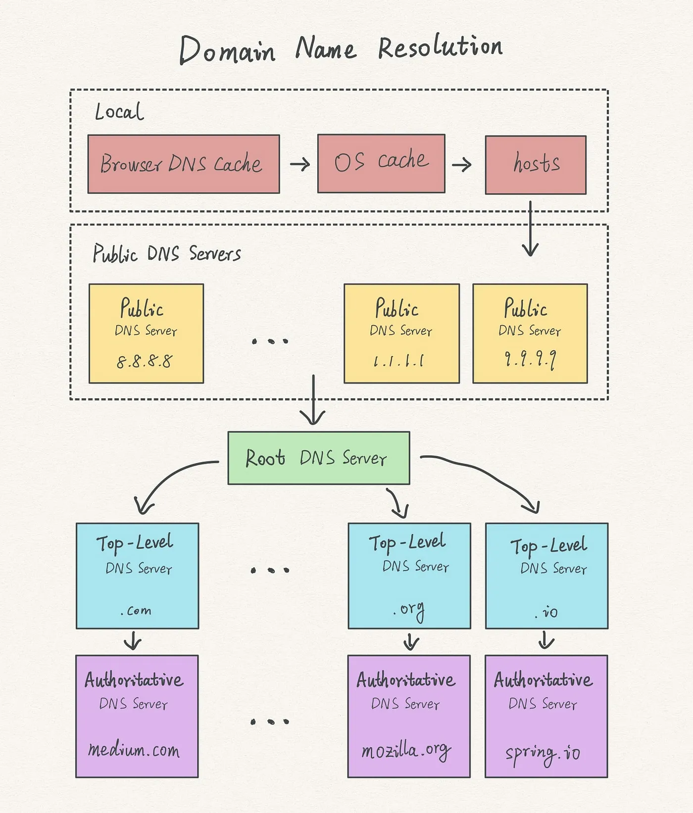

# 브라우저 주소창에 주소를 입력하면 어떤 일들이 일어날까?

## 0. 주소창에 www.naver.com을 입력한다.

## 1. 웹 브라우저는 입력된 텍스트를 확인한다.

- 주소창에 텍스트를 입력하면, 브라우저는 텍스트가 검색어인지 URL인지 확인한다.
- 만약 입력된 텍스트가 검색어이면 검색 엔진의 URL에 검색어를 포함하여 이동시킨다.
- 입력된 텍스트가 URL이면 DNS 서버에 naver.com의 주소를 요청할 준비를 한다.

 

## 2. 캐싱된 DNS 기록을 확인한다.

- 만약 도메인 이름이 맞는 IP 주소가 존재하면, 캐싱된 IP 주소를 반환한다.
- 일치하는 IP 주소가 없다면 DNS server에 요청을 보낸다.

> ※ DNS 기록을 캐싱하는 이유
>
> 만약 새로운 웹사이트 요청이 들어올때마다 DNS 서버에 요청을 보내면 웹브라우저는 매번 `resolver` 에게 요청을 보내고, `resolver`에서 `root server`, `root server` 에서 `TLD server`에 요청을 보내는 과정이 필요하다. 
>
> 따라서, 웹 사이트 요청마다 매번 DNS 서버와의 통신 과정을 반복하면 속도는 느려질 것이고 **DNS 서버**에 병목 현상이 발생할 수 있다.
>
> 병목 현상을 방지하고 반복을 막기위해 OS와 웹브라우저는 검색된적 있는 DNS 기록을 캐싱한다.
>
> [DNS란?](https://github.com/pozafly/TIL/blob/main/CS/Network/DNS%EB%9E%80%3F.md)을 보자.

### Local DNS Cache 찾는 순서

1. 브라우저의 DNS 캐시를 찾는다.
   - `브라우저`에 저장된 `DNS Cache` 목록은 `chrome://net-internals/?#dns`를 검색하면 조회할 수 있다.
   - 단, 브라우저 DNS 캐시는 브라우저 세션동안 유지되며, 브라우저가 종료되면 삭제된다.
2. OS의 DNS 캐시에서 찾는다.
   - Mac OS에 저장된 DNS Cache 목록은 `$ sudo dscacheutil -cachedump -entries Host` 이거라는데 잘 먹히지 않는다.
3.  os의 hosts 파일에서 도메인에 맞는 ip를 찾아 반환.

---

- `DNS Cache`는 영구적으로 저장되지 않으며, `TTL`은 `DNS Query`를 저장하는 기간을 의미한다.
- DNS Caching은 OS와 브라우저 단에서만 일어나지 않는다.
- 새로운 웹사이트 요청이 들어오면 DNS가 조회되는 동안, `resolver`, `root server`, `TLD server`를 거치고 각 단계에서 정보가 수집되고 캐시된다.
- 따라서, `local DNS cache`가 비어있더라도 `resolver`는 모든 DNS 조회 과정을 거칠 필요가 없을 수 있다.

> resolver란?
>
> `resolver`는 웹 브라우저와 같이 `DNS 클라이언트`의 요청을 `네임 서버`로 전달하고 `네임 서버`로부터 정보를 받아 `클라이언트`에 제공하는 기능을 수행한다. 일반적으로 모든 기능을 `PC`와 같은 클라이언트 호스트에 구현하는 것은 제약이 있기 때문에 `resolver`의 대부분의 기능은 `local DNS server`에 구현한다.

 

## 3. DNS server에 IP 주소를 요청한다.

- 브라우저는 ISP(인터넷 서비스 제공자)를 통해 DNS query를 전달한다.
- 먼저 local DNS에 문의한 www.naver.com 의 IP 주소를 문의함.
- 만약 local DNS에 주소의 IP가 없다면 root DNS Server를 시작으로 원하는 IP 주소를 찾을 때까지 도메인의 뒤에서부터 재귀적 탐색을 반복함.
  - 이 과정을 Recursive Query라고 함.
  - 탐색 순서는 (root DNS) -> .com (TLD) -> naver.com (SLD)

ISP란, kt, sk브로드밴드, lg유플러스 등 인터넷 서비스를 제공하는 업체를 ISP라 함.

 

## 4. 응답받은 IP 주소를 이용하여 HTML 문서 요청

네이버 서버에 html을 요청하는 http request를 보낸다. 이때, TCP/IP 프로토콜을 사용해 서버와 통신한다.

> HTTP Request란?
>
> HTTP Method(GET, POST, PUT, DELETE)를 사용해 클라이언트에서 서버로 전송하는 메시지다.

> TCP/IP 프로토콜이란?
>
> Transmission Control Protocol과 Internet Protocol의 조합이다.
>
> - TCP 프로토콜은 연결 지향적으로 프로토콜로 데이터 전송 과정에서 데이터의 무손실 전송을 보장하고, 패킷의 순서를 보장하며 오류가 발생하면 재전송을 시도함으로써 신뢰성 있는 데이터 전송을 보장한다.
> - IP 프로토콜은 비연결형 프로토콜로, 데이터 전송 과정에서 패킷의 라우팅을 담당한다. 신뢰성과 연결성을 위해 배부분의 인터넷 서비스는 TCP/IP 프로토콜을 사용한다.
>
> 3-way handshake를 사용해 연결하며 4-way handshake를 사용하여 연결을 종료한다.

> DNS 서버와 통신할 때는 어떤 프로토콜을 사용할까?
>
> DNS 서버와 통신할 때는 TCP/IP 프로토콜을 사용하지 않고 UDP 프로토콜을 사용한다. udp는 tcp보다 빠르며 대부분의 DNS 요청은 크기가 매우 작다. (upd 제한: 512bit 이하) 또한, udp는 연결을 유지하지 않으므로 dns 서버 부하를 줄일 수 있다.

 

## 5. 웹 서버는 WAS와의 상호 작용을 통해 컨텐츠를 생성한다.

- 웹 서버는 정적 컨텐츠(ex. HTML, CSS, JS 등)를 제공하는 서버다.
- WAS(웹 어플리케이션 서버)는 동적 컨텐츠(ex. 페이지 생성, 비즈니스 로직 처리, DB 접근 등)을 처리하는 서버이다.
- WAS만으로 웹 서버의 기능을 구현할 수 있지만 트래픽 분산 및 보안 등의 이유로 웹 서버와 WAS를 함께 사용한다.
- 흔히 말하는 프론트 서버를 웹서버, 백엔드 서버를 WAS라 볼 수 있다.

> ※BFF
>
> 하지만, 프론트엔드 개발자가 Web Server만 다루는 것은 아니며, BFF(Backend for Frontend)등을 다루는 경우 Web Server 뿐 아니라 WAS를 함께 관리하고 다룬다.
>
> BFF는 주로 MSA와 함께 사용되는 개념으로 프론트엔드를 요구사항에 맞게 구현하기 위한 도움을 주는 보조 서버의 의미를 갖는다.

 

## 6. 생성된 컨텐츠를 요청한 웹 브라우저(클라이언트)에게 전송한다.

웹 서버는 웹 브라우저에게 HTTP Response를 보낸다. HTTP Response는 status code를 포함한다.

### 주요 상태 코드

- 1xx(정보) : 추가 정보가 있음을 전달한다.
- 2xx(성공) : 서버가 요청을 처리했음을 전달한다.
- 3xx(리다이렉트) : 다른 URI로 다시 리퀘스트 하도록 요청한다.
- 4xx(클라이언트 오류) : 요청에 문제가 있어 처리할 수 없음을 전달한다.
- 5xx(서버 오류) : 서버쪽 문제가 있어 처리할 수 없음을 전달한다.

 

## 정리

- 브라우저 주소창에 주소를 입력하면 어떤일이 일어날까?

  1. 브라우저 DNS Cache 확인 후 존재하면 IP를 반환 후 요청. 없다면,
  2. OS DNS Cache 확인 후 존재하면 IP를 반환 후 요청. 없다면,
  3. OS의 Hosts 확인 후 존재하면 IP를 반환 후 요청. 없다면,
  4. Local DNS Server(ISP)에 요청, 존재하면 IP를 반환 후 요청. 없다면,
  5. Root DNS Server에 요청, TLD server 주소를 가르쳐줌.
  6. TLD server에 요청, SLD 주소를 가르쳐줌.
  7. SLD에서 IP 정보 반환.
  8. 브라우저에서 IP를 받음.

  - 이 과정을 통해 각 통로는 DNS 정보를 캐싱한다. 캐시의 보존 기간은 TTL이라고 하는데, 이는 DNS 세팅시 설정할 수 있다. TTL초가 다하면 캐시가 사라진다.

  9. 응답받은 IP에 HTML을 요청한다.
  10. 웹 서버에서 WAS와 함께 생성한 리소스를 내려준다.
  11. 화면이 렌더링 된다.

- ISP란?

  - Internet Service Provider로, 우리나라에는 KT, SK브로드밴드, LG U+가 있다. 이는, Local DNS Server를 통해 클라이언트에게 ip를 돌려주고, Root DNS Server에 IP를 요청할 수 있다.

- DNS란?

  - Domain Name System으로, 사람이 읽을 수 있는 도메인 이름을 컴퓨터가 읽을 수 있는 IP로 변환해 이어주는 시스템.

- Resolver란?

  - 클라이언트 요청을 네임 서버로 전달하고, 네임 서버로부터 정보를 받아 클라이언트에 제공하는 기능을 수행한다. 보통 local DNS Server에서 구현한다. 이때, root, tld, sld 등을 돌아다니며 ip 정보를 찾는다.

- HTTP란?

  - HyperText Transfer Protocol으로, 문서와 같은 리소스를 가져올 수 있는 프로토콜이다.

 

## HTTP의 관점에서 웹 페이지를 띄우는 방법

1. 클라이언트에서 주소창에 주소를 입력.
2. 브라우저 등은 DNS에서 IP 정보를 받아옴
3. 클라이언트에서
   - HTTP 담당 
     - 웹 서버에 보낼 HTTP 메시지 작성
   - TCP 담당
     - 통신하기 쉽도록 HTTP 메시지를 패킷으로 분해한다
     - 조각내서 일련번호를 부여한다
     - 상대방에게 패킷을 보낸다
4. 라우터에서 
   - IP 담당
     - 상대가 어디에 있는지 찾아 중계해 가면서 배송(라우터 등)
5. 서버에서
   - TCP 담당
     - 상대방으로부터 패킷을 수신
     - 도착한 패킷을 조립
     - 일련번호를 보고 조립
   - HTTP 담당
     - 웹 서버에 대한 리퀘스트 내용을 정리
6. 리퀘스트 처리 결과도 마찬가지로 TCP/IP 통신 순서대로 클라이언트에게 반환

