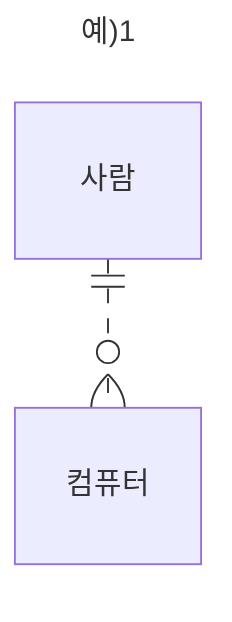
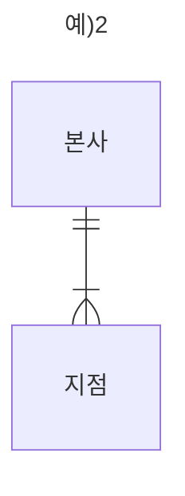

# ER Diagram

```cardlink
url: https://and-or-end.tistory.com/102
title: "[Database] 데이터 모델링 - 개체-관계 다이어그램 ERD 그리기 (까마귀 발)"
description: "데이터 모델링 (Data Modeling) 데이터 모델링은 현실 세계의 개념을 데이터로 저장하기 위해 논리적인 데이터베이스 모델로 만드는 작업을 말한다. 데이터로 정의하고 구조화하는데 여러 기법이 활용될 수 있지만, 그 중 개체-관계 모델 (Entity-Relationship Modelling) 이 많이 적용된다. ERD (Entity-Relationship Diagram) ERD는 개체-관계모델을 다이어그램으로 나타낸 것이다. 그렇다면 개체-관계 모델이란 무엇인가. 예를 들어서 설명해보겠다. 개체는 말 그대로 행동의 물체가 되는 사물, 사람 등의 '명사'를 나타낸다. 사람, 책, 컴퓨터 하나하나가 바로 하나의 개체를 뜻한다. 관계는 두 개 이상의 개체끼리 연관성을 나타내는데, 주로 '동사'형의 의미를 .."
host: and-or-end.tistory.com
favicon: https://t1.daumcdn.net/tistory_admin/favicon/tistory_favicon_32x32.ico
image: https://img1.daumcdn.net/thumb/R800x0/?scode=mtistory2&fname=https%3A%2F%2Fblog.kakaocdn.net%2Fdn%2FMTiTX%2FbtrDV4DWUBn%2FC4kV9NIIN3Z0J1KXJUhN1K%2Fimg.png
```

까마귀발 표기법을 사용한다.
이 모델은 관계의 다(n)를 나타내기 위해 까마귀 발을 사용하기 때문에 까마귀발 모델(Crow's Foot Model)이라 부름.

- **개체**(Entity)는 행동의 물체가 되는 사물, 사람 등 '명사'를 나타냄
- **관계**(Relationship)는 두 개 이상의 개체끼리의 연관성. 주로 '동사'를 나타냄.
만약, 사람이 컴퓨터를 소유하고 있다면 '소유하다' 라는 관계가, 게시판에 글이 포함된다면 '포함하다'는 관계를 말함.

| 카디널리티 기호  | 의미               |
|:-------- | ---------------- |
| o (고리)    | 0 (optional)     |
| \|\| (실선) | 1 (one)          |
| < (까마귀 발) | 다수 / 그 이상 (many) |

- 개체는 사각형으로 표현, 관계는 실선(또는 점선)으로 표현
	- 실선(식별관계): 부모 테이블의 PK가 자식테이블의 FK/PK가 되는 경우 (부모가 있어야 자식이 생기는 경우)
	- 점선(비식별관계): 부모테이블의 PK가 자식테이블의 일반속성이 되는 경우. (부모가 없이도 자식이 생기는 경우)
- 관계 선 양 끝의 `||` 또는 `o` 등의 기호는 관계의 카디널리티(cardinality), 집합 간 크기를 나타냄.
- 실선은 상속 관계인 경우, 점선은 상속이 아니지만 관련성이 있을 때 표시.



- 사람이 컴퓨터를 소유한다.
- 모든 사람은 컴퓨터를 0개 이상 다수 개 소유할 수 있다.
- 사람과 컴퓨터는 비식별관계로 반드시 사람이 없어도 자식이 존재할 수 있음. (점선)



- 본사는 지점을 관리한다.
- 모든 본사는 지점을 1개 이상 다수개 관리해야 한다.
- 식별관계로 지점은 본사가 반드시 존재해야 함. (실선)
