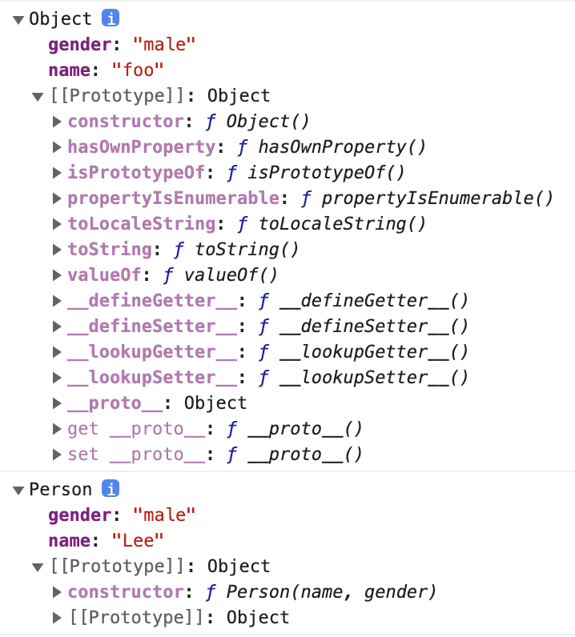

# 생성자 함수

JS에서 생성자 함수는 객체를 생성하는 역할을 함. java와 같은 객체지향 언어의 생성자 함수와는 다르게 그 형식이 정해져 있는게 아니라, **기존 함수에 new 연산자를 붙여 호출하면 해당 함수는 생성자 함수로 동작한다**.

반대로 생각하면 생성자 함수가 아닌 일반 함수에 new 연산자를 붙여 호출하면 생성자 함수처럼 동작할 수 있음. 일반적으로 생성자 함수명은 첫문자를 대문자로 입력해 혼란을 방지한다.

```js
function Person(name) {
  this.name = name;
}

var me = new Person('Lee');
console.log(me); // Person { name: 'Lee' }

// new 연산자 없이 생성자 함수를 호출하지 않으면 생성자 함수로 동작하지 않음.
var you = Person('Lim');
console.log(you); // undefined
```

new 연산자와 함께 생성자 함수를 호출하면 this 바인딩이 메소드나 함수 호출 때와는 다르게 동작함.

<br/>

## 생성자 함수 동작 방식

new 연산자와 함께 생성자 함수를 호출하면 다음과 같은 수순으로 동작함.

1. 빈 객체 생성 및 this 바인딩

   생성자 함수의 코드가 실행되기 전 빈 객체가 생성된다. 이 빈 객체가 생성자 함수가 새로 생성하는 객체이다. 이후 생성자 함수 내에서 사용되는 this는 이 빈 객체를 가리킨다. 그리고 생성된 빈 객체는 생성자 함수의 prototype 프로퍼티가 가리키는 객체를 자신의 프로토타입 객체로 설정한다.

2. this를 통한 프로퍼티 생성
   생성된 빈 객체에 this를 사용하여 동적으로 프로퍼티나 메소드를 생성할 수 있다. this는 새로 생성된 객체를 가리키므로 this를 통해 생성한 프로퍼티와 메소드는 새로 생성된 객체에 추가한다.

3. 생성된 객체 반환

   - 반환문이 없는 경우, this에 바인딩된 새로 생성한 객체가 반환된다. 명시적으로 this를 반환해도 결과는 같다.
   - 반환문이 this가 아닌 다른 객체를 명시적으로 반환하는 경우, this가 아닌 해당 객체가 반환된다. 이때 this를 반환하지 않은 함수는 생성자 함수로서의 역할을 수행하지 못한다. 따라서 생성자 함수는 반환문을 명시적으로 사용하지 않는다.

```js
function Person(name) {
  // 생성자 함수 코드 실행 전 -------- 1
  this.name = name;  // --------- 2
  // 생성된 함수 반환 -------------- 3
}

var me = new Person('Lee');
console.log(me.name);
```

<br/>

## 객체 리터럴 방식과 생성자 함수 방식의 차이

```js
// 객체 리터럴 방식
var foo = {
  name: 'foo',
  gender: 'male'
}

console.dir(foo);

// 생성자 함수 방식
function Person(name, gender) {
  this.name = name;
  this.gender = gender;
}

var me  = new Person('Lee', 'male');
console.dir(me);
```



객체 리터럴 방식과 생성자 함수 방식의 차이는 프로토타입 객체(\[[Prototype]])에 있다.

- 객체 리터럴 방식의 경우, 생성된 객체의 프로토타입 객체는 Object.prototype이다.
- 생성자 함수 방식의 경우, 생성된 객체의 프로토타입 객체는 Person.prototype이다.

<br/>

## 생성자 함수에 new 연산자를 붙이지 않고 호출할 경우

생성자 함수와 일반 함수를 호출할 때의 차이점은 this 바인딩 방식이 다르다. 일반 함수를 호출하면 this는 전역 객체에 바인딩 되지만, new 연산자와 함께 생성자 함수를 호출하면 this는 생성자 함수가 암묵적으로 생성한 빈 객체에 바인딩 된

new 연산자와 함께 생성자 함수를 호출하면 생성자 함수 내부의 this는 생성자 함수에 의해 생성된 인스턴스를 가리키낟. 

```js
// Scope-Safe Constructor Pattern
function A(arg) {
  // 생성자 함수가 new 연산자와 함께 호출되면 함수의 선두에서 빈객체를 생성하고 this에 바인딩한다.

  /*
  this가 호출된 함수(arguments.callee, 본 예제의 경우 A)의 인스턴스가 아니면 new 연산자를 사용하지 않은 것이므로 이 경우 new와 함께 생성자 함수를 호출하여 인스턴스를 반환한다.
  arguments.callee는 호출된 함수의 이름을 나타낸다. 이 예제의 경우 A로 표기하여도 문제없이 동작하지만 특정함수의 이름과 의존성을 없애기 위해서 arguments.callee를 사용하는 것이 좋다.
  */
  if (!(this instanceof arguments.callee)) {
    return new arguments.callee(arg);
  }

  // 프로퍼티 생성과 값의 할당
  this.value = arg ? arg : 0;
}

var a = new A(100);
var b = A(10);

console.log(a.value);
console.log(b.value);
```

