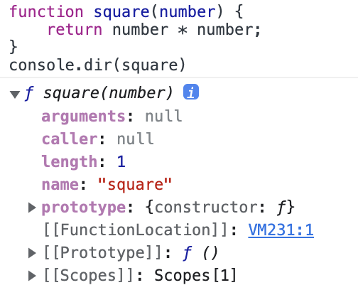

# 내부 슬롯과 내부 메서드

## 내부 슬롯과 내부 메서드

내부 슬롯과 내부 메서드는 자바스크립트 엔진의 구현 알고리즘을 설명하기 위해 ECMAScript 사양에서 사용하는 의사 프로퍼티(pseudo property), 의사 메서드(pseudo method)다. 자바스크립트 엔진에서 실제로 동작하지만, 개발자가 직접 접근할 수 없도록 했다. 단, 일부 내부 슬롯과 내부 메서드에 한하여 간접적으로 접근할 수 있는 수단을 제공하기는 함.

ex) 모든 객체는 \[[Prototype]]이라는 내부 슬롯을 갖는데, 자바스크립트 엔진의 내부 로직이므로 원칙적으로 직접 접근할 수 없지만, \[[Prototype]] 내부 슬롯의 경우, \__proto__를 통해 간접적으로 접근할 수 있다.

<br/>

## 함수의 내부 메서드 Call, Constructor

함수 선언문 또는 함수 표현식으로 정의한 함수는 일반적인 함수도, 생성자 함수로서 호출 할 수 있다. 생성자 함수로 호출한다는 것은 `new` 연산자와 함께 호출해 객체를 생성하는 것을 의미.

함수는 객체이므로 일반 객체와 동일하게 동작할 수 있음. 함수 객체는 일반 객체가 가지고 있는 내부 슬롯과 내부 메서드를 모두 가지고 있다. 하지만, 함수는 객체지만 일반 객체와 다름. **일반 객체는 호출할 수 없지만, 함수는 호출할 수 있다.** 함수는 함수로 동작하기 위해 \[[Environment]], \[[formalParameters]] 등의 내부 슬롯과 \[[Call]], \[[Constructor]] 같은 내부 메서들르 추가로 가지고 있음.

함수가 일반 함수로 호출되면 함수 객체의 내부 메서드 \[[Call]]이 호출되고, new 연산자와 함께 생성자 함수로서 호출되면 내부 메서드 \[[Constructor]]가 호출된다.

<br/>

내부 메서드 \[[Call]]을 갖는 함수를 callable이라고 하며, 내부 메서드 \[[Constructor]]를 갖는 함수를 constructor, \[[Constructor]]를 갖지 않는 함수 객체를 non-constructor라고 부름. 함수는 무조건 callable이어야 하고, constructor, non-constructor일 수 있다.

- constructor : 함수 선언문, 함수 표현식, 클래스
- non-constructor : 메서드(ES6 메서드 축약 표현), 화살표 함수

메서드를 한번 보자.

```js
// 프로퍼티 x의 값으로 할당된 것은 일반 함수로 정의된 '함수'다. 이는 메서드로 인정하지 않는다.
const bas = {
  x: function() {},
}
new bas.x(); // x {}

// 메서드 정의 : ES6의 메서드 축약 표현만 메서드로 인정함.
const obj = {
  x() {},
}
new obj.x(); // TypeError: obj.x is not a constructor
```

<br/>

## 데이터 프로퍼티와 접근자 프로퍼티

- 데이터 프로퍼티(data property)

  키와 값으로 구성된 일반적인 프로퍼티.

- 접근자 프로퍼티(accessor property)

  자체적으로는 값을 갖지 않고 다른 데이터 프로퍼티의 값을 읽거나 저장할 때 호출되는 접근자 함수(accessor function)로 구성된 프로퍼티.

데이터 프로퍼티와 접근자 프로퍼티를 구분하는 방법은 아래와 같음.

```js
Object.getOwnPropertyDescriptor(Object.prototype, '__proto__');
// {
//   get: [Function: get __proto__],
//   set: [Function: set __proto__],
//   enumerable: false,
//   configurable: true
// }
Object.getOwnPropertyDescriptor(function () {}, 'prototype');
// { value: {}, writable: true, enumerable: false, configurable: false }
```

디스크립터를 자세히 보자. 프로퍼티 반환 값으로 데이터 프로퍼티와 접근자 프로퍼티를 구분할 수 있음.

<br/>

## 함수 객체의 프로퍼티

```js
function square(number) {
    return number * number;
}
console.dir(square);
```



`console.log(Object.getOwnPropertyDescriptors(square))` 이렇게 찍어보면 결과는 아래와 같다.

```js
{
  length: { value: 1, writable: false, enumerable: false, configurable: true },
  name: {
    value: 'square',
    writable: false,
    enumerable: false,
    configurable: true
  },
  arguments: {
    value: null,
    writable: false,
    enumerable: false,
    configurable: false
  },
  caller: {
    value: null,
    writable: false,
    enumerable: false,
    configurable: false
  },
  prototype: { value: {}, writable: true, enumerable: false, configurable: false }
}
```

`arguments`, `caller`, `length`, `name`, `prototype` 프로퍼티가 보인다. 이는 **데이터 프로퍼티**다.


