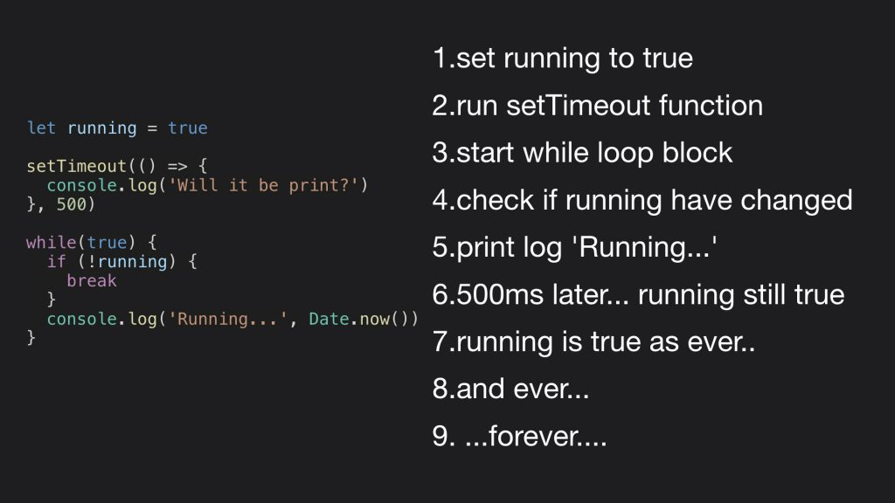

# Event Loop

JavaScript는 싱글 스레드 언어다. 한 번에 하나의 작업만 실행할 수 있다. JavaScript로 30초가 걸리는 작업을 해야한다고 가정해보자. 이 작업을 시작하면 유저는 30초 동안 ui에서 할 수 있는 일이 없다. 단지 기다려야 할 뿐이다.

> ※ 스레드란, 
>
> - 스레드는 어떠한 프로그램이 실행되는 작업을 말한다.
> - 싱글 스레드는 한 번에 하나의 작업만 수행할 수 있으며, 멀티 스레드는 한 번에 여러 개의 작업을 수행할 수 있다.

하지만, 웹 어플리케이션에서는 동시에 다른 무언가를 할 수있다. 예를 들면, 브라우저에서는 파일을 다운로드 받고 있으면서 다른 링크로 이동한다던지, Node.js에서는 HTTP 요청을 처리하기도 한다. V8과 같은 JavaScript 엔진은 단일 호출 스택(Call Stack)을 사용하며, 요청이 들어올 때마다 해당 요청을 순차적으로 Call Stack에 담아 처리할 뿐이다.

JavaScript 언어 자체에는 Multi Threading을 할 수 없지만, JavaScript가 동작하고 있는 '**브라우저**'(브라우저라는 프로그램)에서는 여러 스레드를 활용할 수 있다. 브라우저에서 지원하는 Web API를 사용하는 것이다. Web API는 JavaScript엔진 자체가 제공하지 않는, 브라우저에서 제공하는 API다. DOM API, `setTimeout`, HTTP 요청 등이 여기에 포함된다. JavaScript Runtime Environment(브라우저 or Node.js)에는 Event Loop가 있다. 이 Event Loop를 통해 여러 처리를 동시에 할 수 있는 것이다. 브라우저 환경을 그림으로 표현하면 다음과 같다.

JavaScript 엔진에는 **Memory Heap**과 **Call Stack**이 있다.

- Memory Heap : 데이터를 만들 때(변수선언 및 할당) 저장이 되는 공간.
- Call Stack : 함수를 실행할 때마다 쌓이는 공간. 함수 실행 순서를 제어한다.

비동기 호출을 위해 사용하는 `setTimeout`, `fetch` 같은 함수는 자바스크립트 엔진이 아니라 Web APIs 영역에 따로 정의 되어 있다. 또한 Event Loop나 Task Queue 같은 장치도 자바스크립트 엔진 외부에 구현되어 있다. 아래 사진은 Node.js 환경이다.

이 그림에서도 브라우저 환경과 비슷하다. Node.js는 비동기 IO를 지원하기 위해 `libuv` 라이브러리를 사용하고, libuv에서 Event Loop를 제공한다. 자바스크립트 엔진은 비동기 작업을 위해 Node.js API를 호출하고, 이때 넘겨진 콜백은 libuv의 Event Loop를 통해 스케줄되고 실행된다.

확실한 것은, 자바스크립트가 '단일 스레드' 기반의 언어라는 것은, '자바스크립트 엔진이 단일 Call Stack을 사용한다'는 관점에서만 사실이다. **실제 자바스크립트가 실행되는 환경(브라우저, Node.js)에서는 주로 여러 개의 스레드가 사용**되고, 이런 구동 환경이 Call Stack을 사용하는 자바스크립트 엔진과 상호 연동하기 위해 사용하는 장치가 '이벤트 루프'인 것이다. 즉, 브라우저, Node.js환경은 자바스크립트 엔진의 Wrapper 역할을 하고 있다.

 

## Run-to-Completion

자바스크립트 함수의 특징이 있다. 하나의 함수가 실행되면 함수의 실행이 끝날 때까지 다른 작업이 중간에 끼어들지 못한다. 자바스크립트는 하나의 Call  Stack을 사용하기 때문이다.

위 코드를 실행하면 브라우저 프로세스가 죽어버린다. console 창에 'Will it be print?' 라는 문장은 나타나지 않을 것이다. 다만, 'Running...1234837' 이라는 문구만 console에 나타난다. 그리고 브라우저가 동작하지 않는다는 alert이 뜬다.

 

## Call Stack

함수를 호출하면 Call Stack에 함수가 추가된다. Call Stack은 '자바스크립트 엔진' 안에 있다. Stack 구조로 되어있는데 가장 나중에 들어간 것이 가장 먼저 나오는 자료구조다. 이것을 LIFO(Last In First Out)이라고 한다. FILO라고도 한다. 함수가 값을 return하면 Call Stack에서 제거된다. 아래 그림을 보자.

