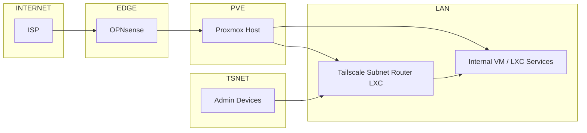

# 🛡️ Homelab Network Architecture (OPNsense + Tailscale)

이 문서는 개인 홈랩 환경에서 **OPNsense와 Tailscale을 조합해 외부 서비스와 내부 관리 트래픽을 명확히 분리**하기 위한 네트워크 아키텍처를 설명합니다.

실제 운영 환경에서 검증된 구조를 기반으로 하되, 보안상 민감한 정보(IP, 실호스트명 등)는 모두 일반화되어 있습니다.

---

## 🎯 설계 목표

- 외부에 노출되는 서비스는 **방화벽(OPNsense)** 을 통해서만 접근
- 내부 관리 및 운영 접근은 **Tailscale 전용 네트워크**로만 허용
- 내부 서비스는 **공인망에서 직접 접근 불가**
- 관리 경로와 서비스 경로를 **물리적으로 분리된 흐름**으로 설계

---

## 🧱 전체 네트워크 구조 (개념도)

---

## 🧩 구성 요소 역할 설명

### 1️⃣ OPNsense (Firewall / Router)

**역할**

- 외부 인터넷과 내부 네트워크의 경계
- 외부로 노출되는 웹 서비스의 유일한 진입 지점
- NAT, 방화벽 정책, 포트 포워딩 담당

**특징**

- 내부 관리 접근(Tailscale)은 처리하지 않음
- "외부 서비스 전용 경계 장비" 역할에 집중

---

### 2️⃣ Proxmox (Virtualization Host)

**역할**

- VM / LXC 실행 환경
- 내부 서비스와 관리용 컨테이너 호스팅

**특징**

- 외부에서 직접 접근 불가
- 모든 접근은 OPNsense 또는 Tailscale 경유

---

### 3️⃣ Tailscale Subnet Router (LXC)

**역할**

- Tailscale 네트워크와 내부 사설망을 연결하는 **유일한 관문**
- 관리 트래픽 전용 경로

**중요 포인트**

- OPNsense에 Tailscale를 직접 설치하지 않음
- LXC 컨테이너로 분리하여 관리 책임을 명확히 함
- 내부 사설망 접근은 **Tailscale 인증을 통과한 기기만 허용**

---

### 4️⃣ Internal Services (VM / LXC)

**역할**

- 웹 서버, API 서버, DB 등 실제 서비스 구성 요소

**접근 정책**

- 외부 사용자 → **OPNsense → 서비스**
- 관리자 → **Tailscale → Subnet Router → 서비스**
- 내부 서비스는 공인 IP나 직접 노출 없음

---

## 🔐 트래픽 흐름 요약

### 🌍 외부 사용자 → 웹 서비스

`Internet → OPNsense (Firewall/NAT) → Internal Service`

### 👨‍💻 관리자 → 내부 시스템

`Admin Device → Tailscale → Subnet Router → Internal Service`

> 관리 트래픽과 서비스 트래픽은 **완전히 다른 경로**를 사용합니다.

---

## 🔒 보안 설계 원칙

- **Zero Trust 기본 전제**
    - 내부망이라도 인증 없이 접근 불가
- **관리 인터페이스 분리**
    - SSH / Admin UI는 Tailscale에서만 접근
- **Single Entry Point**
    - 내부망 진입점은 Subnet Router 단 하나
- **Blast Radius 최소화**
    - OPNsense 장애 ≠ 관리망 전체 붕괴
    - Tailscale 장애 ≠ 외부 서비스 중단

---

## 🛠️ 유지보수 시 확인해야 할 핵심 포인트

### OPNsense

- WAN ↔ LAN 방화벽 정책
- 포트 포워딩 대상 서비스
- Outbound NAT 정책

### Tailscale Subnet Router

- Advertised Subnet 설정 여부
- ACL 정책 적용 상태
- Subnet Router 단일화 유지

### Proxmox

- 내부 브리지 분리 상태
- 서비스별 네트워크 위치 확인
- 관리용 컨테이너 접근 경로 점검

---

## 📌 왜 이 구조를 선택했는가

- OPNsense에 Tailscale를 직접 설치하면
    - 책임 경계가 모호해지고
    - 장애 시 영향 범위가 커짐
- Subnet Router 분리는
    - 기업 환경에서도 흔히 사용하는 방식
    - 관리/보안/확장성 측면에서 유리
